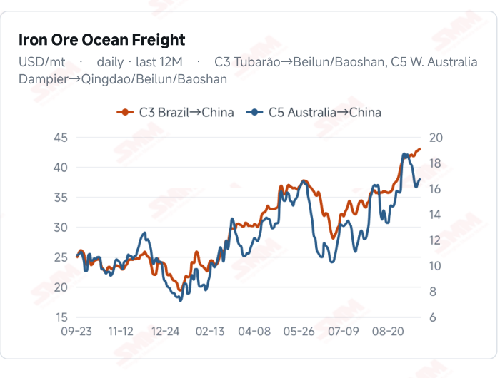
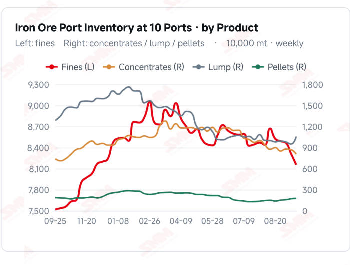
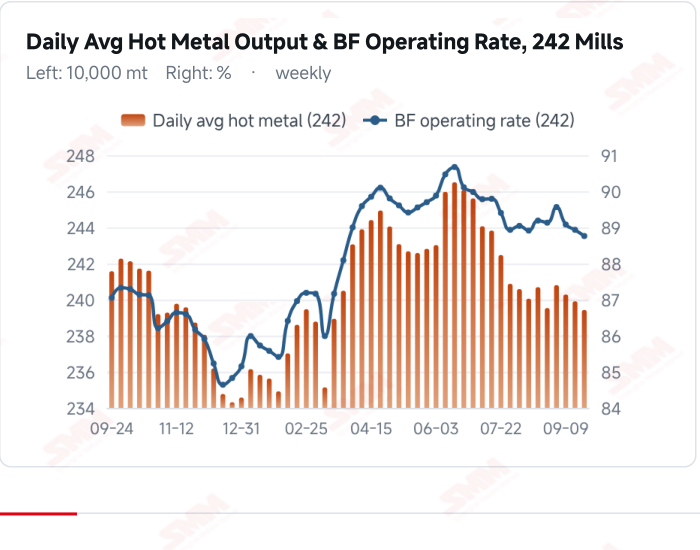
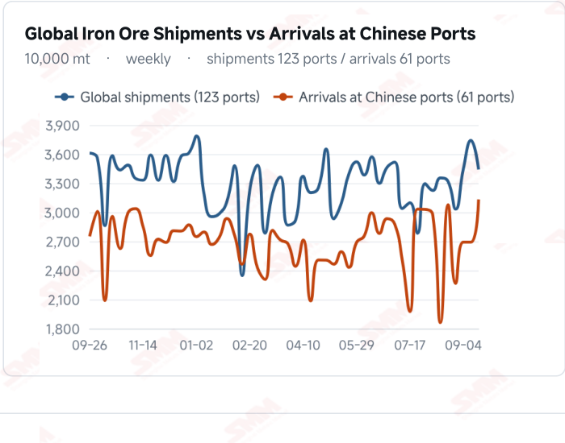

# SMM Iron Ore Daily — 2026-09-23 (Wednesday)

**Source:** SMM Data-pro · Shanghai Metals Market (SMM)

---

## Futures Contracts

| Exchange | Contract | Price | Unit | Daily Change | Daily Change % | MTD Avg |
|:---|:---|:---:|:---:|:---:|:---:|:---:|
| SGX | SGX Iron Ore Most-traded | 97.00 | USD/dmt | -0.21 | -0.22% | 97.94 |
| DCE | DCE Iron Ore Most-traded I2701 | 712.00 | yuan/mt | +4.0 | +0.56% | 720.30 |

## SMM Iron Ore Price Index (Physical & Benchmark Indices)

| Index Name | Market Type | Fe % | Price | Unit | Daily Change | Daily Change % | MTD Avg |
|:---|:---|:---:|:---:|:---:|:---:|:---:|:---:|
| MMi 61% Port Spot | port_spot | 61.0% | 690.00 | yuan/wmt | +3.0 | +0.44% | 695.00 |
| MMi 58% Port Spot | port_spot | 58.0% | 645.00 | yuan/wmt | +1.0 | +0.16% | 649.00 |
| MMi 65% Port Spot | port_spot | 65.0% | 844.00 | yuan/wmt | +3.0 | +0.36% | 840.00 |
| MMi 61% Seaborne Index | seaborne | 61.0% | 95.30 | USD/dmt | -1.05 | -1.09% | 96.99 |
| MMi 65% Seaborne Index | seaborne | 65.0% | 112.40 | USD/dmt | -0.6 | -0.53% | 114.96 |
| SMM Domestic Ore Composite Index | domestic_composite | 66.0% | 837.61 | yuan/mt | -8.33 | -0.98% | 841.26 |

## Key View

### High grade led lower and mid/low grades led higher — the first structural flip; hot metal fell a third week with the decline widening, and SMM warns of worse in October

The story today is not the board's 4-yuan bounce but the first structural flip in spot. The past week ran on Carajas fines holding best and the high-low spread widening six sessions in a row; today it turned completely: PB fines, Newman fines, BRBF and PB lump each rose 3 yuan, SSF rose 3 yuan for a market-leading +0.56%, while Carajas fines fell 2 yuan to 842 and Newman lump 2 yuan. The flip has a clear industrial logic: with losses deepening and production appetite weakening, lowering the charged grade and substituting mid and low grades for high grade is the most direct cost compression available, and today's price distribution is its signature. Note this runs opposite to the earlier “low-grade release” rumour — a supply-side release would weigh on low grade, yet low grade led the gains, so the driver is demand-side grade switching. Aggregate demand, meanwhile, keeps deteriorating. SMM's survey puts hot metal at 2.3943 million mt, down for a third straight week, with the decline widening from last week's 3,700 mt to 4,800 mt; four furnaces entered maintenance against three restarts. More important is SMM's forward view: more mills are scheduling maintenance, and hot metal may fall more sharply once October begins, strengthening expectations of supply-side contraction. Set against maintenance losses of 1.5267 million mt this week and 1.5733 million next, the pressure is extending into October. Costs have not improved either — SMM calls import margins lower and expects them to stay choppy. SMM does not credit fundamentals for the bounce either — “fundamentals remain bearish, but the board firmed slightly on market talk of reduced Brazilian shipments” — a second straight rumour-driven session after yesterday's bearish low-grade release, with SMM expecting prices under pressure as restocking ends and arrivals rise. On balance this bounce is news-driven rather than a turn in trend: demand is falling, the mix is shifting down, and the arrival surge has yet to land. This week's Two index details are worth recording: first, the 61% seaborne index fell 1.09% to USD 95.30/dmt while all three port spot readings rose — offshore is not endorsing this rumour-driven rally; second, on the index basis the high-low spread widened rather than narrowed (197→199), opposite to single-grade spot where Carajas fines fell and SSF rose, because the 65% index is basket-weighted and Carajas fines is only one constituent. Structure must be read on one basis or the other — not both at once. This week's port inventory print and the actual path of October hot metal are the next two things to verify.

## Today's Highlights

- High grade led lower and mid/low grades led higher — the first structural flip of this cycle. Qingdao Port spot reversed: PB fines 677, Newman fines 680, BRBF 734 and PB lump 872 each rose 3 yuan, with SSF up 3 yuan to 539 (+0.56%), while Carajas fines fell 2 yuan to 842 and Newman lump 2 yuan to 872, and Mac fines slipped 1 yuan to 673. The past week's pattern of Carajas fines holding best has turned on its head. The indices went the other way, however — the 65% and 61% port spot indices both rose 3 yuan, widening the high-low spread from 197 to 199 yuan/wmt, because the indices are basket-based and Carajas fines is only one constituent.
- Hot metal fell for a third straight week, and the decline is widening. SMM's survey puts daily average hot metal output at 2.3943 million mt on Sep 23 (-4,800 mt WoW), with the blast furnace operating rate at 88.76% (-0.17 ppt) and capacity utilisation at 88.37% (-0.18 ppt) — a wider fall than last week's 3,700 mt. Four furnaces entered maintenance this period (Hebei, Shaanxi, Shanxi) against three restarts (Hebei, Shaanxi), so maintenance now outnumbers restarts.
- SMM warns that demand-side contraction expectations are strengthening for October. “More mills are scheduling maintenance, and hot metal output may fall more sharply once October begins, strengthening expectations of demand- side contraction.” Together with maintenance losses of 1.5267 million mt this week and 1.5733 million next, the pressure on iron ore demand is extending into October.
- The rebound was news-driven, not fundamental. The DCE most-traded I2701 closed at 712.0 yuan/mt (+4.0 yuan, +0.56% on a closing basis; SMM cites +0.07% including the night session). SMM is explicit: “iron ore fundamentals remain bearish, but the board firmed slightly on market talk of reduced Brazilian shipments” — a second straight session driven by rumour, after yesterday's bearish “low-grade release”. SMM's conclusion: as pre-holiday restocking ends and arrivals rise, prices should trade under pressure with a soft bias. The indices push back on the rally too: all three port spot readings rose while the 61% seaborne index fell 1.09% to USD 95.30/dmt — offshore is not buying it.

## Qingdao Port Imported Ore Spot Prices (yuan/wet mt, tax incl.)

| Product | Fe % | Type | Price (yuan/wmt) | Daily Change | Daily Change % | MTD Avg |
|:---|:---:|:---:|:---:|:---:|:---:|:---:|
| PB Fines 60.8% | 60.8% | Fines | 677.0 | +3.0 | +0.45% | 686.0 |
| Newman Fines 61.2% | 61.2% | Fines | 680.0 | +3.0 | +0.44% | 692.0 |
| Mac Fines 60.8% | 60.8% | Fines | 673.0 | -1.0 | -0.15% | 689.0 |
| BRBF 62.5% | 62.5% | Fines | 734.0 | +3.0 | +0.41% | 743.0 |
| Newman Lump 63% | 63.0% | Lump | 872.0 | -2.0 | -0.23% | 886.0 |
| Super Special Fines (SSF) 56.5% | 56.5% | Fines | 539.0 | +3.0 | +0.56% | 548.0 |
| Carajas Fines (IOCJ) 65% | 65.0% | Fines | 842.0 | -2.0 | -0.24% | 845.0 |
| PB Lump 61.5% | 61.5% | Lump | 872.0 | +3.0 | +0.35% | 882.0 |

## Imported Ore USD Prices & MMi Indices (CFR Qingdao, USD/dry mt)

| Product | Fe % | Type | Price (USD/dmt) | Daily Change | Daily Change % | MTD Avg |
|:---|:---:|:---:|:---:|:---:|:---:|:---:|
| Carajas Fines (IOCJ) 65% | 65.0% | Fines | 116.48 | -0.45 | -0.38% | 116.06 |
| PB Lump 61.6% | 61.6% | Lump | 120.76 | -0.02 | -0.02% | 121.46 |
| BRBF 62.5% | 62.5% | Fines | 101.08 | -0.02 | -0.02% | 101.62 |
| Newman Fines 61.2% | 61.2% | Fines | 93.39 | -0.01 | -0.01% | 94.43 |
| Mac Fines 61% | 61.0% | Fines | 92.39 | -1.01 | -1.08% | 93.99 |
| Jimblebar Fines 60.5% | 60.5% | Fines | 90.82 | -0.44 | -0.48% | 90.89 |
| FMG Blend Fines 58.5% | 58.5% | Fines | 88.68 | -0.01 | -0.01% | 88.44 |
| Newman Lump 63% | 63.0% | Lump | 120.76 | -0.73 | -0.60% | 121.94 |
| Super Special Fines (SSF) 57% | 57.0% | Fines | 73.28 | -0.01 | -0.01% | 73.94 |
| Indian Fines 57% | 57.0% | Fines | 68.72 | -0.01 | -0.01% | 69.62 |

## SMM Iron Ore Price Index — Weekly / Monthly Statistics

| Index Name | Month-to-date Avg | MoM % | YTD % | Unit |
|:---|:---:|:---:|:---:|:---:|
| SMM MMi 61% Iron Ore Seaborne Index | 96.99 | +1.73% | -10.1% | USD/dmt |
| SMM MMi 65% Iron Ore Seaborne Index | 114.96 | -0.72% | -7.4% | USD/dmt |
| SMM MMi 61% Iron Ore Port Spot Index | 695.00 | +0.81% | -15.1% | yuan/wmt |
| SMM MMi 65% Iron Ore Port Spot Index | 840.00 | +0.79% | -6.1% | yuan/wmt |
| SMM MMi 58% Iron Ore Port Spot Index | 649.00 | +1.54% | -10.2% | yuan/wmt |
| SMM China Domestic Ore Composite Price Index | 841.26 | +0.03% | -5.5% | yuan/mt |

## Key Price Drivers (12-Month Charts & Operational Metrics)

### Charts: Freight & Port Inventory

### Charts: Hot Metal Output & Shipments vs Arrivals

### Operational Fundamentals Snapshot

| Fundamental Indicator | Value | Unit |
|:---|:---:|:---:|
| C3 Freight (Brazil to China) | 43.02 | USD/mt |
| C5 Freight (Australia to China) | 16.73 | USD/mt |
| Daily Avg Hot Metal Output (242 Mills) | 2.3943 | Million MT |
| Blast Furnace Operating Rate (242 Mills) | 88.76 | % |
| Blast Furnace Capacity Utilisation (242 Mills) | 88.37 | % |
| Iron Ore Port Inventory (10 Major Ports) | 101.9125 | Million MT |
| Iron Ore Port Inventory (35 Major Ports) | 144.33 | Million MT |
| Daily Avg Port Outbound Volume | 3.21 | Million MT |
| Imported Ore Stocks (242 Steel Mills) | 78.61 | Million MT |
| Steel Mill Imported Ore Inventory Cover | 20.5 | Days |
| Global Iron Ore Shipments (Weekly) | 34.4065 | Million MT |
| Chinese Port Arrivals (Weekly) | 31.32 | Million MT |
| Domestic Mine Capacity Utilisation | 58.2 | % |

## Market Commentary · Imported Ore

### Futures & Spot

The board rebounded while spot reversed structurally. The DCE most-traded I2701 settled at 712.0 yuan/mt, up 4.0 yuan (+0.56%) from Sep 22 and ending two straight sessions of decline; the SGX most-traded contract was at USD 97.00/dmt (as of Sep 22, -0.21, -0.22%). Qingdao Port spot produced the first structural flip of this cycle: mid and low grades broadly higher while high grades fell — PB fines 677, Newman fines 680, BRBF 734 and PB lump 872 yuan/wmt each up 3 yuan, with SSF up 3 yuan to 539 (+0.56%, the largest gain); Carajas fines down 2 yuan to 842 and Newman lump 2 yuan to 872, and Mac fines down 1 yuan to 673 yuan/wmt. That is the exact opposite of the past week, when Carajas fines held best and the high-low spread widened for six straight sessions.

### Driver

The flip points to mills shifting their burden mix down in grade. With losses deepening and production appetite weakening, lowering the charged grade and substituting better-value mid and low grades for high grade is the most direct way to compress costs; SSF leading with +0.56% while Carajas fines fell is the price signature of exactly that. Note this runs opposite to the earlier “low-grade release” rumour — more low-grade supply should weigh on low-grade prices, yet low grade led the gains today, which says the driver is demand-side grade switching rather than a supply-side release. On the board, the DCE's 0.56% rebound ended two days of decline — but SMM attributes that to news flow rather than fundamentals: “iron ore fundamentals remain bearish, but the board firmed slightly on market talk of reduced Brazilian shipments”. This is the second straight session driven by rumour: yesterday's bearish low-grade release, today's bullish Brazilian shipment cut. SMM reports spot up 0–3 yuan/mt with traders holding quotes firm, but mills buying only as needed and spot trading cold — the gains have no transacted support.

### Demand

Hot metal fell for a third straight week and the decline is widening. SMM's survey puts daily average hot metal output across 242 mills at 2.3943 million mt on Sep 23, down 4,800 mt WoW against last week's 3,700 mt; the blast furnace operating rate was 88.76% (-0.17 ppt) and capacity utilisation 88.37% (-0.18 ppt). Four furnaces entered maintenance this period (Hebei, Shaanxi, Shanxi) against three restarts (Hebei, Shaanxi), so maintenance now outnumbers restarts, with production rhythms diverging by region. SMM attributes this to deepening mill losses and weaker production appetite. The forward view matters more: SMM's tracking shows more mills scheduling maintenance, with hot metal output likely to fall more sharply once October begins and expectations of supply-side contraction strengthening. Set against maintenance losses of 1.5267 million mt this week and 1.5733 million next, the pressure on demand is extending into October.

### Inventory & Supply

Weekly balance data were not updated this period and still stand as of Sep 18: 35-port inventory 144.33 million mt (+840,000 mt WoW), daily outbound volume 3.21 million mt (-25,000 mt), imported ore stocks at 242 mills 78.61 million mt (+4.37 million mt) with 20.5 days of cover; the 10-port total was 101.9125 million mt (as of Sep 17). Global shipments last week were 34.4065 million mt (-8.02%) and arrivals at Chinese ports 31.32 million mt (+4.41 million mt, +16.39%). That arrival surge is still not in the port readings, and falling hot metal will keep depressing outflows — this week's port inventory print is the key observation.

### Cost & Margin

SMM's Sep 23 cost table describes import margins as edging lower and expects them to stay choppy, again without giving a figure (the previous issue said “broadly stable”). For reference, the Sep 21 average margin was +6.48 yuan/mt. Freight remains elevated: C3 Brazil→China at USD 43.02/mt and C5 Australia→China at 16.73/mt (both as of Sep 22), with C5 up a cumulative USD 0.65 from 16.08 on Sep 17. Today's pattern — mid and low grades up, high grades down — is unhelpful for imported ore, which prices off high grade. SMM's overall view: as pre-holiday restocking ends and arrivals rise, prices should trade under pressure with a soft bias.

## Market Commentary · Domestic Ore

### Prices

The SMM China Domestic Ore Composite Price Index reads 837.61 yuan/mt (as of Sep 18, -0.98%), with no new print this week. SMM's latest domestic brief points to western Liaoning concentrate trading steady-to-soft and rangebound; previously published regional prices show Hebei concentrate down 10–20 yuan/mt and Tangshan 66% concentrate at 940–950 yuan/mt ex-works, dry basis and tax inclusive.

### Supply & Demand

Supply has loosened: domestic mine capacity utilisation rose to 58.2% last week (+1.8 ppt) with concentrate output at 900,000 mt (+28,000 mt) and mine concentrate stocks down to around 253,000 mt. On demand, deepening mill losses and wider maintenance are eroding essential requirements for domestic concentrate, and buyers are pressing hard on price.

### Outlook

Today's gains in imported mid and low grades ease the relative-value pressure on domestic concentrate somewhat. But with maintenance widening and expectations of a sharper hot metal decline in October, domestic ore demand lacks support and concentrate prices should stay steady-to-soft near term.

## Market Factors

### Supportive Factors

- Market talk of reduced Brazilian shipments firmed the board, with the DCE up 4.0 yuan to 712.0 yuan/mt.
- Mid and low grade spot rose 3 yuan across the board, with SSF leading at +0.56%.
- SMM judges pre-holiday restocking incomplete, leaving strong downward resistance.
- Freight stays high (C3 43.02, C5 16.73/mt), still supporting landed costs.
- Global shipments fell 8.02% last week; the shipment peak has passed.
- Mill stocks at 78.61 million mt with 20.5 days of cover leave no near-term restocking pressure.

### Bearish Factors

- Hot metal at 2.3943 million mt fell for a third week, with the decline widening from 3,700 to 4,800 mt.
- Four furnaces entered maintenance against three restarts — maintenance now outnumbers restarts.
- SMM warns hot metal may fall more sharply from October, strengthening supply-side contraction expectations.
- Maintenance losses are 1.5267 million mt this week, rising to 1.5733 million next.
- High grade fell while mid/low led — a signature of mills shifting their burden mix down to cut costs.
- SMM expects prices under pressure as restocking ends and arrivals rise; arrivals already jumped 4.41 million mt to 31.32 million.

## Flash News Briefs

- [SMM Blast Furnace Operating Rate] More maintenance; hot metal output keeps falling (2.3943 million mt, -4,800 mt)
- Imported Iron Ore Cost & Margin Table, Sep 23 (margins edging lower, expected to stay choppy)
- News flow lifts iron ore prices slightly [SMM Daily Iron Ore Review]
- [SMM Domestic Iron Ore Brief] Western Liaoning concentrate to trade steady-to-soft and rangebound
- Ocean Freight and Dry Bulk Shipping Indices, Sep 22

---
*(c) 2026 Shanghai Metals Market (SMM) · Iron Ore Value-Chain Data & Research*
