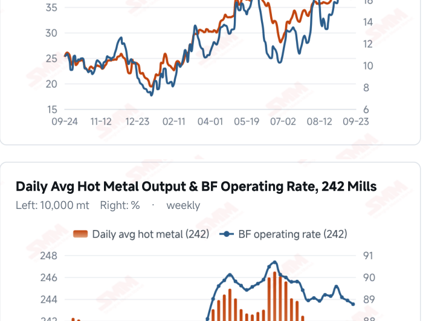
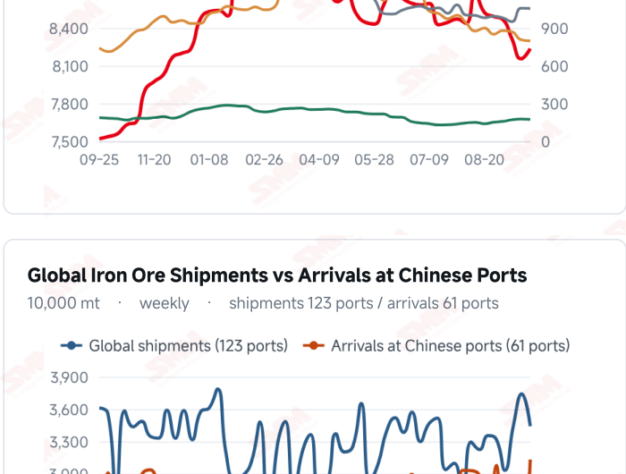
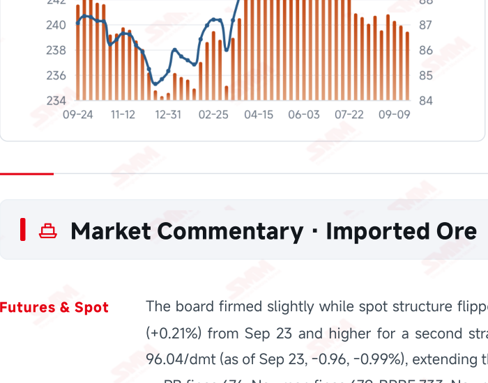
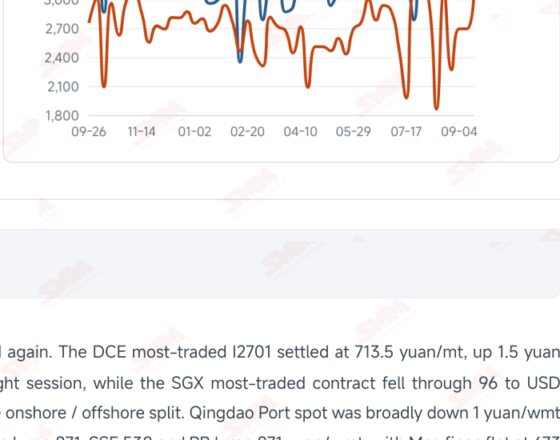

# SMM Iron Ore Daily — 2026-09-24 (Thursday)

**Source:** SMM Data-pro · Shanghai Metals Market (SMM)

---

## Futures Contracts

| Exchange | Contract | Price | Unit | Daily Change | Daily Change % | MTD Avg |
|:---|:---|:---:|:---:|:---:|:---:|:---:|
| SGX | SGX Iron Ore Most-traded | 96.04 | USD/dmt | -0.96 | -0.99% | 97.84 |
| DCE | DCE Iron Ore Most-traded I2701 | 713.50 | yuan/mt | +1.5 | +0.21% | 719.90 |

## SMM Iron Ore Price Index (Physical & Benchmark Indices)

| Index Name | Market Type | Fe % | Price | Unit | Daily Change | Daily Change % | MTD Avg |
|:---|:---|:---:|:---:|:---:|:---:|:---:|:---:|
| MMi 61% Port Spot | port_spot | 61.0% | 689.00 | yuan/wmt | -1.0 | -0.14% | 695.00 |
| MMi 58% Port Spot | port_spot | 58.0% | 645.00 | yuan/wmt | 0.0 | 0.00% | 649.00 |
| MMi 65% Port Spot | port_spot | 65.0% | 846.00 | yuan/wmt | +2.0 | +0.24% | 840.00 |
| MMi 61% Seaborne Index | seaborne | 61.0% | 95.25 | USD/dmt | -0.05 | -0.05% | 96.89 |
| MMi 65% Seaborne Index | seaborne | 65.0% | 112.60 | USD/dmt | +0.2 | +0.18% | 114.83 |
| SMM Domestic Ore Composite Index | domestic_composite | 66.0% | 831.59 | yuan/mt | -5.86 | -0.70% | 840.09 |

## Key View

### Ports have formally turned to building with fines up 808,100 mt in a week — but outflows rose too, and restocking still holds the floor

What several issues have been flagging has now landed: ports have formally turned to building. The 10-port total rose to 102.594 million mt, +681,500 mt WoW, ending three straight weeks of draws, with the 35-port series up in step to 145.45 million mt (+1.12 million mt). The product mix is unambiguous — the entire build is fines (+808,100 mt) while concentrates, lump and pellets all drew down. That is exactly how last week's 4.41 million mt surge in arrivals (+16.39%) shows up: the increment is fines, and it lands at the ports. The build is only half the picture, though. Outflows rose the same day, up 25,000 mt to 3.235 million mt, and SMM's wording is “arrivals up markedly, outflows lifted somewhat by pre-holiday restocking, yet ports still building modestly” — restocking is still holding the floor, just no longer holding it up. SMM's view for next week is blunt: arrivals keep rising, mill stocks keep accumulating, restocking support weakens. On price structure, today calls for a correction of my own. Yesterday Carajas fines fell 2 yuan while SSF rose 3, and the previous issue read that as mills shifting their burden mix down amid deepening losses. Today reversed completely — Carajas fines jumped 9 yuan to 851 while SSF slipped 1. That reading lasted a single session, so the last two days look more like short-term noise than a structural switch; today's strength in Carajas fines fits better with C3 Brazil→China freight rising to USD 43.38/mt (+0.84%). The onshore/offshore split persists: the DCE rose for a second session to 713.5 yuan/mt while SGX fell through 96 to USD 96.04/dmt, and domestic ore weakened in step, the composite index down to 831.59 yuan/mt (-0.70%). The indices sent a different signal today than yesterday: the 65% port spot index rose 2 yuan and the 65% seaborne USD 0.20, widening the high-low spread to 201 yuan/wmt, in line with the jump in Carajas fines. Where the two bases diverged yesterday, they confirm each other today, with high grade strongest on both sides. On balance, the build has started and restocking is on its way out; the two lines cross around the National Day break. Next week's arrivals and outflows, plus the actual path of October hot metal, will set the slope of this accumulation.

## Today's Highlights

- Ports have formally turned to building as the arrivals land. Inventory at the 10 ports rose to 102.594 million mt (+681,500 mt WoW, +0.67%), ending three straight weeks of draws; the entire build sits in fines (+808,100 mt), while concentrates (-86,900 mt), lump (-21,700 mt) and pellets (-18,000 mt) still drew down. On SMM's news basis the 35 ports rose to 145.45 million mt (+1.12 million mt).
- But outflows rose too — restocking is still holding the floor. Daily average outbound volume at the 35 ports gained 25,000 mt to 3.235 million mt, which SMM reads as “arrivals up markedly and outflows lifted somewhat by pre-holiday restocking, yet ports still building modestly”. Its view for next week: arrivals should keep rising, mill stocks keep accumulating, and the restocking support weaken at the margin.
- Carajas fines jumped 9 yuan and the structure flipped straight back. Qingdao Port spot fell 1 yuan across the board (Mac fines flat), while Carajas fines rose 9 yuan to 851 yuan/wmt (+1.07%) and SSF slipped 1 yuan to 538 — the exact opposite of yesterday's “Carajas -2, SSF +3”. The “mills shifting their burden mix down” reading from the previous issue lasted a single session; the past two days look more like short-term noise than a structural switch. Today's indices do validate the Carajas move, however — the 65% port spot index rose 2 yuan to 846 and the 65% seaborne USD 0.20 to 112.60, widening the high-low spread to 201 yuan/wmt.
- Domestic ore keeps weakening and the onshore/offshore split persists. The SMM China Domestic Ore Composite Price Index fell to 831.59 yuan/mt (-5.86 yuan, -0.70%), with Tangshan 66% concentrate at 930–940 yuan/mt ex-works, dry basis and tax exclusive. Offshore, the SGX most-traded contract broke below 96 to USD 96.04/dmt (as of Sep 23, -0.99%), while the DCE rose 1.5 yuan to 713.5 yuan/mt for a second straight session.

## Qingdao Port Imported Ore Spot Prices (yuan/wet mt, tax incl.)

| Product | Fe % | Type | Price (yuan/wmt) | Daily Change | Daily Change % | MTD Avg |
|:---|:---:|:---:|:---:|:---:|:---:|:---:|
| PB Fines 60.8% | 60.8% | Fines | 676.0 | -1.0 | -0.15% | 685.0 |
| Newman Fines 61.2% | 61.2% | Fines | 679.0 | -1.0 | -0.15% | 691.0 |
| Mac Fines 60.8% | 60.8% | Fines | 673.0 | 0.0 | 0.00% | 688.0 |
| BRBF 62.5% | 62.5% | Fines | 733.0 | -1.0 | -0.14% | 742.0 |
| Newman Lump 63% | 63.0% | Lump | 871.0 | -1.0 | -0.11% | 885.0 |
| Super Special Fines (SSF) 56.5% | 56.5% | Fines | 538.0 | -1.0 | -0.19% | 547.0 |
| Carajas Fines (IOCJ) 65% | 65.0% | Fines | 851.0 | +9.0 | +1.07% | 845.0 |
| PB Lump 61.5% | 61.5% | Lump | 871.0 | -1.0 | -0.11% | 881.0 |

## Imported Ore USD Prices & MMi Indices (CFR Qingdao, USD/dry mt)

| Product | Fe % | Type | Price (USD/dmt) | Daily Change | Daily Change % | MTD Avg |
|:---|:---:|:---:|:---:|:---:|:---:|:---:|
| Carajas Fines (IOCJ) 65% | 65.0% | Fines | 117.16 | +0.68 | +0.58% | 116.11 |
| PB Lump 61.6% | 61.6% | Lump | 119.30 | -1.46 | -1.21% | 121.35 |
| BRBF 62.5% | 62.5% | Fines | 100.34 | -0.74 | -0.73% | 101.55 |
| Newman Fines 61.2% | 61.2% | Fines | 92.64 | -0.75 | -0.80% | 94.33 |
| Mac Fines 61% | 61.0% | Fines | 91.93 | -0.46 | -0.50% | 93.88 |
| Jimblebar Fines 60.5% | 60.5% | Fines | 90.08 | -0.74 | -0.81% | 90.85 |
| FMG Blend Fines 58.5% | 58.5% | Fines | 87.94 | -0.74 | -0.83% | 88.41 |
| Newman Lump 63% | 63.0% | Lump | 120.01 | -0.75 | -0.62% | 121.84 |
| Super Special Fines (SSF) 57% | 57.0% | Fines | 72.55 | -0.73 | -1.00% | 73.87 |
| Indian Fines 57% | 57.0% | Fines | 67.99 | -0.73 | -1.06% | 69.54 |

## SMM Iron Ore Price Index — Weekly / Monthly Statistics

| Index Name | Month-to-date Avg | MoM % | YTD % | Unit |
|:---|:---:|:---:|:---:|:---:|
| SMM MMi 61% Iron Ore Seaborne Index | 96.89 | +1.63% | -10.1% | USD/dmt |
| SMM MMi 65% Iron Ore Seaborne Index | 114.83 | -0.83% | -7.2% | USD/dmt |
| SMM MMi 61% Iron Ore Port Spot Index | 695.00 | +0.75% | -15.3% | yuan/wmt |
| SMM MMi 65% Iron Ore Port Spot Index | 840.00 | +0.84% | -5.9% | yuan/wmt |
| SMM MMi 58% Iron Ore Port Spot Index | 649.00 | +1.51% | -10.2% | yuan/wmt |
| SMM China Domestic Ore Composite Price Index | 840.09 | -0.11% | -6.2% | yuan/mt |

## Key Price Drivers (12-Month Charts & Operational Metrics)

### Charts: Freight & Port Inventory

### Charts: Hot Metal Output & Shipments vs Arrivals

### Operational Fundamentals Snapshot

| Fundamental Indicator | Value | Unit |
|:---|:---:|:---:|
| Daily Avg Hot Metal Output (242 Mills) | 2.3943 | Million MT |
| Iron Ore Port Inventory (10 Major Ports) | 102.594 | Million MT |
| Daily Avg Port Outbound Volume | 3.235 | Million MT |

## Market Commentary · Imported Ore

### Futures & Spot

The board firmed slightly while spot structure flipped again. The DCE most-traded I2701 settled at 713.5 yuan/mt, up 1.5 yuan (+0.21%) from Sep 23 and higher for a second straight session, while the SGX most-traded contract fell through 96 to USD 96.04/dmt (as of Sep 23, -0.96, -0.99%), extending the onshore / offshore split. Qingdao Port spot was broadly down 1 yuan/wmt — PB fines 676, Newman fines 679, BRBF 733, Newman lump 871, SSF 538 and PB lump 871 yuan/wmt, with Mac fines flat at 673 — while Carajas fines jumped 9 yuan to 851 yuan/wmt (+1.07%), the only clear gainer. Note this is the exact opposite of yesterday's pattern (Carajas -2, SSF +3): the “mills shifting their burden mix down” reading offered in the previous issue lasted a single session, so the last two days are more likely short-term noise than a structural switch.

### Driver

SMM's read on the driver is unchanged from yesterday: iron ore fundamentals remain bearish, but the board firmed slightly on market talk of reduced Brazilian shipments. Its conclusion has hardened a notch: as pre-holiday restocking ends and arrivals recover, prices should trade under pressure and stay soft, with import margins following spot and weakening overall. Today's port data is that view landing — rising arrivals producing a build, with support still coming from restocking that has not yet finished.

### Demand

Hot metal was not updated this period and still stands at Sep 23's 2.3943 million mt (-4,800 mt WoW) with a blast furnace operating rate of 88.76% (-0.17 ppt). SMM has flagged that more mills are scheduling maintenance, with hot metal likely to fall more sharply once October begins and demand-side contraction expectations strengthening; maintenance losses are 1.5267 million mt this week and 1.5733 million next. The short-term support remains pre-holiday restocking — today's 25,000 mt rise in outflows to 3.235 million mt is the evidence — but SMM says plainly that this support is weakening at the margin.

### Inventory & Supply

The core change this period: ports have formally turned to building. The 10-port total was 102.594 million mt, up 681,500 mt WoW (+0.67%), ending three straight weeks of draws. The product mix points clearly: fines built 808,100 mt (+0.99%) while concentrates fell 86,900 mt (-1.08%), lump 21,700 mt and pellets 18,000 mt — the entire build is fines, which is exactly how last week's 4.41 million mt surge in arrivals (+16.39%) lands. The 35-port series moved in step: SMM news puts inventory at 145.45 million mt (+1.12 million mt) with daily outbound volume at 3.235 million mt (+25,000 mt). Caliber note: the Sep 24 35-port figure comes from SMM news; the Data-pro database has not yet synced (still Sep 18's 144.33 million mt), and the charts here use the database values. SMM's outlook for next week: arrivals should keep rising, mill stocks keep accumulating and restocking support weaken; if outflows keep running high and mill restocking beats expectations, the build could come in below current expectations.

### Cost & Margin

SMM's Sep 24 cost table again gives no figure, with the outlook that import margins will follow spot and weaken overall (the two prior issues said “broadly stable” and “edging lower”). For reference, the Sep 21 average margin was +6.48 yuan/mt. Freight diverged again: C3 Brazil→China rose USD 0.36 to 43.38/mt (+0.84%) while C5 Australia→China eased USD 0.09 to 16.64/mt (-0.54%, both as of Sep 23). C3's continued climb lines up with today's jump in Carajas fines — Brazilian route costs still support Brazilian high grade.

## Market Commentary · Domestic Ore

### Prices

The domestic composite index kept falling. The SMM China Domestic Ore Composite Price Index reads 831.59 yuan/mt as of Sep 24, down 5.86 yuan (-0.70%) from Sep 23. Regionally, Tangshan concentrate prices were little changed, with 66% concentrate at 930–940 yuan/mt ex-works, dry basis and tax exclusive.

### Supply & Demand

Both sides are clearly testing each other and trading is quiet. On supply, run-of-mine and concentrate resources remain relatively tight, offering some support to local prices; domestic mine capacity utilisation had already recovered to 58.2% last week with concentrate output at 900,000 mt. On demand, mill losses are pronounced and buyers are pressing concentrators hard on price.

### Outlook

SMM expects Tangshan concentrate prices to stay soft and rangebound near term. With mill losses persisting and expectations of wider October maintenance strengthening, domestic ore lacks demand support; and with only Carajas fines rising among imported grades today, relative value offers little lift either.

## Market Factors

### Supportive Factors

- Daily outbound volume at the 35 ports rose 25,000 mt to 3.235 million mt as restocking keeps lifting material.
- Carajas fines jumped 9 yuan to 851 yuan/wmt, a pulse of high-grade demand.
- C3 Brazil→China freight rose to USD 43.38/mt (+0.84%), strengthening cost support for Brazilian high grade.
- The DCE contract rose 1.5 yuan to 713.5 yuan/mt, higher for a second straight session.
- Concentrates, lump and pellets at the 10 ports still drew down; the build is confined to fines.
- Tight run-of-mine and concentrate resources still support domestic concentrate prices.

### Bearish Factors

- The 10 ports built 681,500 mt, ending three weeks of draws, with fines alone up 808,100 mt.
- The 35 ports rose to 145.45 million mt, +1.12 million mt WoW (SMM news basis).
- SMM expects arrivals up, mill stocks accumulating and restocking support weakening next week.
- The SGX contract broke below 96 to USD 96.04/dmt (-0.99%); offshore is not endorsing the onshore rally.
- Hot metal at 2.3943 million mt and the operating rate at 88.76% keep falling, with October maintenance building.
- The domestic composite index fell to 831.59 yuan/mt (-0.70%) as domestic ore weakens in step.

## Flash News Briefs

- Iron Ore Port Inventory and Outbound Volume, Sep 24, 2026 (35 ports 145.45 million mt, +1.12 million mt WoW)
- Iron Ore Inventory at 10 Ports by Product, Sep 24, 2026 (102.59 million mt, +681,500 mt; fines build clearly)
- SMM Imported Iron Ore Cost & Margin Table, Sep 24, 2026 (arrivals recovering; prices expected under pressure)
- [SMM Domestic Iron Ore Brief] Tangshan concentrate prices set to trade rangebound
- Ocean Freight and Dry Bulk Shipping Indices, Sep 23

---
*(c) 2026 Shanghai Metals Market (SMM) · Iron Ore Value-Chain Data & Research*
