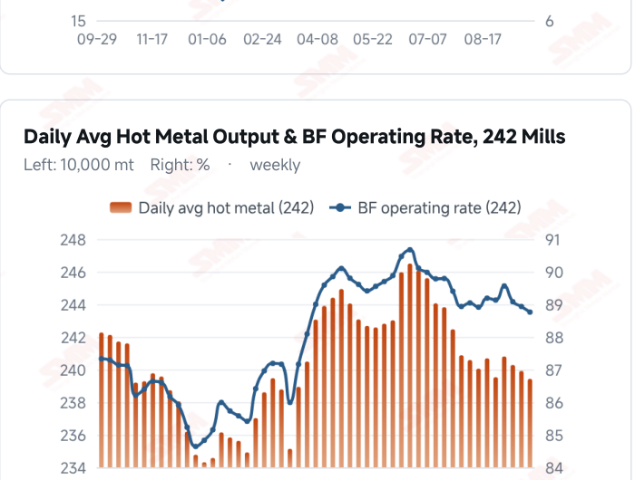
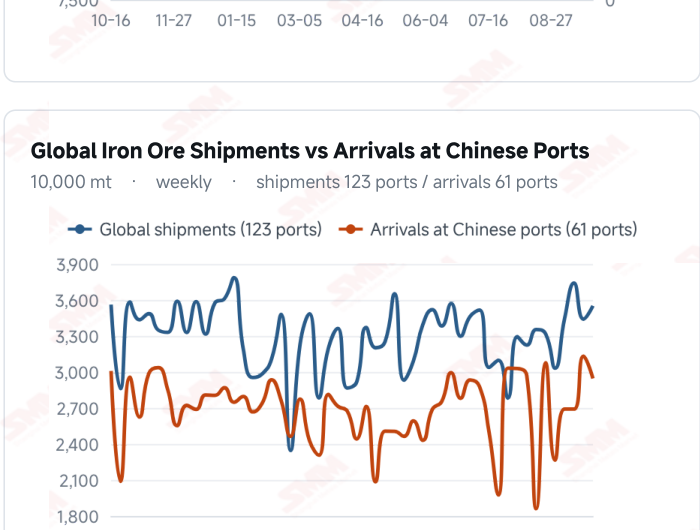
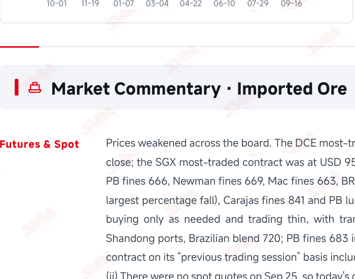
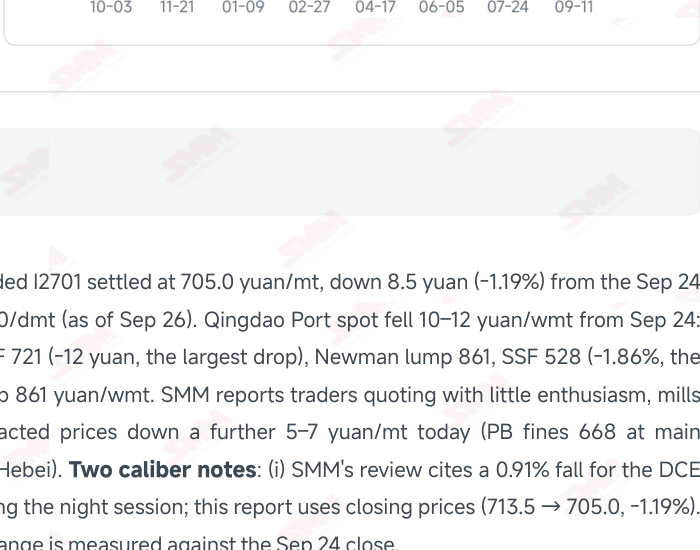

# SMM Iron Ore Daily — 2026-09-28 (Monday)

**Source:** SMM Data-pro · Shanghai Metals Market (SMM)

---

## Futures Contracts

| Exchange | Contract | Price | Unit | Daily Change | Daily Change % | MTD Avg |
|:---|:---|:---:|:---:|:---:|:---:|:---:|
| SGX | SGX Iron Ore Most-traded | 95.10 | USD/dmt | -0.65 | -0.68% | 97.54 |
| DCE | DCE Iron Ore Most-traded I2701 | 705.00 | yuan/mt | -8.5 | -1.19% | 719.20 |

## SMM Iron Ore Price Index (Physical & Benchmark Indices)

| Index Name | Market Type | Fe % | Price | Unit | Daily Change | Daily Change % | MTD Avg |
|:---|:---|:---:|:---:|:---:|:---:|:---:|:---:|
| MMi 61% Port Spot | port_spot | 61.0% | 677.00 | yuan/wmt | -12.0 | -1.74% | 694.00 |
| MMi 58% Port Spot | port_spot | 58.0% | 643.00 | yuan/wmt | -2.0 | -0.31% | 648.00 |
| MMi 65% Port Spot | port_spot | 65.0% | 837.00 | yuan/wmt | -9.0 | -1.06% | 840.00 |
| MMi 61% Seaborne Index | seaborne | 61.0% | 94.40 | USD/dmt | -0.85 | -0.89% | 96.76 |
| MMi 65% Seaborne Index | seaborne | 65.0% | 112.15 | USD/dmt | -0.45 | -0.40% | 114.69 |
| SMM Domestic Ore Composite Index | domestic_composite | 66.0% | 831.59 | yuan/mt | -5.86 | -0.70% | 840.09 |

## Key View

### Restocking has formally ended and prices fell across the board; the high-grade premium gave back 7 yuan in a session and last week's structure has broken down

The previous issue closed by saying the build had started, restocking was on its way out, and the two lines would cross around the National Day break — that crossing has arrived. SMM states today that “restocking demand for iron ore is largely complete and price support is weakening”, and prices duly fell across the board: the DCE most-traded contract dropped 8.5 yuan to 705.0 yuan/mt and Qingdao Port spot fell 10–12 yuan/wmt, with traders quoting listlessly, mills buying only as needed and trading thin. Structurally, the “high grade alone is strong” theme of last week broke down in a single session: the MMi 61% port spot index fell 12 yuan (-1.74%), the largest of the five, against -9 for the 65% and just -2 for the 58%, so the high-low spread collapsed from 201 to 194 yuan/wmt, unwinding the entire widening of the previous four sessions. That confirms the earlier call: the past fortnight's grade divergence was noise, not trend. Supply produced a divergence worth tracking: global shipments recovered 3.21%, with Australia back above 20 million mt at 20.7633 million while Brazil fell a further 8.61% to 6.7772 million. SMM attributes Brazil's decline to high freight curbing shipments from some smaller miners — one of the few supports left, and the industrial footnote to C3's elevated level. Arrivals, meanwhile, fell 5.93%, easing pressure for now. On demand, the line that matters most is “some mills have moved maintenance plans to after the holiday because of tight coke supply”: the gap is delayed, not removed, and October's fall in hot metal may be more concentrated. CISA's mid-September pig iron output of 1.770 million mt/day (-1.4%) now aligns with SMM's sample, closing the earlier caliber gap. On balance, the restocking support has left the stage and prices lack support, staying soft near term — in line with SMM's conclusion. Three things to watch after the holiday: the actual size of October's hot metal decline, whether Brazilian shipments recover as freight eases, and the slope of the port build.

## Today's Highlights

- Restocking has formally ended and prices fell across the board. SMM states plainly that “restocking demand for iron ore is largely complete and price support is weakening”. The DCE most-traded I2701 settled at 705.0 yuan/mt (-8.5 yuan, -1.19% on a closing basis; SMM cites -0.91% including the night session). Qingdao Port spot fell 10–12 yuan/wmt from Sep 24 — PB fines 666, Carajas fines 841, SSF 528 and BRBF 721 yuan/wmt — with SMM reporting a further 5–7 yuan drop in transacted prices today.
- The high-grade premium gave back 7 yuan in a single session. All five MMi indices fell, and the 61% port spot index led with 12 yuan to 677 (-1.74%), against -9 for the 65% to 837 and just -2 for the 58% to 643. The high-low spread collapsed from 201 to 194 yuan/wmt, unwinding the previous four sessions of widening — last week's “high grade alone is strong” structure has broken down.
- Supply recovered and arrivals fell, but Brazil is the variable. Global shipments reached 35.5121 million mt last week (+3.21%), with Australia back above 20 million at 20.7633 million (+6.50%), while Brazil fell again to 6.7772 million mt (-8.61%). Arrivals at Chinese ports came to 29.4625 million mt (-5.93%). SMM attributes Brazil's decline to sustained highs in Brazilian freight curbing shipments from some smaller miners — one of the few supports left.
- Maintenance pushed past the holiday: the demand gap is delayed, not removed. SMM reports that mill losses have not improved and most mills are holding output at recent levels, but some have moved maintenance plans to after the holiday because of tight coke supply. CISA's series has also turned down: key enterprise pig iron output averaged 1.770 million mt/day in mid-September, -1.4% (vs 1.795 million and +1.7% in early September), finally aligning with SMM's sample.

## Qingdao Port Imported Ore Spot Prices (yuan/wet mt, tax incl.)

| Product | Fe % | Type | Price (yuan/wmt) | Daily Change | Daily Change % | MTD Avg |
|:---|:---:|:---:|:---:|:---:|:---:|:---:|
| PB Fines 60.8% | 60.8% | Fines | 666.0 | -10.0 | -1.48% | 684.0 |
| Newman Fines 61.2% | 61.2% | Fines | 669.0 | -10.0 | -1.47% | 690.0 |
| Mac Fines 60.8% | 60.8% | Fines | 663.0 | -10.0 | -1.49% | 687.0 |
| BRBF 62.5% | 62.5% | Fines | 721.0 | -12.0 | -1.64% | 741.0 |
| Newman Lump 63% | 63.0% | Lump | 861.0 | -10.0 | -1.15% | 884.0 |
| Super Special Fines (SSF) 56.5% | 56.5% | Fines | 528.0 | -10.0 | -1.86% | 546.0 |
| Carajas Fines (IOCJ) 65% | 65.0% | Fines | 841.0 | -10.0 | -1.18% | 845.0 |
| PB Lump 61.5% | 61.5% | Lump | 861.0 | -10.0 | -1.15% | 880.0 |

## Imported Ore USD Prices & MMi Indices (CFR Qingdao, USD/dry mt)

| Product | Fe % | Type | Price (USD/dmt) | Daily Change | Daily Change % | MTD Avg |
|:---|:---:|:---:|:---:|:---:|:---:|:---:|
| Carajas Fines (IOCJ) 65% | 65.0% | Fines | 116.60 | -0.56 | -0.48% | 116.14 |
| PB Lump 61.6% | 61.6% | Lump | 118.74 | -0.56 | -0.47% | 121.22 |
| BRBF 62.5% | 62.5% | Fines | 99.76 | -0.58 | -0.58% | 101.46 |
| Newman Fines 61.2% | 61.2% | Fines | 92.05 | -0.59 | -0.64% | 94.22 |
| Mac Fines 61% | 61.0% | Fines | 91.34 | -0.59 | -0.64% | 93.75 |
| Jimblebar Fines 60.5% | 60.5% | Fines | 89.48 | -0.6 | -0.67% | 90.78 |
| FMG Blend Fines 58.5% | 58.5% | Fines | 87.34 | -0.6 | -0.68% | 88.36 |
| Newman Lump 63% | 63.0% | Lump | 119.46 | -0.55 | -0.46% | 121.72 |
| Super Special Fines (SSF) 57% | 57.0% | Fines | 71.93 | -0.62 | -0.85% | 73.77 |
| Indian Fines 57% | 57.0% | Fines | 67.36 | -0.63 | -0.93% | 69.43 |

## SMM Iron Ore Price Index — Weekly / Monthly Statistics

| Index Name | Month-to-date Avg | MoM % | YTD % | Unit |
|:---|:---:|:---:|:---:|:---:|
| SMM MMi 61% Iron Ore Seaborne Index | 96.76 | +1.49% | -10.9% | USD/dmt |
| SMM MMi 65% Iron Ore Seaborne Index | 114.69 | -0.95% | -7.6% | USD/dmt |
| SMM MMi 61% Iron Ore Port Spot Index | 694.00 | +0.62% | -16.7% | yuan/wmt |
| SMM MMi 65% Iron Ore Port Spot Index | 840.00 | +0.82% | -6.9% | yuan/wmt |
| SMM MMi 58% Iron Ore Port Spot Index | 648.00 | +1.46% | -10.4% | yuan/wmt |
| SMM China Domestic Ore Composite Price Index | 840.09 | -0.11% | -6.2% | yuan/mt |

## Key Price Drivers (12-Month Charts & Operational Metrics)

### Charts: Freight & Port Inventory

### Charts: Hot Metal Output & Shipments vs Arrivals

### Operational Fundamentals Snapshot

| Fundamental Indicator | Value | Unit |
|:---|:---:|:---:|
| Blast Furnace Capacity Utilisation (242 Mills) | 58.1 | % |
| Iron Ore Port Inventory (10 Major Ports) | 102.594 | Million MT |
| Iron Ore Port Inventory (35 Major Ports) | 145.45 | Million MT |
| Daily Avg Port Outbound Volume | 3.235 | Million MT |
| Global Iron Ore Shipments (Weekly) | 35.5121 | Million MT |
| Chinese Port Arrivals (Weekly) | 1.8581 | Million MT |
| Domestic Mine Capacity Utilisation | 58.1 | % |

## Market Commentary · Imported Ore

### Futures & Spot

Prices weakened across the board. The DCE most-traded I2701 settled at 705.0 yuan/mt, down 8.5 yuan (-1.19%) from the Sep 24 close; the SGX most-traded contract was at USD 95.10/dmt (as of Sep 26). Qingdao Port spot fell 10–12 yuan/wmt from Sep 24: PB fines 666, Newman fines 669, Mac fines 663, BRBF 721 (-12 yuan, the largest drop), Newman lump 861, SSF 528 (-1.86%, the largest percentage fall), Carajas fines 841 and PB lump 861 yuan/wmt. SMM reports traders quoting with little enthusiasm, mills buying only as needed and trading thin, with transacted prices down a further 5–7 yuan/mt today (PB fines 668 at main Shandong ports, Brazilian blend 720; PB fines 683 in Hebei). Two caliber notes: (i) SMM's review cites a 0.91% fall for the DCE contract on its “previous trading session” basis including the night session; this report uses closing prices (713.5 → 705.0, -1.19%). (ii) There were no spot quotes on Sep 25, so today's change is measured against the Sep 24 close.

### Driver

SMM identifies three drivers over the past week: first, pre-holiday restocking nearing its end — with the Mid-Autumn and National Day breaks approaching, mills have completed most of their raw material cover, buying interest has fallen away and spot trading is thin; second, hot metal output continuing to fall as deepening mill losses drive more blast furnace maintenance, suppressing ore demand; third, sustained highs in Brazilian freight curbing shipments from some smaller miners, which lends prices some support. Today SMM goes further: restocking demand is largely complete, price support is weakening, and prices lack support and should stay soft near term.

### Demand

Hot metal was not updated this period and still stands at Sep 23's 2.3943 million mt (-4,800 mt WoW) with an 88.76% operating rate. SMM reports mill losses have not meaningfully improved and most mills are holding output at recent levels, but some have moved maintenance plans to after the holiday because of tight coke supply — meaning the demand gap is delayed rather than removed, and October's decline in hot metal may be more concentrated. CISA's series turned down this period: key enterprise pig iron output averaged 1.770 million mt/day in mid-September, -1.4% WoW (early September was 1.795 million, +1.7%), finally aligning with SMM's 242-mill sample; steel product inventory was 17.08 million mt, up 560,000 mt (+3.4%) from the prior ten days. Data anomaly note: Data-pro shows imported ore stocks at 242 mills jumping from 78.61 to 92.9984 million mt (+14.3884 million mt, +18.30%), with days of consumption up from 20.5 to 24.3. That increase is 3.3 times the largest weekly change of the past 14 weeks (+4.37 million mt), the figure carries two decimals for the first time, and it directly contradicts SMM's statement that restocking is largely complete. This report treats it as most likely a sample or methodology change rather than genuine restocking, pending clarification from SMM.

### Inventory & Supply

Supply recovered. Global iron ore shipments totalled 35.5121 million mt last week, up 1.1056 million mt (+3.21%) with the year-to- date total flat YoY; Australia at 20.7633 million mt (+1.2676 million mt, +6.50%) is back above 20 million and non- mainstream origins also grew, while Brazil fell again to 6.7772 million mt (-638,300 mt, -8.61%). Arrivals at Chinese ports came to 29.4625 million mt, down 1.8581 million mt (-5.93%), +4.9% YTD. At the ports, the 35-port total was 145.45 million mt (+1.12 million mt WoW) with daily outbound volume at 3.235 million mt (+25,000 mt); the 10-port total was 102.594 million mt (+681,500 mt), with fines building 808,100 mt while concentrates, lump and pellets drew down. Brazil's continued decline is worth tracking — SMM attributes it to high Brazilian freight curbing shipments from smaller miners.

### Cost & Margin

Both routes eased: C3 Brazil→China fell USD 0.32 to 43.06/mt (-0.74%) and C5 Australia→China USD 0.28 to 16.36/mt (-1.68%, both as of Sep 24). SMM nonetheless stresses in its weekly review that Brazilian freight has kept pushing higher and has already curbed shipments from some smaller miners — C3 may be lower day on day, but it remains in a high range above USD 43, so cost support for Brazilian grades has not gone. SMM's last three cost tables have given no margin figure, with outlooks of “broadly stable”, “edging lower” and “following spot weaker” in turn.

## Market Commentary · Domestic Ore

### Prices

The SMM China Domestic Ore Composite Price Index reads 831.59 yuan/mt (as of Sep 24, -0.70%), with no new print this period. Regional prices kept easing: eastern Liaoning 65% concentrate is at 825 yuan/mt, dry basis and tax exclusive; Tangshan 66% concentrate was previously quoted at 930–940 yuan/mt ex-works on the same basis.

### Supply & Demand

SMM's survey puts domestic mine capacity utilisation at 58.1% this week, down 0.1 ppt, with concentrate output at 898,000 mt (-2,000 mt) and mine concentrate stocks down 5,000 mt to around 248,000 mt. Concentrators are running to plan with no marked swings in output. With the National Day break approaching, some state-owned operations expect short maintenance and output may dip slightly, though the fall should be limited and production will resume after the holiday.

### Outlook

One positive signal has appeared: SMM notes that with domestic ore prices having fallen, domestic concentrate now offers better relative value, trading has improved from earlier and some concentrators report demand picking up. Mill losses remain pronounced and buyers are pressing hard, however, so SMM expects eastern Liaoning concentrate prices to stay soft and rangebound near term.

## Market Factors

### Supportive Factors

- Brazilian shipments fell 8.61% to 6.7772 million mt, which SMM attributes to high freight curbing smaller miners.
- Arrivals at Chinese ports dropped 1.8581 million mt (-5.93%), easing supply pressure for now.
- Lower domestic ore prices have improved its relative value, and trading has picked up from earlier.
- Some mills pushed maintenance past the holiday, so the near-term hot metal decline may be smaller than feared.
- C3 freight eased day on day but stays in a high range above USD 43, still supporting Brazilian grades.
- Concentrates, lump and pellets at the 10 ports still drew down; the build is confined to fines.

### Bearish Factors

- SMM states restocking demand is largely complete and price support is weakening, leaving prices unsupported.
- The high-low spread collapsed from 201 to 194 yuan/wmt; the high-grade-alone structure has broken down.
- Global shipments rose 3.21% last week, with Australia back above 20 million mt at 20.7633 million.
- The 35 ports rose to 145.45 million mt and the 10 ports to 102.594 million; the build continues.
- CISA mid-September pig iron output was 1.770 million mt/day, -1.4%, now aligned with SMM's weaker read.
- Mill losses have not improved, and maintenance pushed to after the holiday may concentrate October's decline.

## Flash News Briefs

- Restocking ends and support weakens; ore prices set to stay soft [SMM Daily Iron Ore Review]
- [SMM Brief] Macro floor versus weak fundamentals — iron ore to keep trading soft in a narrow range
- [SMM Iron Ore Shipping] Global shipments up 3% WoW last week; arrivals down 6%
- [SMM Survey] Concentrators running to plan; iron ore concentrate output broadly steady
- [SMM Domestic Iron Ore Brief] Eastern Liaoning prices set to trade soft and rangebound
- Key Enterprise Steel Output and Inventory, Mid-September 2026 (pig iron 1.770 million mt/day, -1.4%)

---
*(c) 2026 Shanghai Metals Market (SMM) · Iron Ore Value-Chain Data & Research*
