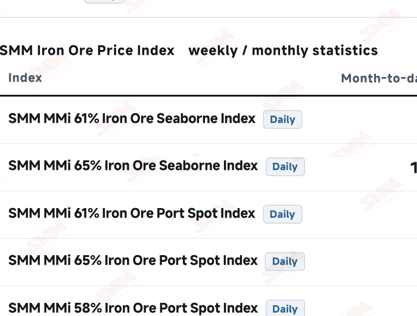
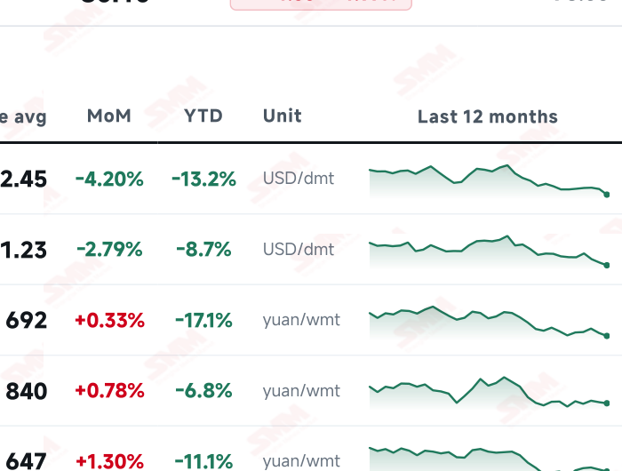
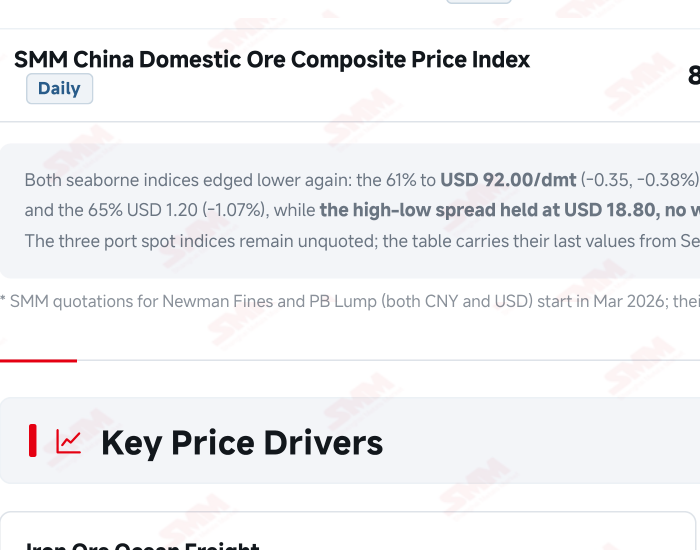
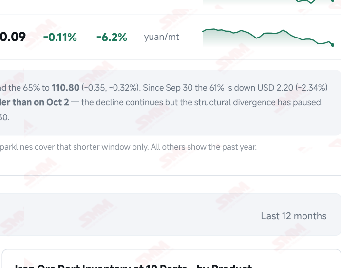

# SMM Iron Ore Daily — 2026-10-05 (Monday)

**Source:** SMM Data-pro · Shanghai Metals Market (SMM)

---

## Futures Contracts

| Exchange | Contract | Price | Unit | Daily Change | Daily Change % | MTD Avg |
|:---|:---|:---:|:---:|:---:|:---:|:---:|
| SGX | SGX Iron Ore Most-traded | 91.35 | USD/dmt | -1.17 | -1.26% | 92.43 |
| DCE | DCE Iron Ore Most-traded I2701 | 702.50 | yuan/mt | +3.5 | +0.50% | 717.40 |

## SMM Iron Ore Price Index (Physical & Benchmark Indices)

| Index Name | Market Type | Fe % | Price | Unit | Daily Change | Daily Change % | MTD Avg |
|:---|:---|:---:|:---:|:---:|:---:|:---:|:---:|
| MMi 61% Port Spot | port_spot | 61.0% | 674.00 | yuan/wmt | 0.0 | 0.00% (Holiday) | 692.00 |
| MMi 58% Port Spot | port_spot | 58.0% | 638.00 | yuan/wmt | 0.0 | 0.00% (Holiday) | 647.00 |
| MMi 65% Port Spot | port_spot | 65.0% | 838.00 | yuan/wmt | 0.0 | 0.00% (Holiday) | 840.00 |
| MMi 61% Seaborne Index | seaborne | 61.0% | 92.00 | USD/dmt | -0.35 | -0.38% | 92.45 |
| MMi 65% Seaborne Index | seaborne | 65.0% | 110.80 | USD/dmt | -0.35 | -0.31% | 111.23 |
| SMM Domestic Ore Composite Index | domestic_composite | 66.0% | 831.59 | yuan/mt | -5.86 | -0.70% | 840.09 |

## Key View

### Brazilian shipments surged 26.85% in a week, offshore markets fell four sessions to the edge of USD 90, and supply pressure at the reopen looks harder than the weekly review assumed

On the fourth session of the holiday China remained dark across the board, but this issue brought something more important than price — a hard supply number. For the week to Oct 2, Brazilian iron ore shipments reached 8.5967 million mt, up 1.8195 million mt or 26.85% WoW, reversing two straight weeks of decline, while Australia fell 1.2988 million mt (-6.26%) to 19.4645 million and the global total came in at 35.9424 million mt (+1.21%). Essentially all of the growth came from Brazil. That lines up exactly with the chain this report has followed for three weeks: C3 Brazil–China freight slid from 43.06 to 40.26, and the moment the cost constraint eased, Brazilian shipments came back. On a roughly 40-day voyage, the arrival pressure from this batch lands around mid-November. A correction to last issue is in order here. Our Oct 2 issue read CSN's guidance cut (45–47 to 39–41 million mt) as the first case of high freight converting into low-grade supply loss, yet the shipment data for that same week came in at +26.85%. The two are not truly contradictory — CSN is annual guidance and explicitly reversible, shipments are actual loadings — but for supply pressure at the reopen, actual loadings carry far more weight, and last issue's framing needs pulling back a step. On price, offshore markets have now fallen four sessions running: SGX most-traded went 93.50 (Sep 30) → 93.43 → 92.52 → 91.35 (Oct 3), a cumulative USD 2.15 or -2.30%, close to the floor of the USD 90–95/mt range SMM set out in its weekly review. The seaborne indices moved with it, the 61% at 92.00 (-0.38%) and the 65% at 110.80 (-0.32%); since Sep 30 the 61% is down 2.34% and the 65% 1.07%, so high grades still hold up better — but both fell by the same USD 0.35 today and the high-low spread held at USD 18.80 rather than widening, pausing the structural divergence of the first two holiday sessions. Laying out the post-holiday ledger: demand must absorb 1.6839 million mt of maintenance losses (a further +55,100 mt WoW), with SMM already warning that early-October maintenance planning could cut hot metal markedly; supply has just delivered a Brazilian shipment surge on top of the usual holiday port build; and prices have already given up 2.30% offshore, a gap the domestic market has to close at the reopen. All three point the same way. The only plausible support in the first week back is margin repair from a coke price cut — and SMM has been explicit that even if it lands, the pass-through to higher hot metal “will not happen in the first week back”.

## Today's Highlights

- Brazilian shipments jumped 26.85% in a single week — the hardest number of the holiday. For the week to Oct 2, SMM puts Brazilian iron ore shipments at 8.5967 million mt, up 1.8195 million mt (+26.85%) WoW and reversing two straight weeks of decline. Australian shipments fell over the same week to 19.4645 million mt (-1.2988 million, -6.26%), leaving global shipments at 35.9424 million mt (+430,300 mt, +1.21%) and arrivals in China at 29.0943 million mt (-368,200 mt, -1.25%).
- Offshore markets have fallen four sessions running, down to the lower edge of SMM's post-holiday range. SGX most-traded has slid from USD 93.50/dmt on Sep 30 to 91.35 on Oct 3, a cumulative USD 2.15 (-2.30%) over the four holiday sessions. SMM's weekly review put the post-holiday reference range at USD 90–95/mt, so prices now sit close to the floor of it.
- Seaborne indices fell again, but the grade divergence paused. The MMi 61% seaborne index reads USD 92.00/dmt (-0.35, 0.38%) and the 65% 110.80 (-0.35, -0.32%). Since Sep 30 the 61% is down 2.34% and the 65% 1.07%, so high grades still hold up better — but both fell by exactly USD 0.35 today, leaving the high-low spread at USD 18.80, no wider than on Oct 2.
- A fourth consecutive closed session in China. Yuan spot, the three port spot indices and the DCE were all unquoted and the tables carry their last Sep 30 values. Hot metal (2.3882 million mt), 10-port stocks (103.02 million mt) and freight (C3 40.26 / C5 14.13) were likewise not updated over the break, so the first prints after the holiday carry every outstanding test at once.

## Qingdao Port Imported Ore Spot Prices (yuan/wet mt, tax incl.)

| Product | Fe % | Type | Price (yuan/wmt) | Daily Change | Daily Change % | MTD Avg |
|:---|:---:|:---:|:---:|:---:|:---:|:---:|
| PB Fines 60.8% | 60.8% | Fines | 665.0 | 0.0 | 0.00% (Holiday) | 683.0 |
| Newman Fines 61.2% | 61.2% | Fines | 668.0 | 0.0 | 0.00% (Holiday) | 688.0 |
| Mac Fines 60.8% | 60.8% | Fines | 667.0 | 0.0 | 0.00% (Holiday) | 685.0 |
| BRBF 62.5% | 62.5% | Fines | 720.0 | 0.0 | 0.00% (Holiday) | 739.0 |
| Newman Lump 63% | 63.0% | Lump | 860.0 | 0.0 | 0.00% (Holiday) | 881.0 |
| Super Special Fines (SSF) 56.5% | 56.5% | Fines | 527.0 | 0.0 | 0.00% (Holiday) | 545.0 |
| Carajas Fines (IOCJ) 65% | 65.0% | Fines | 842.0 | 0.0 | 0.00% (Holiday) | 845.0 |
| PB Lump 61.5% | 61.5% | Lump | 860.0 | 0.0 | 0.00% (Holiday) | 878.0 |

## Imported Ore USD Prices & MMi Indices (CFR Qingdao, USD/dry mt)

| Product | Fe % | Type | Price (USD/dmt) | Daily Change | Daily Change % | MTD Avg |
|:---|:---:|:---:|:---:|:---:|:---:|:---:|
| Carajas Fines (IOCJ) 65% | 65.0% | Fines | 116.54 | 0.0 | 0.00% (Holiday) | 116.14 |
| PB Lump 61.6% | 61.6% | Lump | 119.11 | 0.0 | 0.00% (Holiday) | 121.00 |
| BRBF 62.5% | 62.5% | Fines | 99.12 | 0.0 | 0.00% (Holiday) | 101.22 |
| Newman Fines 61.2% | 61.2% | Fines | 91.69 | 0.0 | 0.00% (Holiday) | 93.96 |
| Mac Fines 61% | 61.0% | Fines | 91.55 | 0.0 | 0.00% (Holiday) | 93.49 |
| Jimblebar Fines 60.5% | 60.5% | Fines | 89.55 | 0.0 | 0.00% (Holiday) | 90.64 |
| FMG Blend Fines 58.5% | 58.5% | Fines | 87.26 | 0.0 | 0.00% (Holiday) | 88.23 |
| Newman Lump 63% | 63.0% | Lump | 119.11 | 0.0 | 0.00% (Holiday) | 121.46 |
| Super Special Fines (SSF) 57% | 57.0% | Fines | 71.55 | 0.0 | 0.00% (Holiday) | 73.54 |
| Indian Fines 57% | 57.0% | Fines | 66.98 | 0.0 | 0.00% (Holiday) | 69.18 |

## SMM Iron Ore Price Index — Weekly / Monthly Statistics

| Index Name | Month-to-date Avg | MoM % | YTD % | Unit |
|:---|:---:|:---:|:---:|:---:|
| SMM MMi 61% Iron Ore Seaborne Index | 92.45 | -4.20% | -13.2% | USD/dmt |
| SMM MMi 65% Iron Ore Seaborne Index | 111.23 | -2.79% | -8.7% | USD/dmt |
| SMM MMi 61% Iron Ore Port Spot Index | 692.00 | +0.33% | -17.1% | yuan/wmt |
| SMM MMi 65% Iron Ore Port Spot Index | 840.00 | +0.78% | -6.8% | yuan/wmt |
| SMM MMi 58% Iron Ore Port Spot Index | 647.00 | +1.30% | -11.1% | yuan/wmt |
| SMM China Domestic Ore Composite Price Index | 840.09 | -0.11% | -6.2% | yuan/mt |

## Key Price Drivers (12-Month Charts & Operational Metrics)

### Charts: Freight & Port Inventory

### Charts: Hot Metal Output & Shipments vs Arrivals

### Operational Fundamentals Snapshot

| Fundamental Indicator | Value | Unit |
|:---|:---:|:---:|
| C3 Freight (Brazil to China) | 40.26 | USD/mt |
| C5 Freight (Australia to China) | 14.13 | USD/mt |
| Daily Avg Hot Metal Output (242 Mills) | 2.3882 | Million MT |
| Blast Furnace Operating Rate (242 Mills) | 88.57 | % |
| Blast Furnace Capacity Utilisation (242 Mills) | 88.15 | % |
| Iron Ore Port Inventory (10 Major Ports) | 103.02 | Million MT |
| Iron Ore Port Inventory (35 Major Ports) | 145.45 | Million MT |
| Global Iron Ore Shipments (Weekly) | 35.9424 | Million MT |
| Chinese Port Arrivals (Weekly) | 29.0943 | Million MT |
| Domestic Mine Capacity Utilisation | 58.1 | % |

## Market Commentary · Imported Ore

### Futures & Spot

A fourth consecutive closed session in China. Yuan spot, the three port spot indices and the DCE were all unquoted; the tables carry their last Sep 30 values with a marker. Offshore, SGX most-traded traced 93.50 (Sep 30) → 93.43 → 92.52 → 91.35 (Oct 3), a cumulative fall of USD 2.15 or 2.30% across the four holiday sessions; the seaborne indices on Oct 5 read 92.00 for the 61% (-0.38%) and 110.80 for the 65% (-0.32%). Basis note: “prices as of Oct 5” applies only to the seaborne indices — yuan spot and port spot stop at Sep 30, SGX at Oct 3, freight at Sep 29, and the weekly supply figures cover the week to Oct 2. The “Seaborne Fines Prices in USD” sub-table below is dated Oct 2, behind this issue's seaborne indices; its own cut-off is labelled in the table header. Note also that SMM's SGX series carries Saturday observations (Oct 3 was a Saturday); this report labels by the series date, consistent with earlier issues.

### Driver

No new news flow over the break, but one very hard data point: the surge in Brazilian shipments. It matches the chain this report has tracked for three weeks — C3 freight slid from 43.06 to 40.26, and once that cost constraint loosened, Brazilian shipments came straight back. A correction to last issue is warranted here: our Oct 2 issue read CSN's guidance cut as “high freight converting into low-grade supply loss”, yet the shipment data for the same week came in at +26.85%. The two are not strictly contradictory — CSN is annual guidance and explicitly reversible, while shipments are actual loadings — but for supply pressure at the reopen, actual loadings clearly carry more weight, and last issue's framing needs pulling back a step.

### Demand

No demand updates over the break. The Sep 30 prints still stand: daily average hot metal across 242 mills at 2.3882 million mt (-6,100 mt WoW), the blast furnace operating rate at 88.57% and capacity utilisation at 88.15% — a fourth consecutive WoW decline with the drops widening (3,700 → 4,800 → 6,100 mt). The first week back must absorb the 1.6839 million mt of maintenance losses projected for Oct 3–9, a further 55,100 mt WoW, and SMM has already flagged that some mills will set maintenance plans in early October with hot metal possibly falling markedly. Every open question on demand rests on that first print.

### Inventory & Supply

The only new data this issue — and it leans bearish. For the week to Oct 2, global iron ore shipments reached 35.9424 million mt (+430,300 mt, +1.21% WoW), of which Brazil contributed 8.5967 million mt (+1.8195 million, +26.85%) against Australia's 19.4645 million mt (-1.2988 million, -6.26%); arrivals in China fell for a second week to 29.0943 million mt (-368,200 mt, -1.25%). Essentially all of the shipment growth came from Brazil while Australia shrank — consistent with the freight structure, since C3 fell from 43.06 to 40.26 in two weeks and the Brazilian route's cost constraint eased first. On a roughly 40-day Brazil–China voyage, the arrival pressure from this batch lands around mid-November. Port stocks still read 103.0165 million mt across 10 ports as of Sep 30 (+430,000 mt WoW) and 145.45 million mt across 35 ports as of Sep 25; freight was last published Sep 29 at USD 40.26/mt for C3 and 14.13 for C5.

### Cost & Margin

No cost table update over the break; the Oct 1 print of an average 2.45 yuan/mt loss still stands (narrowed from 6.12 on a modest spot rise, a stronger yuan and lower freight). Offshore prices have since fallen another 2.30%, so if port spot catches down to offshore after the holiday, that margin improvement gets eaten back; conversely, a persistently firm yuan and soft freight would keep the loss contained. Our view is unchanged: improvements driven by the currency and freight do not reflect ore strength and should not be extrapolated.

## Market Commentary · Domestic Ore

### Prices

The domestic ore market was closed for a fourth consecutive session with no new quotations. The SMM China Domestic Ore Composite Price Index still reads 831.59 yuan/mt (as of Sep 24, -0.70%).

### Supply & Demand

Monthly data still show September national iron ore concentrate output of 18.87 million mt and inventory of 280,000 mt; weekly figures remain the Sep 25 prints of a 58.1% mine capacity utilisation rate and 898,000 mt of concentrate output. Worth noting: this period's growth in imported ore shipments is concentrated in Brazilian fines, which substitute only marginally for domestic concentrates — the two occupy different positions in the burden, and domestic concentrate pricing still turns mainly on regional supply and contract relationships.

### Outlook

Direction for domestic ore after the holiday rests on three things: how much of the 1.6839 million mt of maintenance losses actually materialises, whether the first round of coke price cuts lands, and how far imported ore catches down. Given tight domestic supply, a high share of contract volumes and September concentrate stocks of just 280,000 mt, domestic ore typically has less catch-down to do — but a wider wave of mill maintenance after the holiday would squeeze its demand side too.

## Market Factors

### Supportive Factors

- The high-low spread held at USD 18.80 without widening; the high-grade decline is slowing.
- The average imported ore loss still reads 2.45 yuan/mt, constraining further downside.
- Arrivals in China fell for a second week to 29.0943 million mt (-1.25% WoW).
- CSN cut 2026 guidance to 39–41 million mt, pressuring low-grade supply over the medium term.
- Talk of a first round of coke price cuts persists; landing after the holiday would ease mill cost pressure.
- September manufacturing PMI rose to 50.1%, back in expansion territory.

### Bearish Factors

- Brazilian shipments surged 1.8195 million mt (+26.85%) in a single week to 8.5967 million mt.
- Global shipments reached 35.9424 million mt (+1.21% WoW), reinforcing the comfortably supplied backdrop.
- SGX fell 2.30% across the four holiday sessions to USD 91.35/dmt, close to the floor of the 90–95 range.
- The seaborne 61% is down 2.34% since Sep 30 and the 65% down 1.07%.
- Maintenance losses of 1.6839 million mt land in the first week back, a further +55,100 mt WoW.
- Port stocks build through the holiday and mill deliveries bunch up; neither side favours prices at the reopen.

## Flash News Briefs

- [SMM Imported Ore Weekly] Restocking support withdrawn, hot metal down five readings, pre-holiday decline confirmed
- MMi Iron Ore Port Spot Index Report (Oct 2)
- SMM Imported Iron Ore Cost & Margin Table, Oct 1, 2026 (average loss 6.12 → 2.45 yuan/mt)
- MMi Iron Ore Port Spot Index Report (Oct 1)
- Iron Ore Inventory by Product at 10 Ports, Sep 30, 2026 (total 103.02 million mt, +430,000 mt WoW)
- [SMM BF Operating Rate] Weaker mill production appetite as hot metal output keeps sliding (2.3882 million mt, -6,100 mt WoW)

---
*(c) 2026 Shanghai Metals Market (SMM) · Iron Ore Value-Chain Data & Research*
