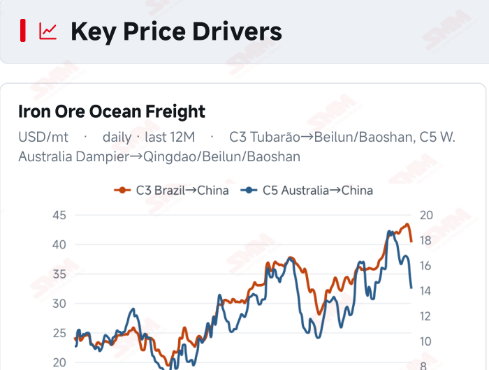
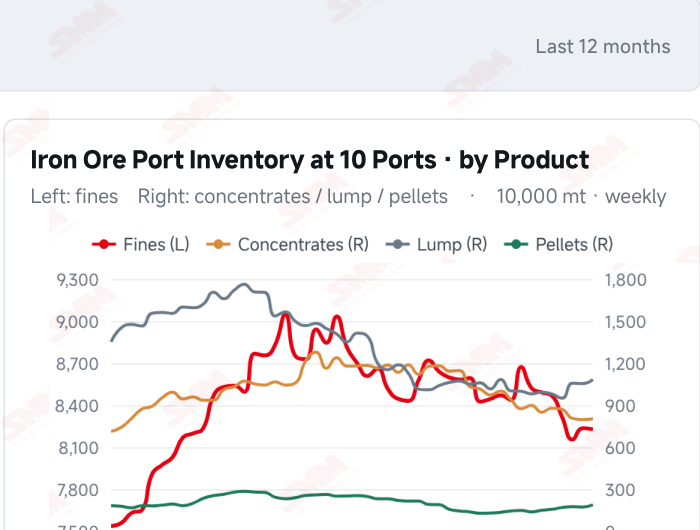
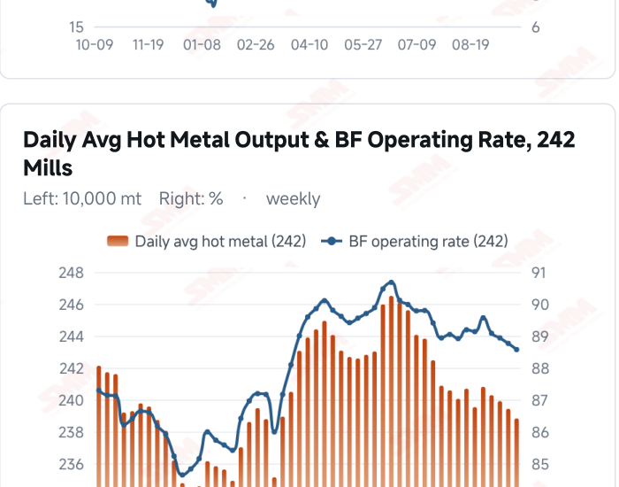
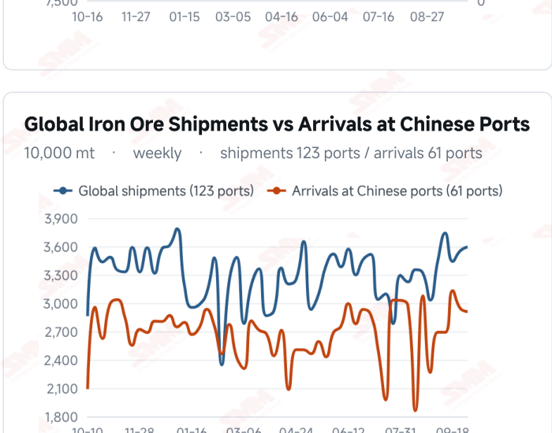

# SMM Iron Ore Daily — 2026-10-06 (Tuesday)

**Source:** SMM Data-pro · Shanghai Metals Market (SMM)

---

## Futures Contracts

| Exchange | Contract | Price | Unit | Daily Change | Daily Change % | MTD Avg |
|:---|:---|:---:|:---:|:---:|:---:|:---:|
| SGX | SGX Iron Ore Most-traded | 91.35 | USD/dmt | 0.0 | 0.00% | 92.16 |

## SMM Iron Ore Price Index (Physical & Benchmark Indices)

| Index Name | Market Type | Fe % | Price | Unit | Daily Change | Daily Change % | MTD Avg |
|:---|:---|:---:|:---:|:---:|:---:|:---:|:---:|
| MMi 61% Seaborne Index | seaborne | 61.0% | 91.65 | USD/dmt | -0.35 | -0.38% | 92.25 |
| MMi 65% Seaborne Index | seaborne | 65.0% | 110.00 | USD/dmt | -0.8 | -0.72% | 110.92 |

## Key View

### Seaborne quotations remain soft as the grade spread narrows; post-holiday buying remains key

Seaborne prices continued to ease as the composite grade spread narrowed. On Oct 6, the MMi 61% index was USD 91.65/dmt, down USD 0.35 from the previous reading; the 65% was 110.00, down USD 0.80, reducing the spread to USD 18.35. Mainstream brand quotations also softened, with PB, Newman and Mac Fines declining 0.27%–0.33%. The latest SGX reading, dated Oct 5, held at 91.35 without a further decline. The supply-demand backdrop remains anchored in pre-holiday and the latest weekly data. Global shipments rose to 35.9424 million mt in the week to Oct 2 as Brazil offset declines elsewhere, while arrivals in China fell to 29.0943 million mt. The lag between loadings and arrivals means supply pressure need not be immediate, but sustained high shipments could bring more available material to the domestic market. On demand, hot metal output fell to 2.3882 million mt on Sep 30, while mill profitability and maintenance schedules may continue to restrain discretionary buying. Actual post-holiday purchasing may matter more for direction than a single day’s price move during the break. If mills focus on immediate requirements, softer seaborne prices may continue to influence port pricing. Conversely, lower coke costs and stronger buying could ease downward pressure. A soft, range-bound outlook remains appropriate in the near term, with attention on hot metal, port inventories and mill restocking.

## Today's Highlights

- Seaborne indices eased further and the grade spread narrowed. On Oct 6, the MMi 61% seaborne index was USD 91.65/dmt, down USD 0.35 (-0.38%) from the previous reading; the 65% was 110.00, down USD 0.80 (-0.72%). Their spread narrowed from USD 18.80 to 18.35/dmt.
- Mainstream seaborne brand quotations moved lower. Against Oct 5, PB Fines were USD 91.90/dmt (-0.27%), Newman Fines 91.00 (-0.33%) and Mac Fines 91.40 (-0.27%); Jimblebar Fines were 86.95 (-0.80%), Brazilian Blend Fines 97.75 (-0.76%) and SP10 79.35 (-0.69%).
- Offshore futures held steady while China remained on holiday. SGX most-traded stood at USD 91.35/dmt as of Oct 5, unchanged from the previous observation. The DCE and yuan-denominated port spot market remained closed, with their last pre-holiday close and quotations retained in the respective data panels.
- Shipments and mill maintenance remain the key supply-demand considerations. In the week to Oct 2, global shipments were 35.9424 million mt, up 1.21% WoW, while arrivals in China fell 1.25% to 29.0943 million mt. Surveyed daily hot metal output was 2.3882 million mt on Sep 30, down 6,100 mt WoW; profitability and maintenance schedules continue to influence buying.

## Key Price Drivers (12-Month Charts & Operational Metrics)

### Charts: Freight & Port Inventory

### Charts: Hot Metal Output & Shipments vs Arrivals

### Operational Fundamentals Snapshot

| Fundamental Indicator | Value | Unit |
|:---|:---:|:---:|
| C3 Freight (Brazil to China) | 40.26 | USD/mt |
| C5 Freight (Australia to China) | 14.13 | USD/mt |
| Daily Avg Hot Metal Output (242 Mills) | 2.3882 | Million MT |
| Blast Furnace Operating Rate (242 Mills) | 88.57 | % |
| Blast Furnace Capacity Utilisation (242 Mills) | 58.1 | % |
| Global Iron Ore Shipments (Weekly) | 35.9424 | Million MT |
| Chinese Port Arrivals (Weekly) | 29.0943 | Million MT |

## Market Commentary · Imported Ore

### Futures & Spot

China remained on the National Day holiday. The last DCE close was 702.5 yuan/mt and Qingdao PB Fines were last quoted at 665 yuan/wmt, both dated Sep 30. SGX most-traded was USD 91.35/dmt as of Oct 5, unchanged from Oct 3. On Oct 6, the seaborne 61% index was USD 91.65/dmt and the 65% was 110.00, down 0.38% and 0.72%, respectively. Mainstream seaborne brand quotations moved lower, keeping the price trend soft.

### Driver

Lower seaborne prices alongside an unchanged latest SGX reading show some divergence between markets. Domestic buying participation may remain limited during the holiday, leaving overseas quotations sensitive to executable demand and brand-specific supply schedules. The 65% composite index fell more than the 61% this period, narrowing the grade spread. Whether this continues will depend on mill buying and blending choices after the reopening.

### Demand

SMM’s 242-mill survey showed daily average hot metal output of 2.3882 million mt on Sep 30, down 6,100 mt WoW; the blast furnace operating rate was 88.57% and capacity utilisation 88.15%. Output has fallen four consecutive times from 2.4080 million mt on Sep 2, with the latest three declines at 3,700, 4,800 and 6,100 mt. SMM projects maintenance-related output losses of 1.6839 million mt for Oct 3–9, up 55,100 mt from the previous week. If mill profitability remains under pressure, ore buying may stay focused on immediate needs.

### Inventory & Supply

In the week to Oct 2, global shipments rose 430,300 mt to 35.9424 million mt. Brazil added 1.8195 million mt, Australia fell 1.2988 million mt and other origins combined fell 90,400 mt. Arrivals in China declined for a second week to 29.0943 million mt. Ten-port stocks were 103.0165 million mt on Sep 30, up 422,500 mt from Sep 24; 35-port stocks were 145.45 million mt as of Sep 25. Stronger shipments may translate into later arrivals, although voyage times, unloading schedules and destinations will shape the actual pressure.

### Cost & Margin

SMM’s Oct 1 assessment put the average imported ore loss at 2.45 yuan/mt, narrower than 6.12 yuan/mt previously, as spot prices, exchange rates and freight contributed to the improvement. The latest freight readings were USD 40.26/mt for C3 and 14.13/mt for C5, dated Sep 29. Future import margins depend on relative changes in seaborne procurement costs, port selling prices and exchange rates; if port prices fall faster than landed costs, margin recovery may face pressure.

## Market Commentary · Domestic Ore

### Prices

The domestic ore market is on the National Day holiday, with no new quotations. The SMM China Domestic Ore Composite Price Index stands at 831.59 yuan/mt as of Sep 24.

### Supply & Demand

National concentrate output was 18.87 million mt in September, with inventory at 280,000 mt. The Sep 25 weekly survey showed mine capacity utilisation of 58.1% and concentrate output of 898,000 mt. Regional supply, mill blending needs and execution of long-term contracts remain key influences on domestic ore prices.

### Outlook

Regional supply and mill maintenance may jointly shape domestic ore prices after the holiday. Broader maintenance could weigh on concentrate demand, while lower coke costs could improve mill margins and support buying at the margin. Price performance is likely to remain differentiated across regions.

## Market Factors

### Supportive Factors

- The latest SGX reading held at USD 91.35/dmt, unchanged from the previous observation.
- Arrivals in China fell for a second week to 29.0943 million mt in the week to Oct 2.
- Lower coke prices, if implemented, could ease mill cost pressure.
- Earlier narrowing in import losses improved trading conditions.

### Bearish Factors

- The seaborne 61% and 65% indices fell 0.38% and 0.72%, respectively.
- Mainstream seaborne brand quotations moved lower, potentially keeping buyers cautious.
- Global shipments remained high at 35.9424 million mt, warranting attention to subsequent arrivals.
- Hot metal output has fallen four consecutive times WoW, with maintenance losses projected to rise for Oct 3–9.

---
*(c) 2026 Shanghai Metals Market (SMM) · Iron Ore Value-Chain Data & Research*
