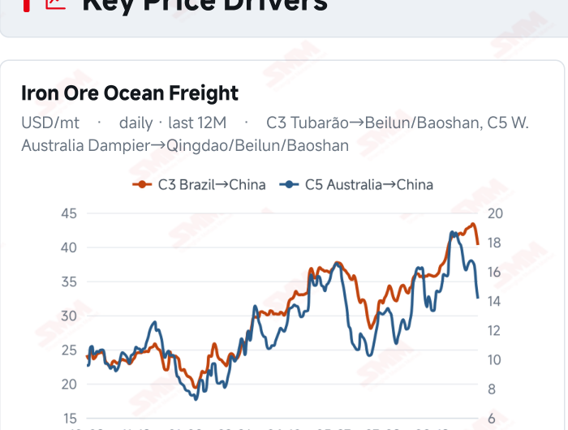
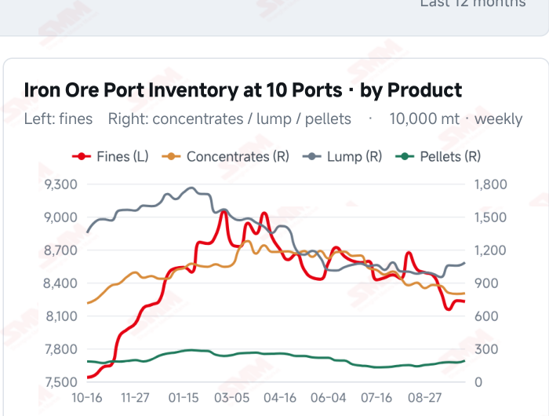
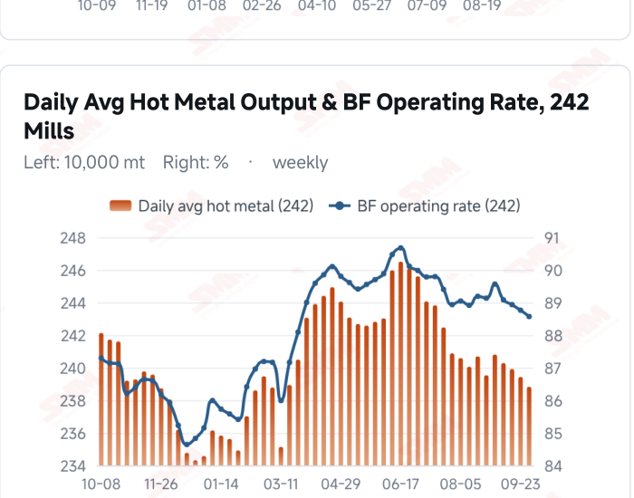
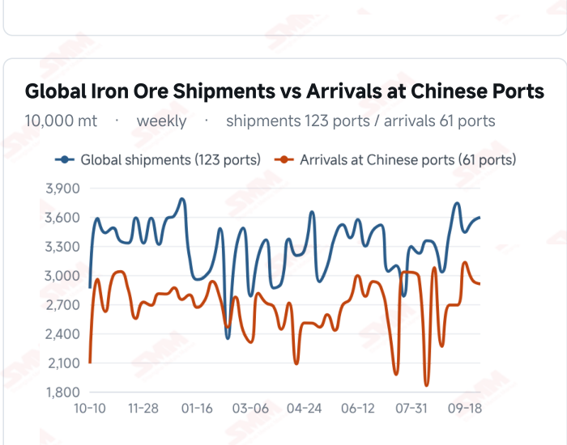

# SMM Iron Ore Daily — 2026-10-07 (Wednesday)

**Source:** SMM Data-pro · Shanghai Metals Market (SMM)

---

## Futures Contracts

| Exchange | Contract | Price | Unit | Daily Change | Daily Change % | MTD Avg |
|:---|:---|:---:|:---:|:---:|:---:|:---:|

## SMM Iron Ore Price Index (Physical & Benchmark Indices)

| Index Name | Market Type | Fe % | Price | Unit | Daily Change | Daily Change % | MTD Avg |
|:---|:---|:---:|:---:|:---:|:---:|:---:|:---:|
| MMi 61% Seaborne Index | seaborne | 61.0% | 91.25 | USD/dmt | -0.4 | -0.44% | 92.05 |
| MMi 65% Seaborne Index | seaborne | 65.0% | 109.70 | USD/dmt | -0.3 | -0.27% | 110.68 |

## Key View

### Seaborne prices remain soft; post-holiday buying will test market support

Seaborne indices and mainstream brand quotations continued to soften, although not every product declined. On Oct 7, the MMi 61% index fell to USD 91.25/dmt and the 65% to 109.70, with their spread widening slightly to USD 18.45. PB, Newman and Mac Fines each lost USD 0.40, while Jimblebar Fines and SP10 were unchanged. This looks more like continued adjustment amid cautious buying than a clear trend reversal. The supply-demand backdrop remains anchored in the latest published weekly data. Global shipments were 35.9424 million mt in the week to Oct 2 as Brazil offset declines elsewhere; arrivals in China were 29.0943 million mt, down for a second week. Lower arrivals may temporarily ease spot supply pressure, but the lag between loadings and arrivals keeps subsequent inflows in focus. On demand, hot metal output was 2.3882 million mt on Sep 30, with maintenance schedules and mill profitability continuing to influence buying intensity. The key after the holiday is whether lower prices generate sustained physical demand. Buying restricted to immediate needs could keep prices soft and range-bound amid ample supply. Conversely, lower coke costs, improved margins and concentrated restocking could ease downward pressure. Port transactions, hot metal and inventories should be assessed together rather than treating a one-day change in the grade spread as a trend signal.

## Today's Highlights

- Seaborne indices fell again as the grade spread widened slightly. On Oct 7, the MMi 61% seaborne index was USD 91.25/dmt, down USD 0.40 (-0.44%) from Oct 6; the 65% was 109.70, down USD 0.30 (-0.27%). Their spread widened from USD 18.35 to 18.45/dmt.
- Mainstream brands remained soft, with some quotations unchanged. Against Oct 6, PB Fines were USD 91.50/dmt, Newman Fines 90.60 and Mac Fines 91.00, each down about 0.44%. Brazilian Blend Fines were 97.10 (-0.66%) and SSFT/SSFG 97.05 (-0.77%). Jimblebar Fines at 86.95 and SP10 at 79.35 were unchanged.
- The SGX current-month contract provides an intraday reference. SGX official delayed data showed the October 2026 contract, FEFV26, at a latest price of USD 91.20/dmt, with a quote timestamp of Oct 7, 17:20:20 (UTC+8). The DCE and yuan-denominated port spot market remained closed.
- Margins and maintenance remain central to post-holiday demand. Surveyed daily hot metal output was 2.3882 million mt on Sep 30, down 6,100 mt WoW; SMM projects 1.6839 million mt of blast furnace maintenance- related output losses for Oct 3–9. Whether improved profitability translates into buying will influence price support after reopening.

## Key Price Drivers (12-Month Charts & Operational Metrics)

### Charts: Freight & Port Inventory

### Charts: Hot Metal Output & Shipments vs Arrivals

### Operational Fundamentals Snapshot

| Fundamental Indicator | Value | Unit |
|:---|:---:|:---:|
| C3 Freight (Brazil to China) | 40.26 | USD/mt |
| C5 Freight (Australia to China) | 14.13 | USD/mt |
| Daily Avg Hot Metal Output (242 Mills) | 2.3882 | Million MT |
| Blast Furnace Operating Rate (242 Mills) | 88.57 | % |
| Blast Furnace Capacity Utilisation (242 Mills) | 58.1 | % |
| Global Iron Ore Shipments (Weekly) | 35.9424 | Million MT |
| Chinese Port Arrivals (Weekly) | 29.0943 | Million MT |

## Market Commentary · Imported Ore

### Futures & Spot

China remained on the National Day holiday. The last DCE close was 702.5 yuan/mt on Sep 30, and Qingdao PB Fines were last quoted at 665 yuan/wmt. SGX official delayed data showed the October contract FEFV26 at USD 91.20/dmt, timestamped Oct 7, 17:20:20 (UTC+8). The seaborne 61% and 65% indices fell 0.44% and 0.27% on Oct 7, while mainstream brand quotations remained under pressure.

### Driver

Both composite indices declined, with the 61% falling slightly more than the 65%. The modest widening in their spread is not sufficient to establish a material shift in demand structure. Lower quotations for most mainstream fines and unchanged prices for some brands may reflect caution near the end of the holiday. Buying limited to immediate needs could constrain a recovery after reopening, while concentrated restocking could offer temporary support.

### Demand

SMM’s 242-mill survey showed daily average hot metal output of 2.3882 million mt on Sep 30, down 6,100 mt WoW; the blast furnace operating rate was 88.57% and capacity utilisation 88.15%. Output has fallen four consecutive times from 2.4080 million mt on Sep 2, with the latest three declines at 3,700, 4,800 and 6,100 mt. SMM projects maintenance-related output losses of 1.6839 million mt for Oct 3–9, up 55,100 mt from the previous week. If mill profitability remains under pressure, ore buying may stay focused on immediate needs.

### Inventory & Supply

In the week to Oct 2, global shipments rose 430,300 mt to 35.9424 million mt. Brazil added 1.8195 million mt, Australia fell 1.2988 million mt and other origins combined fell 90,400 mt. Arrivals in China declined for a second week to 29.0943 million mt. Ten-port stocks were 103.0165 million mt on Sep 30, up 422,500 mt from Sep 24; 35-port stocks were 145.45 million mt as of Sep 25. Stronger shipments may translate into later arrivals, although voyage times, unloading schedules and destinations will shape the actual pressure.

### Cost & Margin

SMM’s Oct 1 assessment put the average imported ore loss at 2.45 yuan/mt, narrower than 6.12 yuan/mt previously, as spot prices, exchange rates and freight contributed to the improvement. The latest freight readings were USD 40.26/mt for C3 and 14.13/mt for C5, dated Sep 29. Future import margins depend on relative changes in seaborne procurement costs, port selling prices and exchange rates; if port prices fall faster than landed costs, margin recovery may face pressure.

## Market Commentary · Domestic Ore

### Prices

The domestic ore market is on the National Day holiday, with no new quotations. The SMM China Domestic Ore Composite Price Index stands at 831.59 yuan/mt as of Sep 24.

### Supply & Demand

National concentrate output was 18.87 million mt in September, with inventory at 280,000 mt. The Sep 25 weekly survey showed mine capacity utilisation of 58.1% and concentrate output of 898,000 mt. Regional supply, mill blending needs and execution of long-term contracts remain key influences on domestic ore prices.

### Outlook

Regional supply and mill maintenance may jointly shape domestic ore prices after the holiday. Broader maintenance could weigh on concentrate demand, while lower coke costs could improve mill margins and support buying at the margin. Price performance is likely to remain differentiated across regions.

## Market Factors

### Supportive Factors

- Arrivals in China fell for a second week to 29.0943 million mt in the week to Oct 2.
- Jimblebar Fines and SP10 quotations were unchanged this period.
- A coke price cut, if implemented, could ease mill cost pressure.
- Concentrated restocking after reopening could provide temporary demand support.

### Bearish Factors

- The seaborne 61% and 65% indices fell 0.44% and 0.27%, respectively.
- PB, Newman and Mac Fines quotations declined further.
- Global shipments remained relatively high at 35.9424 million mt, warranting attention to subsequent arrivals.
- Hot metal output has fallen four consecutive times WoW, while maintenance may restrain ore buying.

---
*(c) 2026 Shanghai Metals Market (SMM) · Iron Ore Value-Chain Data & Research*
