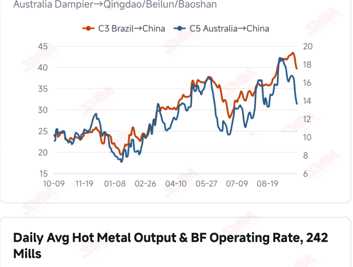
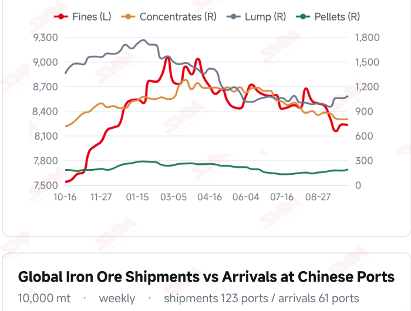
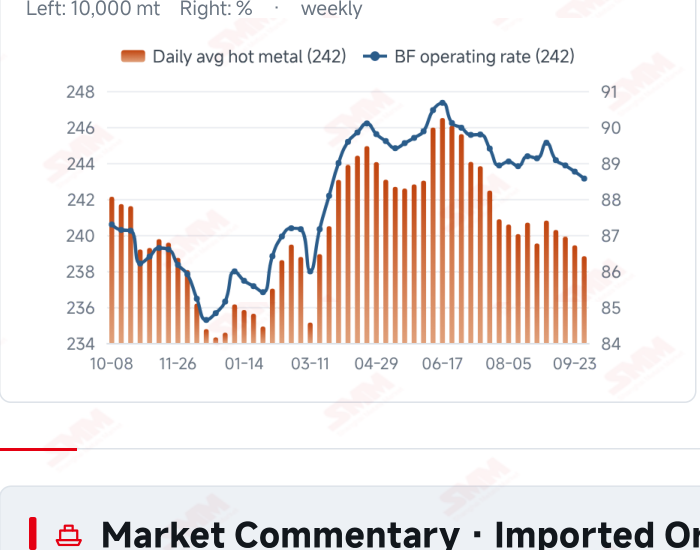
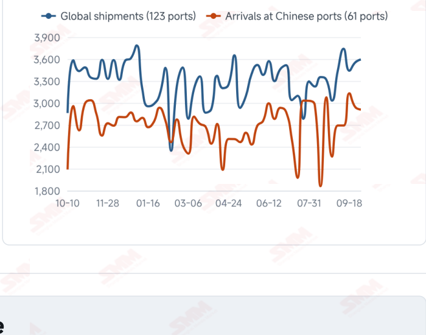

# SMM Iron Ore Daily — 2026-10-08 (Thursday)

**Source:** SMM Data-pro · Shanghai Metals Market (SMM)

---

## Futures Contracts

| Exchange | Contract | Price | Unit | Daily Change | Daily Change % | MTD Avg |
|:---|:---|:---:|:---:|:---:|:---:|:---:|
| DCE | DCE Iron Ore Most-traded I2701 | 682.50 | yuan/mt | -20.0 | -2.85% | 682.50 |

## SMM Iron Ore Price Index (Physical & Benchmark Indices)

| Index Name | Market Type | Fe % | Price | Unit | Daily Change | Daily Change % | MTD Avg |
|:---|:---|:---:|:---:|:---:|:---:|:---:|:---:|
| MMi 61% Port Spot | port_spot | 61.0% | 664.00 | yuan/wmt | -10.0 | -1.48% | 664.00 |
| MMi 58% Port Spot | port_spot | 58.0% | 627.00 | yuan/wmt | -11.0 | -1.72% | 627.00 |
| MMi 65% Port Spot | port_spot | 65.0% | 828.00 | yuan/wmt | -10.0 | -1.19% | 828.00 |
| MMi 61% Seaborne Index | seaborne | 61.0% | 90.35 | USD/dmt | -0.9 | -0.99% | 91.77 |
| MMi 65% Seaborne Index | seaborne | 65.0% | 109.45 | USD/dmt | -0.25 | -0.23% | 110.48 |

## Key View

### Prices fall on reopening; the key is whether coke cost relief translates into stronger buying

Price adjustments on reopening suggest that the soft expectations built during the holiday are feeding into domestic trading. DCE most-traded closed at 682.5 yuan/mt, down 2.85% from before the break; most mainstream Qingdao fines fell 15 yuan/wmt and PB Lump fell 17 yuan. The seaborne 61% index eased to USD 90.35/dmt and the 65% to 109.45, while all 12 brand quotations declined. Although mill enquiries resumed, SMM reported continued pressure on bids and only moderate trading, suggesting that lower prices have yet to attract significantly stronger demand. Costs offer a cushion. SMM’s Oct 8 briefing confirmed the first round of coke purchase-price cuts effective Oct 1, at 100 yuan/mt for wet-quenched and 110 yuan/mt for dry-quenched coke; the latest freight readings also declined. These changes may improve cost conditions for mills or traders, but actual margin repair depends on relative movements in finished-steel prices, ore prices and exchange rates. If mills continue to control arrivals and buy only to immediate needs, the demand response to cost relief may take time. The near-term question is whether trading and production respond to the price adjustment. Global shipments remain relatively high, while hot metal and maintenance conditions constrain demand expectations. Tight domestic concentrate resources offer support, but mill pressure on bids persists. Prices may remain soft and range-bound. Sustained restocking following margin improvement could provide a floor; if trading recovery is limited, pressure from incoming supply may continue to dominate.

## Today's Highlights

- Futures and port spot prices fell on the first session after the holiday. DCE most-traded I2701 closed at 682.5 yuan/mt, down 20.0 yuan (-2.85%) from the last pre-holiday close. Qingdao PB Fines were 650 yuan/wmt, Newman Fines 653 and Mac Fines 652, each down 15 yuan; PB Lump fell 17 yuan to 843 yuan/wmt.
- Seaborne indices and brand quotations continued lower. On Oct 8, the MMi 61% seaborne index was USD 90.35/dmt, down 0.90 (-0.99%) from Oct 7; the 65% was 109.45, down 0.25 (-0.23%). All 12 brand quotations declined, with PB Fines at 90.60, Newman Fines 89.70 and Mac Fines 90.10 USD/dmt.
- Port indices declined, with a slightly larger fall at the low-grade end. The 61%, 58% and 65% port spot indices were 664, 627 and 828 yuan/wmt, down 10, 11 and 10 yuan from before the holiday. The 65%-58% spread widened marginally from 200 to 201 yuan/wmt.
- Coke cost relief coexists with pressure on demand. SMM’s Oct 8 coking coal and coke briefing reported that major mills had confirmed a first-round purchase-price cut of 100 yuan/mt for wet-quenched coke and 110 yuan/mt for dry-quenched coke, effective Oct 1. Mills nevertheless continued buying to immediate needs and controlling arrivals; the transmission of cost relief to ore demand depends on margins and production plans.

## Key Price Drivers (12-Month Charts & Operational Metrics)

### Charts: Freight & Port Inventory

### Charts: Hot Metal Output & Shipments vs Arrivals

### Operational Fundamentals Snapshot

| Fundamental Indicator | Value | Unit |
|:---|:---:|:---:|
| C3 Freight (Brazil to China) | 39.51 | USD/mt |
| C5 Freight (Australia to China) | 13.56 | USD/mt |
| Blast Furnace Operating Rate (242 Mills) | 88.57 | % |
| Iron Ore Port Inventory (10 Major Ports) | 103.0165 | Million MT |
| Iron Ore Port Inventory (35 Major Ports) | 145.45 | Million MT |
| Global Iron Ore Shipments (Weekly) | 35.9424 | Million MT |

## Market Commentary · Imported Ore

### Futures & Spot

DCE most-traded I2701 closed at 682.5 yuan/mt, down 2.85% from 702.5 on Sep 30. Qingdao PB Fines were 650, Newman Fines 653, Mac Fines 652, BRBF 705, Newman Lump 845, SSF 512 and Carajas Fines 827 yuan/wmt, each down 15 yuan from before the holiday; PB Lump fell 17 yuan to 843. SMM’s daily review described active mill enquiries but strong pressure on bids and only moderate overall trading. SGX official delayed data showed current-month FEFV26 at USD 91.10/dmt, timestamped Oct 8, 17:47:03 (UTC+8).

### Driver

Weaker domestic futures and spot prices on reopening may reflect the transmission of offshore adjustments during the holiday. Renewed mill enquiries did not immediately translate into stronger transaction support. The seaborne 61% index fell more than the 65%, widening the composite grade spread from USD 18.45 to 19.10/dmt, but a one-day change is insufficient to establish a structural shift in blending demand. Price stabilisation will depend more on the strength of mill buying and sustained port trading.

### Demand

SMM’s Sep 30 survey of 242 mills showed daily hot metal output of 2.3882 million mt, down 6,100 mt WoW; the blast furnace operating rate was 88.57% and capacity utilisation 88.15%. The Oct 8 coking coal and coke briefing described cautious buying, controlled arrivals and maintenance scheduled at some mills. The earlier estimate of 1.6839 million mt of blast furnace maintenance losses for Oct 3–9 remains a weekly projection. If margin improvement is limited, raw-material purchases may continue to focus on immediate needs.

### Inventory & Supply

In the week to Oct 2, global shipments reached 35.9424 million mt, up 430,300 mt WoW. Brazil shipped 8.5967 million mt, up 1.8195 million, while Australia shipped 19.4645 million mt, down 1.2988 million. Arrivals in China fell 368,200 mt to 29.0943 million mt. The latest port stock readings were 103.0165 million mt across 10 ports on Sep 30 and 145.45 million mt across 35 ports on Sep 25. High shipment levels may influence subsequent arrivals, with routes and unloading schedules shaping the actual pressure.

### Cost & Margin

SMM’s Oct 8 briefing reported the first round of coke price cuts effective Oct 1: 100 yuan/mt for wet-quenched and 110 yuan/mt for dry-quenched coke. This offers mill cost relief but does not imply an immediate increase in raw-material buying. The latest freight readings, dated Sep 30, were USD 39.51/mt for C3 and 13.56/mt for C5, down 1.86% and 4.03% from the previous observation. Import trading margins still depend on relative changes in port selling prices, seaborne procurement costs, exchange rates and freight.

## Market Commentary · Domestic Ore

### Prices

SMM’s Oct 8 domestic ore brief reported modest concentrate price declines during the holiday against pre- holiday levels: 20–25 yuan/mt in Shandong and Anhui, 5–10 yuan/mt in Hebei, with northeastern China relatively stable. The latest Domestic Ore Composite Price Index reading was 831.59 yuan/mt on Sep 24.

### Supply & Demand

Domestic resources remained relatively tight, offering some price support, but mill losses and pressure on bids were strong. Supply constraints may not fully offset demand weakness. National concentrate output was 18.87 million mt in September, with inventory at 280,000 mt; regional conditions and long-term contract execution continue to influence available supply.

### Outlook

SMM expects domestic concentrate prices may edge lower in the short term. If hot metal output and mill buying intensity do not recover, weaker imported ore prices may add pressure. Whether lower coke costs improve profitability enough to stimulate purchases will be an important indicator.

## Market Factors

### Supportive Factors

- The first round of coke purchase-price cuts offers mill cost relief.
- Mill enquiries resumed after the holiday, creating scope for better trading.
- Domestic concentrates remain relatively tight, supporting some regional markets.
- Arrivals in China fell 1.25% WoW in the week to Oct 2.

### Bearish Factors

- DCE fell 2.85% from the pre-holiday close, while port spot quotations broadly declined.
- The seaborne 61% index fell 0.99% and all 12 brand quotations declined.
- Mills continued to press bids lower, with no clear strengthening in overall trading.
- High shipment levels and maintenance schedules may continue to shape the supply-demand balance.

---
*(c) 2026 Shanghai Metals Market (SMM) · Iron Ore Value-Chain Data & Research*
