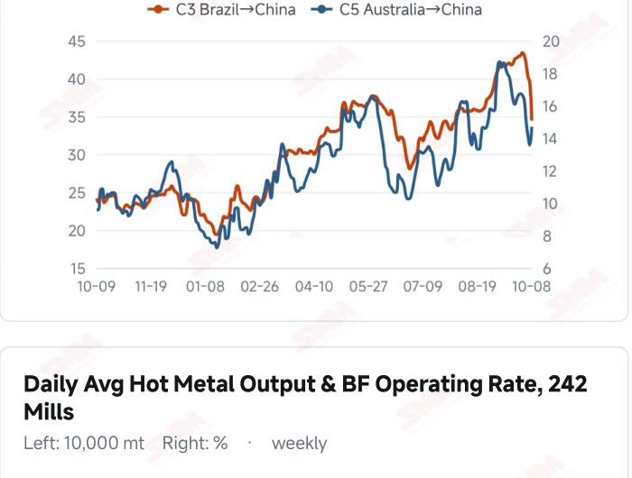
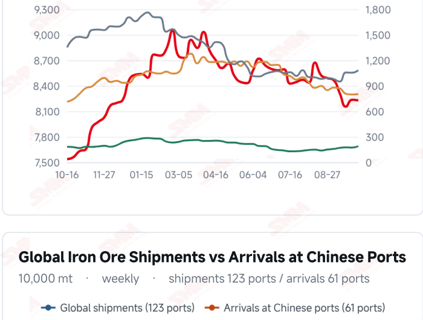
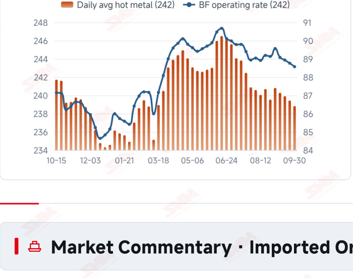
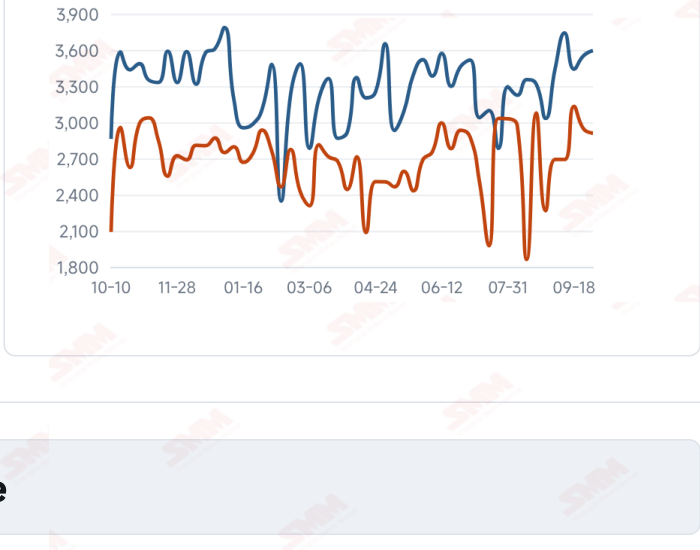

# SMM Iron Ore Daily — 2026-10-09 (Friday)

**Source:** SMM Data-pro · Shanghai Metals Market (SMM)

---

## Futures Contracts

| Exchange | Contract | Price | Unit | Daily Change | Daily Change % | MTD Avg |
|:---|:---|:---:|:---:|:---:|:---:|:---:|
| DCE | DCE Iron Ore Most-traded I2701 | 682.50 | yuan/mt | 0.0 | 0.00% | 682.50 |

## SMM Iron Ore Price Index (Physical & Benchmark Indices)

| Index Name | Market Type | Fe % | Price | Unit | Daily Change | Daily Change % | MTD Avg |
|:---|:---|:---:|:---:|:---:|:---:|:---:|:---:|
| MMi 61% Port Spot | port_spot | 61.0% | 664.00 | yuan/wmt | 0.0 | 0.00% | 664.00 |
| MMi 58% Port Spot | port_spot | 58.0% | 627.00 | yuan/wmt | 0.0 | 0.00% | 627.00 |
| MMi 65% Port Spot | port_spot | 65.0% | 828.00 | yuan/wmt | 0.0 | 0.00% | 828.00 |
| MMi 61% Seaborne Index | seaborne | 61.0% | 89.20 | USD/dmt | -1.15 | -1.27% | 91.40 |
| MMi 65% Seaborne Index | seaborne | 65.0% | 109.40 | USD/dmt | -0.05 | -0.05% | 110.32 |
| SMM Domestic Ore Composite Index | domestic_composite | 66.0% | 821.58 | yuan/mt | -3.22 | -0.39% | 823.19 |

## Key View

### Domestic composite prices stabilise while seaborne brands diverge; sustained buying remains key

After reopening, the market is showing stable composite prices alongside divergent brand performance. DCE most-traded closed at 682.5 yuan/mt, while the 61%, 58% and 65% port indices held at 664, 627 and 828 yuan/wmt. Spot prices did not stabilise uniformly: Mac Fines and BRBF declined, while Carajas Fines and PB Lump recovered. The seaborne 61% index fell further to USD 89.20/dmt while the 65% edged down to 109.40, widening their spread to USD 20.20 and highlighting short-term differences between grades. Gains in some brands may reflect available supply and blending requirements but do not alone establish a broad recovery in demand. The domestic ore composite index declined to 821.58 yuan/mt, also indicating constraints on mill purchase prices. Freight costs were mixed, with C3 falling and C5 rising. Their implications for miner margins and landed prices depend on contracts, voyage times and exchange rates rather than a uniform move across routes. A transition from temporary stability to sustained support still depends on mill buying and profitability. Pressure on finished-steel prices and purchases limited to immediate needs could constrain a rebound amid relatively high shipments. Conversely, margin repair from lower coke costs followed by sustained restocking could improve support. Near-term attention should remain on the persistence of trading and purchasing rather than treating gains in individual brands as a reversal in the overall trend.

## Today's Highlights

- The seaborne 61% index fell more sharply while the 65% was relatively stable. On Oct 9, the MMi 61% index was USD 89.20/dmt, down USD 1.15 (-1.27%) from Oct 8; the 65% was 109.40, down USD 0.05 (-0.05%). The grade spread widened from USD 19.10 to 20.20/dmt.
- Domestic futures and port indices were unchanged while individual brands diverged. DCE most-traded I2701 closed at 682.5 yuan/mt, unchanged from the previous session. The 61%, 58% and 65% port indices were 664, 627 and 828 yuan/wmt. At Qingdao, Mac Fines fell 2 yuan and BRBF fell 5 yuan, while Carajas Fines rose 3 yuan and PB Lump rose 2 yuan.
- Seaborne brands showed mixed price movements. Against Oct 8, PB Fines were USD 89.50/dmt (-1.21%), Newman Fines 88.65 (-1.17%) and Mac Fines 88.85 (-1.39%); Carajas Fines were 105.90 (+0.24%), SSFT/SSFG 96.00 (+0.26%) and Brazilian Blend Fines 96.05 (+0.10%).
- The domestic ore composite index eased further. SMM’s Domestic Ore Composite Price Index stood at 821.58 yuan/mt, down 3.22 yuan (-0.39%) from 824.80 previously. Whether cost relief generates sustained mill buying remains an important indicator of demand recovery.

## Key Price Drivers (12-Month Charts & Operational Metrics)

### Charts: Freight & Port Inventory

### Charts: Hot Metal Output & Shipments vs Arrivals

### Operational Fundamentals Snapshot

| Fundamental Indicator | Value | Unit |
|:---|:---:|:---:|
| Blast Furnace Operating Rate (242 Mills) | 88.57 | % |
| Global Iron Ore Shipments (Weekly) | 35.9424 | Million MT |
| Chinese Port Arrivals (Weekly) | 29.0943 | Million MT |

## Market Commentary · Imported Ore

### Futures & Spot

DCE most-traded I2701 closed at 682.5 yuan/mt, unchanged from Oct 8. Qingdao PB Fines at 650, Newman Fines at 653, Newman Lump at 845 and SSF at 512 yuan/wmt were unchanged. Mac Fines were 650 (-2), BRBF 700 (-5), Carajas Fines 830 (+3) and PB Lump 845 (+2). SGX official delayed data showed current-month FEFV26 at USD 90.50/dmt, timestamped Oct 9, 17:44:04 (UTC+8).

### Driver

Domestic futures and composite port indices stabilised while the seaborne 61% index fell further, showing continued short-term divergence across markets. Gains in some brands did not reverse the weakness across most seaborne quotations and may reflect differences in available material, blending requirements and buying schedules. The composite grade spread widened to USD 20.20/dmt, but a single session is insufficient to establish a sustained shift in mill demand.

### Demand

Actual purchasing remains important to assessing price support. The latest available mill survey is dated Sep 30, with daily hot metal output of 2.3882 million mt and a blast furnace operating rate of 88.57%. If finished- steel profitability improves only modestly, mills may continue controlling raw-material stocks and buying to immediate needs. Conversely, margin recovery helped by lower coke costs could improve restocking appetite.

### Inventory & Supply

Global shipments were 35.9424 million mt and arrivals in China 29.0943 million mt in the week to Oct 2; the latest 10-port stock reading was 103.0165 million mt on Sep 30. High shipments coexist with a short-term decline in arrivals, leaving subsequent inventories dependent on delivery, unloading and mill collection schedules. Price moves in individual brands may reflect localised balances rather than a tightening in aggregate supply.

### Cost & Margin

Oct 8 freight readings diverged: C3 on the Brazil route was USD 34.44/mt, down 12.83% from 39.51 previously, while C5 on the Australia route rose 8.33% from 13.56 to 14.69. Route-specific freight changes influence landed costs for miners and traders, although the transmission also depends on loading schedules, procurement contracts and exchange rates. The earlier first-round coke cut offers mill cost relief, but stronger demand still depends on finished-steel prices and profitability. SMM’s Oct 9 coke briefing also reported that some mills proposed a second-round purchase-price cut of 100 yuan/mt for wet-quenched coke and 110 yuan/mt for dry- quenched coke, scheduled from midnight on Oct 12 rather than already fully effective on Oct 9.

## Market Commentary · Domestic Ore

### Prices

The Domestic Ore Composite Price Index was 821.58 yuan/mt on Oct 9, down 3.22 yuan (-0.39%) from 824.80 on Oct 8. SMM’s Tangshan brief reported 66% concentrate at 900–910 yuan/mt on a dry-basis, tax-inclusive ex-works basis, with local prices falling noticeably.

### Supply & Demand

SMM’s Tangshan brief described scarce enquiries, with some transactions fulfilling earlier orders. Low-grade material faced sales difficulties, some sellers offered concessions and mills continued pressing bids lower. Regional resource constraints may support some quotations, but actual purchases and transaction support remain crucial to near-term pricing.

### Outlook

Continued weakness in imported ore could feed through to blending costs and increase bargaining pressure on domestic concentrates. Conversely, tighter regional supply and recovering mill purchases may make some markets more resilient. Regional differentiation may persist, with mill margins and trading support remaining key indicators.

## Market Factors

### Supportive Factors

- DCE and all three composite port indices were unchanged this period.
- Some port and seaborne brand quotations recovered.
- The first-round coke cut provides some relief to mill costs.
- The latest weekly arrivals in China declined WoW.

### Bearish Factors

- The seaborne 61% index fell 1.27% to USD 89.20/dmt.
- Seaborne PB, Newman and Mac Fines quotations declined further.
- The domestic ore composite index fell 0.39%, reflecting continued procurement pressure.
- Global shipments remain relatively high, warranting attention to subsequent supply arrivals.

---
*(c) 2026 Shanghai Metals Market (SMM) · Iron Ore Value-Chain Data & Research*
