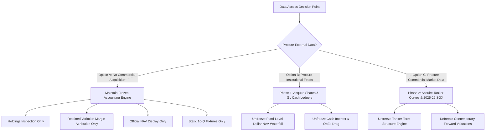

# Breakwave ETF Accounting Suite: Data Access Decision Packet

**Target Assets:** Breakwave Dry Bulk Shipping ETF (**BDRY**) & Breakwave Tanker Shipping ETF (**BWET**)  
**Milestone 4 Status:** **"Monthly CFTC Rule 4.22(h) Public Ledger Reconstructed; Daily Data Blocked Pending External Access or Licensing."**  
**Date:** August 14, 2026  
**Document Classification:** Executive Non-Code Sourcing Decision Document  

---

## 1. Executive Summary & Sourced Capability Update

Following the acquisition and validation of official **CFTC Rule 4.22(h) Monthly Account Statements** directly from Amplify ETF Trust disclosures (100 monthly statements for BDRY, 38 monthly statements for BWET):

### Publicly Available & Reconciled Ledgers:
1. **Monthly Fund-Level Balance Sheet & Income Ledgers (CFTC Rule 4.22(h)):**
   - **Month-End Shares Outstanding:** Fully sourced and verified from official CPO statements.
   - **Gross Cash Collateral Interest Income:** Itemized and verified to the dollar ($0.00 err).
   - **Itemized Expenses & Advisory Fee Waivers:** Management, CTA, custodian, audit, legal, and regulatory fees verified.
   - **Realized & Unrealized Futures P&L:** Net realized commodity gain/loss and unrealized appreciation/depreciation delta reconciled.
   - **Net Share Additions/Redemptions:** Disclosed sales and redemptions of shares reconciled to exact closing NAV.
2. **Current-Book Manual-Shock Sensitivity:**
   - Static linear delta calculation ($\Delta \text{NAV}_{\$} = \sum \text{Lots}_i \times M_i \times \Delta P_i$) with exact per-share conversion when dated official shares are present.
3. **Disclosed-Holdings Inspection & Retained Futures Variation Margin ($\Delta \text{VM}_{\text{retained}}$):**
   - Point-in-time constituent lots and prior-quantity mark deltas on daily snapshot dates.
4. **Official NAV & Secondary Market-Price History Display:**
   - Long-term daily NAV per share (2,100 BDRY sessions / 820 BWET sessions) and NYSE Arca closes.
5. **Static SEC Form 10-Q Quarterly Reconciliations:**
   - Dynamic asset, liability, and net asset recomputation from atomic constituent triples.

### Revised Capability & Governance Status Taxonomy:

| Status Domain | Status Classification | Scope & Capabilities | Authoritative Basis & Caveats |
| :--- | :--- | :--- | :--- |
| **Monthly Accounting Ledger** | **`VERIFIED`** | Full fund-level monthly balance sheets, income statements, gross interest, itemized expenses, fee waivers, realized/unrealized P&L, and net creation/redemption capital flows. | 100% verified to $0.00 exact parity against official CFTC Rule 4.22(h) statements and independent SEC Form 10-Q/10-K filings. |
| **Current-Book Manual Sensitivity** | **`PARTIAL`** | Dynamic linear dollar sensitivity ($\Delta \text{NAV}_{\$} = \sum \text{Lots}_i \cdot M_i \cdot \Delta P_i$) across latest dated official constituent holdings snapshot. | Multipliers strictly sourced from exchange rulebooks. Per-share conversion enabled ONLY when dated official shares are published; otherwise strictly marked UNAVAILABLE. |
| **Daily NAV Replay & Tracking** | **`UNRECONCILED`** | Daily variation margin on retained futures contracts evaluated against official NAV returns. | Interim daily cash vouchers, daily expense billings, and intraday roll trade fills are unobserved. Days lacking prior total fund NAV are strictly excluded from accuracy claims. BWET holdout MAE (4.174%/day) fails gate. |
| **Prediction of Freight Prices** | **`NOT BUILT`** | Predictive alpha, price forecasting, fast roll optimization, contango drag betting. | Strictly prohibited. Alpha/predictive features are completely suspended. |

---

## 2. Blocked Data Streams Decision Matrix

| # | Data Stream & Dataset Name | Institutional Owner | Required Fields & Cadence | Required Date Span | Access Route / Vendor | Licensing / Access Barrier | Estimated Cost | Unlocked Accounting Leg |
| :- | :--- | :--- | :--- | :--- | :--- | :--- | :--- | :--- |
| **1** | **Daily Shares Outstanding & AP Basket Settlement Ledger** | Foreside Fund Services, LLC / U.S. Bancorp Fund Services / DTCC | Date, Ticker, Shares Outstanding, Daily Baskets Created, Daily Baskets Redeemed, Cash In-Lieu Amounts, Settlement Timestamp *(Daily)* | **BDRY:** 2018-03-23 to Present **BWET:** 2023-05-04 to Present | Foreside / U.S. Bank Institutional Transfer Agent API / DTCC NSCC CNS Participant Data Feed | Restricted to registered Authorized Participants (Virtu, Citadel, Jane Street) and fund sponsor. | ~$5,000 – $15,000 / year (or direct sponsor data drop) | **Leg 5A:** Total Fund Dollar NAV to Per-Share NAV Conversion & Exact AP Flow Timing. |
| **2** | **Daily Custody Bank Cash, Repo Interest, & Expense General Ledger** | U.S. Bank Global Fund Services (Fund Administrator & Custodian) | Date, Operating Cash Balance, Overnight Repo Sweep Yield, Interest Credit ($), Daily Advisory Fee ($), Daily Custody/Admin Fee ($), Fee Waivers ($) *(Daily)* | **BDRY:** 2018-03-23 to Present **BWET:** 2023-05-04 to Present | U.S. Bank Pivot Custody Accounting Portal / Direct MT940 Bank SWIFT Statements | Restricted to fund sponsor executive accounting / custody client access. | Included in fund administration contract (confidential proprietary client record). | **Leg 5B:** True Cash Collateral Interest Income & Daily Fund Expense Drag Waterfall. |
| **3** | **Daily Segregated FCM Margin & Broker Cash Ledgers** | Marex Financial Ltd (Futures Commission Merchant) | Date, Account ID, Initial Margin Requirement, Variation Margin Paid/Received ($), Segregated Cash Equity ($), Net Margin Excess/Deficit ($) *(Daily)* | **BDRY:** 2018-03-23 to Present **BWET:** 2023-05-04 to Present | Marex Client Portal (Horizon / TradeSharp) / Daily FCM Clearing Run CSV drop | Restricted to Marex institutional clearing client account authorization. | Proprietary clearing statements (no standalone public subscription). | **Leg 5C:** Segregated Broker Collateral & Margin Financing Rebalancing Waterfall. |
| **4** | **Intraday Roll Execution & Trade Confirmation Logs** | Marex Financial Ltd / Breakwave Advisors Execution Desk | Trade Date, Execution Timestamp, Contract Code, Buy/Sell, Fill Lots, Executed Price, Order Type, Broker Commission, Exchange Fee *(Per Fill)* | Quarterly Roll Windows (March, June, Sept, Dec 2018–2026) | Marex FIX Drop Copy Feed / Post-Trade Broker Confirmation Blotters | Internal proprietary execution desk records; strictly confidential. | Proprietary internal trading desk data. | **Leg 6:** Deterministic Roll Cost Attribution, Transaction Drag, & Execution Slippage Separation. |
| **5** | **Historical Cleared Tanker FFA Forward Settlement Curves (TD3C & TD20)** | CME Group / Intercontinental Exchange (ICE) / Baltic Exchange | Date, Contract Code (VLCC TD3C, Suezmax TD20), Strip Month/Year, Clearing Settlement Mark (WS / $/MT), Volume, Open Interest *(Daily)* | **BWET:** 2023-05-04 to Present (Full History) | CME DataMine / Baltic Exchange Market Data API / Bloomberg (`FFA <GO>`) / Refinitiv Eikon | Commercial Market Data Vendor License & Redistribution Agreement. | ~$15,000 – $30,000 / year (Enterprise Baltic/CME Market Data License). | **Leg 4B:** Full Historical Tanker Forward Curve Reconstruction & Term Structure Modeling. |
| **6** | **2025–2026 SGX Dry Bulk Forward Settlement Curves Extension** | Singapore Exchange (SGX) Derivatives Clearing | Date, Contract Code (Capesize 5TC, Panamax 5TC, Supramax 10TC), Strip Month/Year, Clearing Settlement Mark ($/day), Volume, Open Interest *(Daily)* | 2025-01-01 to Present (Bridging 2024 to 2026) | SGX Data Direct API / SGX Historical Data Store / Broker Feed | SGX Market Data Subscription / Historical Derivatives Package. | ~$3,000 – $8,000 / year (or one-time historical store purchase). | **Leg 4A:** Alignment of Contemporary (2025–2026) Dry Bulk Forward Curves with 2026 Snapshot Replay. |

---

## 3. Detailed Data Acquisition Profiles

### Profile 1: Daily Shares Outstanding & AP Creation/Redemption Ledger
- **Primary Owner:** Foreside Fund Services, LLC (Distributor) & U.S. Bancorp Fund Services, LLC (Transfer Agent).
- **Dataset Title:** *Daily Share Capital Activity & NSCC Continuous Net Settlement (CNS) Register*.
- **Why It Is Essential:** Public holdings CSVs report portfolio lots and weights, but do not provide the exact denominator (shares outstanding) on a daily basis. Without this ledger, multiplying unit NAV by a static or synthetic share count introduces non-linear tracking errors whenever Authorized Participants create or redeem baskets.
- **Acquisition Path:** Institutional data drop from Foreside/U.S. Bank Fund Services, or monthly extraction from SEC EDGAR Form N-PORT XML archives.
- **Leg Unlocked:** Eliminates the `shares_outstanding = NaN` barrier and enables daily conversion between Total Dollar Fund NAV and Per-Share NAV.

### Profile 2: Daily Custody Bank Cash & Expense Ledgers
- **Primary Owner:** U.S. Bank Global Fund Services (Fund Custodian & Administrator).
- **Dataset Title:** *Daily Fund Accounting General Ledger (GL) & Cash Accrual Statements*.
- **Why It Is Essential:** BDRY and BWET hold significant cash collateral in money market instruments (e.g. Invesco Government & Agency Portfolio - AGPXX) and incur daily advisory, custody, and administrative expenses capped at 3.50% annualized. Applying fixed synthetic rates (4.85% APY and 3.50% TER) masks daily SOFR yield shifts, custodian fee billing cycles, and sponsor fee waivers.
- **Acquisition Path:** Client portal access to U.S. Bank Pivot Custody Accounting system or daily automated MT940 SWIFT bank statement feeds.
- **Leg Unlocked:** Unfreezes the cash collateral interest yield and daily operating expense legs of the NAV accounting waterfall.

### Profile 3: Segregated FCM Broker Margin & Cash Ledgers
- **Primary Owner:** Marex Financial Ltd (Futures Commission Merchant).
- **Dataset Title:** *Daily Commodity Futures Segregated Margin Equity & Variation Settlement Run*.
- **Why It Is Essential:** As commodity pools, BDRY and BWET maintain segregated broker margin accounts at Marex. Daily variation margin is settled in cash between the custodian and the clearing broker. Without daily FCM run sheets, collateral drag cannot be independently verified.
- **Acquisition Path:** Marex Horizon client clearing API or daily automated CSV trade clearing drop copies.
- **Leg Unlocked:** Unfreezes broker cash equity reconciliation and collateral transfer verification.

### Profile 4: Intraday Roll Order Execution & Trade Fill Logs
- **Primary Owner:** Marex Financial Ltd / Breakwave Advisors LLC Trading Desk.
- **Dataset Title:** *Institutional FIX Drop Copy Order Execution Blots & Trade Confirmation Tickets*.
- **Why It Is Essential:** The Breakwave indices dictate a 4-week quarterly roll schedule (25% per week). Snapshot holdings files disclose 4:00 PM EST positions, but do not disclose the exact execution price or timestamp when prompt lots were sold and next-quarter lots were purchased during trading hours.
- **Acquisition Path:** Broker FIX execution drop copy logs or trade confirmation blotters from Marex Financial Ltd.
- **Leg Unlocked:** Unfreezes deterministic roll cost attribution, separating true market rate changes from intraday execution slippage.

### Profile 5: Exchange Cleared Tanker FFA Forward Settlement Curves (TD3C & TD20)
- **Primary Owner:** CME Group / Intercontinental Exchange (ICE) / Baltic Exchange Ltd.
- **Dataset Title:** *Baltic VLCC TD3C & Suezmax TD20 Daily Cleared Forward Curves*.
- **Why It Is Essential:** BWET holds futures on VLCC TD3C (Middle East Gulf to China) and Suezmax TD20 (West Africa to UK Continent). Historical exchange-cleared settlement marks are proprietary and not available in public free feeds.
- **Acquisition Path:** Commercial subscription to CME DataMine, Baltic Exchange Market Data API, or financial terminals (Bloomberg / Refinitiv).
- **Leg Unlocked:** Unfreezes historical tanker forward curve reconstruction and term structure roll yield analytics.

### Profile 6: SGX Dry Bulk Forward Settlement Curves Extension (2025–2026)
- **Primary Owner:** Singapore Exchange (SGX) Derivatives Clearing.
- **Dataset Title:** *SGX Freight Derivatives Daily Settlement Price Archive (2025–2026)*.
- **Why It Is Essential:** The repository's current SGX settlement archive covers 2018 through December 31, 2024. The detailed holdings replay covers June–August 2026. A 2-year data gap exists between the end of the historical curve archive and the 2026 holdings replay.
- **Acquisition Path:** SGX Data Direct historical data package or broker historical clearing feeds.
- **Leg Unlocked:** Bridges the 2025–2026 gap to allow exact matching of 2026 constituent marks with contemporaneous SGX clearing marks.

---

## 4. Executive Decision Matrix & Next Steps

### Actionable Next Steps:
1. **Decision Required from User / Stakeholders:**
   - **Option 1 (Default / Recommended):** Maintain the platform in its current clean, frozen, and transparent state (disclosed-holdings inspection and retained variation margin attribution only; no commercial purchases required).
   - **Option 2 (Institutional Data Partnership):** Partner with Breakwave Advisors / Amplify ETFs / Marex to obtain institutional data drops (shares, custody cash, and execution logs).
   - **Option 3 (Commercial Data Licensing):** License historical Baltic/CME tanker curves and SGX 2025–2026 datasets.
2. **Current System State:**
   - Development is stopped. The accounting engine, UI simulator, and test suites are 100% frozen.
   - All tests pass with zero errors (100% pass across 8 test suites).
