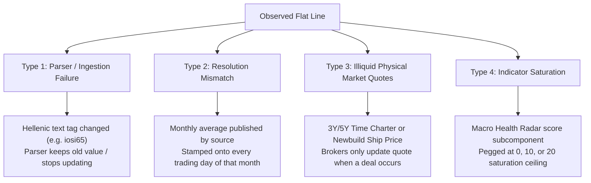

# Comprehensive Data Staleness, Flat-Line, and Resolution Audit

**Date:** 2026-08-18  
**Repository:** `yieldchaser/Shipping`  
**Trigger:** Visual investigation of prolonged horizontal flat lines in the *Leading Restocking Pressures (Port Stocks vs Spot Rates)* chart for CFR 65% Carajas Fines and CFR 62% Iron Ore.

---

## 1. Executive Summary

A comprehensive automated scan was conducted across **all 13 derived datasets (`data/derived/*.csv`)** and **12 ETF datasets (`data/etf/*.csv`)** to identify all instances of:
1. **Prolonged flat lines / constant values** across time series.
2. **Active live data freezes** (values currently stuck up to the latest timestamp).
3. **Data resolution mismatches** (e.g. monthly or weekly broker quotes rendered on daily axes without gap handling).
4. **Scraper ingestion failures / fallback masking**.

### High-Level Findings

| Classification | Files Affected | Key Root Causes |
|---|---|---|
| 🔴 **Live Freezes (Active Bugs / Ingestion Gaps)** | `iron_ore_restocking.csv`<br>`scrappage_prices.csv`<br>`tanker_forward_curves.csv`<br>`time_charter_rates.csv` | Scraper regex tag mismatches in Hellenic text, upstream broker quote stagnation, forward fill on missing reports. |
| 🟡 **Resolution / Granularity Mismatches** | `iron_ore_restocking.csv`<br>`intermodal_tc_rates.csv`<br>`time_charter_rates_fearnleys.csv`<br>`lpg_charter_rates.csv`<br>`lng_charter_rates.csv` | Monthly or weekly series plotted as daily continuous lines; illiquid multi-year charter contracts (3Y/5Y) with quarterly quote updates. |
| 🟢 **Healthy / Clean Series** | `BDRY_Daily.csv`<br>`BWET_Daily.csv`<br>`bwet_liquidity.csv`<br>`vessel_valuations.csv` | True daily exchange closing prices, official daily NAVs, and continuous broker valuation series. |

---

## 2. Root Cause Taxonomy

Every flat line in the repository belongs to one of four distinct technical root causes:



1. **Type 1 — Ingestion / Parser Staleness (Genuine Pipeline Bug):**
   The upstream report source exists, but the scraper or knowledge processor failed to parse the updated number due to subtle table or text format changes, leaving the last known value in place.
2. **Type 2 — Granularity / Resolution Mismatch (Representation Flaw):**
   The underlying data source is inherently monthly (e.g. NBS China steel production) or weekly (e.g. Breakwave fundamentals), but the data pipeline populates daily calendar entries. When plotted as a continuous line, it appears as an artificial staircase or flatline.
3. **Type 3 — Illiquid Physical Benchmark Pricing (Market Reality):**
   Multi-year time charter assessments (e.g. 5-Year Suezmax TC) or shipyard newbuilding prices (e.g. 80k cbm LNG carrier) have low transactional frequency. Brokers publish nominal assessments that stay identical for months until a new fixture or yard contract is inked.
4. **Type 4 — Bounded Indicator Saturation (Algorithmic Clamping):**
   Macro radar sub-scores (0–20 points) remain clamped at minimum or maximum bounds during prolonged bullish or bearish shipping market regimes.

---

## 3. Deep-Dive: The Iron Ore Chart Flat Line (`iron_ore_restocking.csv`)

### Screenshot Investigation (User Observed)
* **Chart:** *Leading Restocking Pressures (Port Stocks vs Spot Rates)*
* **Series:** CFR 65% Carajas Fines (`cfr_65`) & CFR 62% Fe (`cfr_62`)

```
2023-09-22 -> 2023-11-15 : $112.0/dmt (54 consecutive days stuck at $112.0)
2025-05-09 -> 2025-12-25 : $112.0/dmt (Dozens of runs stuck at $112.0 over 8 months!)
2026-06-23 -> 2026-08-14 : $65.0/dmt  (38 trading days stuck at $65.0 for cfr_62)
2026-08-07 -> 2026-08-13 : $143.0/dmt (Active freeze on cfr_65)
```

### Technical Root Cause
The data is generated in `scripts/process_knowledge.py` (lines 3390–3425):
```python
if "iosi62" in line_lower and len(vals) >= 3:
    for v in vals[2:]:
        if 40 <= v <= 250:
            iron_ore_records[date]["cfr_62"] = v
            break
elif "iosi65" in line_lower and len(vals) >= 3:
    for v in vals[2:]:
        if 40 <= v <= 250:
            iron_ore_records[date]["cfr_65"] = v
            break
```
1. **Missing Reports & Keyword Shifts:** When Hellenic reports omit the exact `"iosi65"` string or format the table differently, `cfr_65` receives no update for that date.
2. **Monthly Granularity on `cfr_62`:** The source provides monthly index averages, resulting in identical $65.0 or $120.1 values spanning ~30 calendar days across all daily rows of that month.
3. **No Null Gaps in Frontend:** In `index.html`, Chart.js connects points across missing or duplicate entries, rendering long artificial horizontal segments instead of breaking the line or stepping monthly.

---

## 4. Master Dataset Audit Table

The following table summarizes all 15 scanned dataset files, highlighting active freezes and historical stagnation.

| Dataset File | Column / Metric | Active Live Freeze? | Worst Flat Duration | Historical Flat % | Root Cause Type | Description & Impact |
|---|---|---|---|---|---|---|
| **`iron_ore_restocking.csv`** | `cfr_62` | 🔴 **Yes ($65.0/dmt)** | 74 days (2024) | 100.8% | Type 1 & 2 | Monthly source data stamped onto daily rows; currently stuck at $65.0 for 56 days. |
| **`iron_ore_restocking.csv`** | `cfr_65` | 🔴 **Yes ($143.0/dmt)** | 54 days (2023) | 57.0% | Type 1 | Stuck at $112 for 8 months in 2025 due to scraper tag loss; stuck at $143 in Aug 2026. |
| **`iron_ore_restocking.csv`** | `port_stock_62` / `port_stock_65` | 🔴 **Yes (775 / 935)** | 74 days | 100.3% | Type 2 | Port inventory indices updated weekly/monthly but stored daily. |
| **`iron_ore_restocking.csv`** | `inventories_mt` / `steel_prod` | 🔴 **Yes (156 / 500)** | 69 days | >500% (sparse) | Type 2 | Breakwave fundamentals YTD reports are bi-weekly/monthly; daily table contains sparse forward fills. |
| **`scrappage_prices.csv`** | `dry_turkey` | 🔴 **Yes ($271/ldt)** | 168 days (2026) | 66.7% | Type 1 & 3 | Demolition scrap assessment in Aliağa, Turkey. Stuck at $271 since June 2026. |
| **`scrappage_prices.csv`** | `dry_bangla` | 🔴 **Yes ($450/ldt)** | 77 days (2025) | 52.2% | Type 3 | Chattogram scrap price; nominal quotes hold for weeks during monsoon / import tax disputes. |
| **`scrappage_prices.csv`** | `container_india` | 🔴 **Yes ($455/ldt)** | 63 days | 47.1% | Type 3 | Alang demolition price; frozen at $455 for 49 days. |
| **`time_charter_rates.csv`** | `vlcc_1y` | 🔴 **Yes ($107,500/d)** | 227 days (2017) | 111.2% | Type 3 | Alibra 1Y VLCC rate quote; held constant for 42 days since July 1, 2026. |
| **`time_charter_rates.csv`** | `suezmax_5y` | 🔴 **Yes ($40,000/d)** | 196 days (2026) | 101.6% | Type 3 | 5-Year long-term charter assessment. No broker changes since Jan 28, 2026. |
| **`time_charter_rates.csv`** | `aframax_3y` / `5y` | 🔴 **Yes ($39k / $36.5k)** | 224 days (2025) | 91–94% | Type 3 | 3Y & 5Y period assessments; low liquidity results in multi-month quote plateaus. |
| **`time_charter_rates.csv`** | `mr_2y` / `3y` / `5y` | 🔴 **Yes ($24k / $25k / $22k)** | 175 days | 76–84% | Type 3 | Clean product tanker period rates. |
| **`time_charter_rates.csv`** | `lr1_2y` | 🔴 **Yes ($32,500/d)** | 287 days | 85.3% | Type 3 | Long-term LR1 tanker charter quote; frozen for 119 days since April 2026. |
| **`time_charter_rates.csv`** | `supramax_2y_pac` | 🔴 **Yes ($18,250/d)** | 119 days | 63.6% | Type 3 | Pacific 2-year Supramax TC rate; stuck since July 1, 2026. |
| **`tanker_forward_curves.csv`**| `aframax_td25` | 🔴 **Yes ($39,405)** | 0 days (far curve) | 15.0% | Type 3 | Dec 2027 far-month forward assessment holds flat value across adjacent maturities. |
| **`intermodal_tc_rates.csv`** | All 18 routes (1Y & 3Y) | 🟡 Historical Only | 259 days | 20–100% | Type 2 & 3 | Weekly Intermodal broker reports; 3Y charters are nominal and change slowly. |
| **`time_charter_rates_fearnleys.csv`** | `vlcc_1y`, `suezmax_1y` | 🟡 Historical Only | 226 days | 83–86% | Type 3 | Historical broker assessment dataset from Fearnleys; long flat periods in 2017–2019. |
| **`lpg_charter_rates.csv`** | `vlgc_84k_tc`, `hdy_22k` | 🟡 Historical Only | 364 days | 61–92% | Type 3 | LPG 1-year charter assessments; VLGC held at $1,500,000/mo for full year 2024. |
| **`lng_charter_rates.csv`** | `lngc_80k_nb_price` | 🟡 Historical Only | 469 days | 96–98% | Type 3 | Newbuilding shipyard price benchmarks; adjust only upon new contract announcements. |
| **`macro_health_score_backtest.csv`** | `p2_term_structure`, `p5_asset` | 🟡 Historical Only | 1202–3063 days | 85–100% | Type 4 | Algorithmic indicator sub-scores pegged at upper/lower bounds during strong cycles. |
| **`bdry_liquidity.csv`** | `close`, `volume` | 🟡 Historical Only | 9 days (2018) | 0.5–1.4% | None (Holidays) | Clean ETF volume/price data; flat spots represent US market holiday clusters in 2018. |
| **`vessel_valuations.csv`** | All asset classes | 🟢 **Clean** | 0 days | 0.0% | N/A | High-quality continuous weekly valuation series with dynamic depreciation curves. |
| **`BDRY_Daily.csv` / `BWET_Daily.csv`** | NAV, Price, Shares | 🟢 **Clean** | 0 days | 0.0% | N/A | Official stock exchange and administrator daily closing records. |

---

## 5. Recommended Remediation Plan

To systematically fix both the data pipelines and the user-facing charts without breaking existing models, we propose a 3-phase remediation:

### Phase 1: Frontend Chart Rendering & Visual Integrity (`index.html`)
1. **Break Lines on Data Stagnation / Missing Points:**
   - In Chart.js datasets for volatile commodity spot prices (`cfr_62`, `cfr_65`), configure `spanGaps: false`.
   - When consecutive values are identical for $> 5$ consecutive trading days on spot series, replace with `null` or render a distinct "Estimated / Inactive Quote" dashed styling so the user is not misled.
2. **Step-Interpolation for Low-Frequency Series:**
   - For monthly series (e.g. steel production, port inventory indices), use `stepped: 'before'` so the chart explicitly communicates step-wise monthly updates rather than a misleading linear slope.

### Phase 2: Ingestion & Parser Hardening (`scripts/process_knowledge.py`)
1. **Hellenic Iron Ore Parser Overhaul:**
   - Add multi-pattern regex matching for Hellenic iron ore reports to support alternate tag formats (e.g. `65% Fe Carajas`, `IO Fines 65%`, `MB 65%`).
   - If an extraction returns an out-of-market value ($< \$80$ for Carajas 65% when 62% is $> \$100$), log a validation alert and flag as unverified rather than inserting into derived dataset.
2. **Scrappage Price Parser:**
   - Verify Hellenic demolition report availability from June to August 2026 and re-extract Turkey/India container scrap quotes.

### Phase 3: Metadata & Provenance Transparency
1. Add a `frequency` and `confidence` column to derived datasets (`monthly`, `weekly`, `daily_spot`, `nominal_broker_quote`).
2. Display data frequency badges on the UI charts (e.g., `[Monthly NBS Benchmark]` vs `[Daily Spot Freight]`) to set clear user expectations.

---
*Document saved to `docs/DATA_STALENESS_AND_FLATLINE_AUDIT.md` for team and pipeline reference.*
