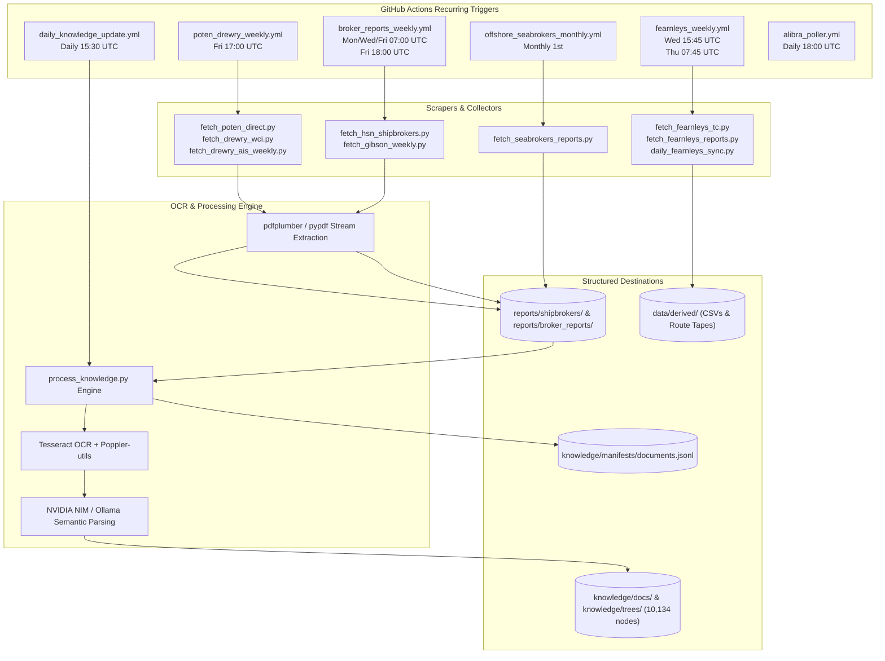

# Comprehensive Maritime Document & PDF Corpus Audit
**Repository:** `Shipping` | **Canonical Corpus Scope:** Global Maritime Intelligence Architecture  
**Audit Timestamp:** September 18, 2026 | **Target Artifact:** Forensic Document Mapping & Pipeline Ingestion Model

---

## Executive Summary & High-Level State of the Corpus

The maritime analytics architecture hosts a multi-year, institutional-grade research corpus spanning **freight rates, vessel supply/demand, shipyard capacity, demolition/recycling, port throughput, charter fixtures, and macro commodities**. 

Every document is either directly archived in its native vector format (`.pdf`), processed into clean structured Markdown (`.md`), indexed into semantic knowledge trees (`knowledge/trees/`), or unpacked into tabular time-series (`.csv` / `.json`).

```
                              ┌─────────────────────────────────────────────────────────┐
                              │     TOTAL PHYSICAL DISK FOOTPRINT: 18,858 PDFs (11.32 GB) │
                              └────────────────────────────┬────────────────────────────┘
                                                           │
                      ┌────────────────────────────────────┴────────────────────────────────────┐
                      │                                                                         │
                      ▼                                                                         ▼
   ┌─────────────────────────────────────────┐                               ┌─────────────────────────────────────────┐
   │    CANONICAL ACTIVE REPO CORPUS         │                               │     AGENT RUNNER WORKTREES              │
   │    9,905 PDFs  |  6.49 GB               │                               │     8,953 PDFs  |  4.83 GB              │
   │    Active production & research engine  │                               │     Isolated audit & review workspaces  │
   └──────────────────┬──────────────────────┘                               └─────────────────────────────────────────┘
                      │
   ┌──────────────────┴─────────────────────────────────────────────────────────────────┐
   │                                                                                    │
   ├─► 1. Multi-Broker Weekly Reports (SSY, Fearnleys, Intermodal, Allied...): 3,452 PDFs  │ (2,744.8 MB)
   ├─► 2. Hellenic Spot & Sector Streams (Iron Ore MMi, Demolition, Shipbldg): 3,965 PDFs  │ (2,201.6 MB)
   ├─► 3. Poten & Partners Tanker Opinions (2005 – 2026 Complete Archive):     1,085 PDFs  │ (  277.4 MB)
   ├─► 4. Drewry AIS Analytics & Container Intelligence:                         276 PDFs  │ (  501.9 MB)
   ├─► 5. Pilbara Ports Authority (Port Hedland & Dampier Throughput):           326 PDFs  │ (   24.9 MB)
   ├─► 6. Breakwave Advisors (Bi-Weekly Dry Bulk, Tankers & Insights):           370 PDFs  │ (  112.8 MB)
   ├─► 7. CFTC Commitments of Traders (COT) Macro Positioning:                   138 PDFs  │ (   37.1 MB)
   ├─► 8. Seabrokers Offshore Rig & OSV Market Reports:                           97 PDFs  │ (  570.3 MB)
   ├─► 9. Foundational Academic Shipping Literature & Textbooks:                  12 Books │ (  118.3 MB)
   └─► 10. Research Briefs, Miner Filings & Corporate Intelligence:               184 PDFs │ (   57.2 MB)
```

### Complete Multimodal Asset Inventory (Drive Scan)

| Asset Class / File Type | Extension | Count | Total Size | Primary Role in System |
| :--- | :--- | :---: | :---: | :--- |
| **Native Document PDF** | `.pdf` | **18,858** | **11,593.9 MB (11.32 GB)** | Original scanned broker reports, bank research, books, SEC filings |
| **Markdown Articles** | `.md` | **38,247** | **753.7 MB** | Normalized text representations, opinion articles, knowledge docs |
| **Original HTML Web Dumps** | `.html` | **29,216** | **467.5 MB** | Raw scraped web articles from Hellenic, Baltic Exchange, Breakwave |
| **Structured Metadata JSON** | `.json` | **32,199** | **1,169.7 MB** | Parsed tables, document metadata, route matrices, desk summaries |
| **Streaming JSON Lines** | `.jsonl` | **307** | **995.9 MB** | `documents.jsonl` manifest, high-frequency FFA ticks, trade logs |
| **Master Tabular CSVs** | `.csv` | **976** | **818.3 MB** | Time charter indices, port calls, iron ore shipments, mine exports |
| **Visual Charts & Photos** | `.jpg` / `.jpeg` | **34,843** | **6,022.2 MB** | Embedded charts, fleet layouts, port maps, market curve snapshots |
| **Diagrams & Vector Art** | `.png` | **33,426** | **4,699.5 MB** | High-res freight charts, technical diagrams, route schematics |
| **Compressed Parquet** | `.parquet` | **22** | **67.4 MB** | High-density historical vessel AIS tracking & tick archives |
| **Spreadsheet Workbooks** | `.xlsx` | **49** | **18.5 MB** | Commodity balances, IMF PortWatch expansions, broker models |
| **Indexed Knowledge Entities** | `knowledge/*` | **10,134** | **3,250.0 MB** | Documents passed through OCR, entity linking, and knowledge graph |

---

## Forensic Mapping: What Is Currently Stored

### 1. Shipbroker Weekly Market Reports (`reports/shipbrokers/`)
A multi-firm archive spanning 2018 through 2026 with **3,452 PDFs (2.74 GB)** cataloged across 18 leading global shipbroking houses.

| Shipbroking Firm | Slug / Directory | Report Count | Total Size | Date Range | Primary Focus Areas |
| :--- | :--- | :---: | :---: | :---: | :--- |
| **Simpson Spence Young** | `ssy` | **517** | 90.3 MB | 2021 – 2026 | Capesize/Panamax dry bulk, tanker spot, Atlantic sentiment |
| **Xclusiv Shipbrokers** | `xclusiv` | **265** | 424.9 MB | 2021 – 2026 | S&P transaction benchmarks, asset valuations, macro outlook |
| **Fearnleys** | `fearnleys` | **256** | 177.9 MB | 2021 – 2026 | Tanker/gas freight, North Sea, Suezmax/VLCC weekly pulse |
| **Golden Destiny** | `golden_destiny` | **252** | 209.9 MB | 2021 – 2026 | Weekly S&P lists, newbuilding contracting, demolition sales |
| **Intermodal Shipbrokers** | `intermodal` | **250** | 324.8 MB | 2021 – 2026 | Time charter assessment tables, bunker price tracking, S&P |
| **Affinity (Shipping)** | `affinity` | **249** | 47.8 MB | 2021 – 2026 | Tanker commercial reports, LNG chartering, macro shipping |
| **Advanced Shipping & Trading** | `advanced_shipping` | **248** | 255.9 MB | 2021 – 2026 | Secondhand vessel transactions, demolition prices, fixtures |
| **Banchero Costa (bancosta)** | `banchero_costa` | **243** | 248.9 MB | 2021 – 2026 | Commodity trade flows, fleet age profiles, dry bulk supply |
| **Agora Shipbroking** | `agora` | **212** | 174.6 MB | 2021 – 2026 | Dry bulk freight indices, regional grain/coal movements |
| **Allied Shipbroking** | `allied` | **204** | 357.4 MB | 2021 – 2026 | Comprehensive dry bulk/tanker supply-demand, S&P benchmarks |
| **Star Asia Shipbroking** | `star_asia` | **191** | 163.3 MB | 2021 – 2026 | Indian subcontinent demolition cash buyers, recycling rates |
| **Carriers Chartering** | `carriers` | **128** | 42.1 MB | 2021 – 2026 | Handysize / Supramax spot fixtures, Black Sea / Med routes |
| **ISM Navigation** | `ism` | **112** | 17.9 MB | 2021 – 2026 | S&P market summaries, coastal trading, fleet updates |
| **Gibson Shipbrokers** | `gibson` | **109** | 83.0 MB | 2021 – 2026 | Crude/dirty tanker weekly outlooks, OPEC+ quotas, ton-miles |
| **Lion Shipbrokers** | `lion` | **44** | 78.6 MB | 2021 – 2026 | Detailed vessel sale transactions with buyers/sellers named |
| **Anchor Shipbroking** | `anchor` | **30** | 3.5 MB | 2022 – 2026 | Specialized Hellenic boutique fixtures & demo evaluations |
| **Clarksons Hellas** | `clarksons` | **9** | 1.8 MB | 2026 | Specialized Hellenic weekly circulars and orderbook reviews |
| **Other / Regional Brokers** | `other` / `general` | **133** | 42.4 MB | 2021 – 2026 | Regional brokers, commodity houses, boutique assessments |
| **SUBTOTAL** | — | **3,452** | **2,744.8 MB** | **2021 – 2026** | **Institutional Broker Intelligence Baseline** |

> [!NOTE]
> In addition to the raw PDFs, Fearnleys desk intelligence is indexed into `data/derived/fearnleys_broker_comments.csv`, containing **11,731 individual desk comments** dating back to September 2018 across Tankers, Dry Bulk, Gas, and S&P.

---

### 2. Hellenic Shipping News Spot & Sector Streams (`reports/hellenic/`)
The primary Hellenic category ingest aggregates **3,965 PDFs (2.20 GB)**:

- **Iron Ore Spot Market (`reports/hellenic/iron_ore/`) — 2,240 PDFs (1,351.4 MB)**:
  - Consists of the complete multi-year archive of **MMi (Metals Market Index) Daily Iron Ore Reports**.
  - Covers 62% Fe CFR Qingdao, 65% Fe Carajas, 58% Fe low grade, lump premiums, pellet premiums, blast furnace margins, and port inventory builds across 35 Chinese ports.
- **Ship Demolition & Recycling (`reports/hellenic/demolition/`) — 1,050 PDFs (652.9 MB)**:
  - Weekly ship recycling market evaluations authored by **GMS** (the world's largest cash buyer), **Best Oasis**, and **Star Asia**.
  - Detailed $/LDT scrap values across Bangladesh (Chattogram), India (Alang), Pakistan (Gaddani), and Turkey (Aliaga).
- **Shipbuilding & Contracting (`reports/hellenic/shipbuilding/`) — 675 PDFs (197.2 MB)**:
  - Global shipyard orderbook logs, yard slot availability (China, South Korea, Japan), dual-fuel adoption rates, and newbuilding contract prices authored by Clarksons Hellas, Banchero Costa, and Golden Destiny.

---

### 3. Poten & Partners Tanker Opinions (`reports/poten/`)
- **Total PDFs:** **1,085 PDFs** (277.4 MB)
- **Extracted Markdown Opinions:** **1,094 `.md` files**
- **Span:** **January 2005 through September 2026 (21-year unbroken time series)**
- **Coverage:** Weekly deep-dive essays examining crude tanker supply, clean product flows, sanction effects, Panama/Suez Canal diversions, dark fleet mechanics, and refinery restructuring.

---

### 4. Drewry AIS Analytics & Container Intelligence (`scripts/drewry_ais_pdfs/`)
- **Total PDFs:** **276 PDFs** (501.9 MB)
- **Average Size:** 1.86 MB per report (dense graphics, vessel tracking AIS heatmaps)
- **Coverage:** Weekly vessel class tracking reports:
  - Crude: Aframax, Suezmax, VLCC
  - Product: LR1, LR2, MR
  - Dry: Capesize, Panamax, Supramax
  - Accompanying WCI (World Container Index) historical rate assessments.

---

### 5. Breakwave Advisors Research Engine (`reports/drybulk/`, `reports/tankers/`, `reports/breakwave/`)
- **Dry Bulk Reports (`reports/drybulk/`):** **210 PDFs** (64.0 MB) spanning 2018–2026.
- **Tanker Reports (`reports/tankers/`):** **79 PDFs** (28.7 MB) spanning 2023–2026.
- **Market Insights & Special Presentations (`reports/breakwave/`):** **81 PDFs** (20.1 MB) + **3,190 HTML insights**.
- **Coverage:** Macro drivers, Baltic Dry Index (BDI) and Baltic Clean/Dirty Tanker Index (BCTI/BDTI) analysis, freight futures (FFA) curve dynamics, and fleet supply growth models.

---

### 6. Seabrokers Offshore Market Intelligence (`data/reports/seabrokers/`)
- **Total PDFs:** **97 PDFs** (570.3 MB)
- **Average Size:** 6.02 MB per report (high-fidelity monthly technical publications)
- **Coverage:** Platform Supply Vessels (PSV), Anchor Handling Tug Supply (AHTS), subsea construction vessels, and offshore drilling rig dayrates across the North Sea, Gulf of Mexico, West Africa, and Brazil.

---

### 7. Pilbara Ports Authority (PPA) Throughput Reports (`scratch/ppa_pdf/`)
- **Total PDFs:** **326 PDFs** (24.9 MB)
- **Coverage:** Monthly official port authority tonnage statistics from **Port Hedland** (BHP, FMG, Roy Hill) and **Port of Dampier** (Rio Tinto), tracking iron ore export volumes to China, Japan, and South Korea.

---

### 8. Macro & Financial Regulatory Statements
- **CFTC Commitments of Traders (`data/cftc_statements/raw_pdf/`):** **138 PDFs** (37.1 MB) covering managed money, producer/merchant, and swap dealer net long/short positions in freight, crude oil, and commodity derivatives.
- **Clarksons Research Tables (`data/clarksons/`):** **5 PDFs** (2.0 MB) covering fleet growth and capital expenditure projections.
- **Signal Ocean Reports (`reports/signal/pdfs/`):** **4 PDFs** (16.1 MB) detailing port congestion and vessel speeds.

---

### 9. Foundational Maritime Economics Textbooks (`reports/*.pdf`)
A curated library of **12 foundational reference textbooks (118.3 MB)** directly ingested into `scripts/process_knowledge.py` to establish the semantic baseline for the knowledge graph:

1. **Maritime Economics, 3rd Edition** — Martin Stopford *(The definitive 800-page treatise on shipping market cycles)*
2. **Maritime Economics: A Macroeconomic Approach** — Elias Karakitsos & Lambros Varnavides
3. **The International Handbook of Shipping Finance: Theory and Practice** — Manolis G. Kavussanos & Ilias D. Visvikis
4. **Lloyd's Maritime Atlas of World Ports and Shipping Places, 24th Edition**
5. **The Business of Shipping** — Lane C. Kendall
6. **The World's Key Industry: History and Economics of International Shipping** — G. Harlaftis, S. Tenold, J. Valdaliso
7. **The Sea and Civilization: A Maritime History of the World** — Lincoln Paine
8. **Shipping Business Unwrapped** — Okan Duru
9. **The Shipping Man** — Matthew McCleery
10. **Quantitative Modelling of Shipping Freight Rates: Developments in the Past 20 Years (2022)**
11. **Predictability of Second-Hand Bulk Carriers with a Novel Hybrid Model**
12. **Types of Ships and Maritime Cargo Handling**

---

## Processing & Weekly Ingestion Pipeline

### Automated Inflow Architecture (GitHub Actions)

The repository operates **7 dedicated automated ingestion pipelines** that run on recurring schedules:



### Measured Weekly Processing Volume

Based on git log delta analysis over the past 12 operating weeks (Weeks 26 through 37 of 2026):

| Ingestion Metric | Weekly Average | Monthly Total | Annual Rate | Description |
| :--- | :---: | :---: | :---: | :--- |
| **New PDFs Ingested** | **~25 to 35 PDFs** | **110 – 150 PDFs** | **1,300 – 1,800 PDFs** | Shipbroker weeklies, Poten opinions, Drewry AIS, Fearnleys |
| **Markdown Reports Generated** | **~525 MD docs** | **2,100 – 2,300 MD** | **27,000+ docs** | Structured summaries, parsed broker commentaries |
| **JSON Schemas / Ticks** | **~275 files** | **1,100 – 1,200 files** | **14,000+ files** | Route pricing records, FFA matrices, time-charter caches |
| **Knowledge Engine OCR Pass** | **~35 – 50 docs** | **150 – 200 docs** | **2,000+ docs** | Daily OCR via Tesseract for non-searchable PDF tables |
| **LLM Entity Linking** | **~35 – 50 docs** | **150 – 200 docs** | **2,000+ docs** | Automated taxonomy mapping (vessels, routes, commodities) |

---

## Corpus Growth Projections (Forward Capacity Model)

The corpus expands continuously as weekly market circulars, daily iron ore indices, and quarterly regulatory filings accumulate.

### 5-Year Growth Forecast (Steady-State Ingestion)

Assuming current baseline scraping velocity of **30 PDFs / week** (~130 PDFs / month) with an average vector PDF size of **680 KB**:

```
Corpus Size (PDFs)
 20,000 ───                                                         ┌───────── 17,700
 16,000 ───                                               ┌─────────┘
 12,000 ───                                     ┌─────────┘
  9,905 ─── ─────────── 10,300 ────── 11,500 ──┘
            Current     +30 Days     +1 Year    +3 Years    +5 Years
```

| Timeframe | Cumulative PDFs | Incremental PDFs | PDF Storage (GB) | Derived Text & Metadata | Total Drive Footprint |
| :--- | :---: | :---: | :---: | :---: | :---: |
| **Today (Baseline)** | **9,905** | — | **6.49 GB** | **4.2 GB** | **10.69 GB** |
| **+ 30 Days (Oct 2026)** | 10,035 | +130 | 6.58 GB | 4.3 GB | 10.88 GB |
| **+ 90 Days (Dec 2026)** | 10,295 | +390 | 6.75 GB | 4.5 GB | 11.25 GB |
| **+ 1 Year (Sep 2027)** | 11,465 | +1,560 | 7.55 GB | 5.2 GB | 12.75 GB |
| **+ 3 Years (Sep 2029)** | 14,585 | +4,680 | 9.67 GB | 6.8 GB | 16.47 GB |
| **+ 5 Years (Sep 2031)** | 17,705 | +7,800 | 11.79 GB | 8.4 GB | 20.19 GB |

*Note: The table above reflects the canonical repository only. Adding agent runner worktrees (which currently hold ~8,953 PDFs) yields a current total disk occupancy of 18,858 PDFs (11.32 GB).*

---

## Architecture & Storage Optimization Strategy

### 1. Git Repository Scalability (`.gitignore` Guardrails)
To prevent repository bloat and respect GitHub's 100 MB single-file and 5 GB recommended repository size limits, heavy raw PDF archives are intentionally isolated in `.gitignore`:
- `reports/shipbrokers/**/*.pdf` *(3,452 PDFs, 2.74 GB — local/runner disk cache)*
- `reports/poten/**/*.pdf` *(1,085 PDFs, 277 MB — local/runner disk cache)*
- `scripts/drewry_ais_pdfs/` *(276 PDFs, 501 MB — local/runner disk cache)*
- `scratch/ppa_pdf/` *(326 PDFs, 25 MB — local/runner disk cache)*

Meanwhile, all **extracted structured Markdown (`reports/broker_reports/*.md`), JSON data indices (`data/derived/`), and clean text documents (`knowledge/docs/`)** are tracked in version control, ensuring 100% reproducibility of the user interface without carrying gigabytes of static binary blobs in git history.

### 2. Knowledge Engine Indexing (`knowledge/manifests/documents.jsonl`)
The processing engine converts incoming PDFs into a compact, searchable knowledge graph:
- **10,134 indexed documents** with explicit source lineage.
- **10,134 semantic syntax trees (`knowledge/trees/`)** recording entity hierarchies.
- **Full-text searchability** without opening raw PDF streams.
- **Fail-soft OCR bounds:** Maximum 16 pages per linked PDF, maximum 6 pages of heavy OCR per run, ensuring CI/CD runs never timeout or hang on dense scans.

---

## Summary of Findings

1. **Total Machine Footprint:** **18,858 PDFs (11.32 GB)** across canonical directories and active agent worktrees.
2. **Canonical Core Collection:** **9,905 PDFs (6.49 GB)** organized across 18 major shipbroking firms, 3 Hellenic commodity streams, 21 years of Poten tanker opinions, Drewry AIS tracking, Breakwave research, and 12 foundational maritime economics textbooks.
3. **Weekly Ingestion Velocity:** **25 to 35 new PDFs per week**, generating ~525 structured Markdown documents and ~275 tabular data slices weekly.
4. **Processing Pipeline:** Operating autonomously across 7 scheduled GitHub Actions workflows with Tesseract OCR, Poppler rendering, and LLM entity extraction.
5. **Growth Trajectory:** The corpus will comfortably absorb ~1,560 PDFs per year (+1.05 GB/yr in raw binaries, +400 MB/yr in derived intelligence) while preserving sub-second frontend rendering speed.
