# End-to-End Maritime & Upstream Commodity Intelligence Expansion Plan

This implementation plan establishes a complete, production-grade integration framework to ingest upstream physical cargo exports, port congestion analytics, carbon compliance benchmarks, and commodity logistics from the verified discoveries in [`docs/Newest Data/`](file:///c:/Users/Dell/Github/Shipping/docs/Newest%20Data).

---

## 1. What Is Needed From You (User Action Items & API Keys)

> [!TIP]
> **Zero-Infrastructure Principle**: All scrapers are engineered with **zero-key public endpoints and resilient HTTP/HTML fallbacks by default**. The platform will function 100% out of the box without any mandatory API keys. However, providing free registration keys enables higher rate limits and deeper historical backfills.

| Service / API | Cost | Required Action from You | What It Enables | Fallback if Skipped |
| :--- | :---: | :--- | :--- | :--- |
| **US Energy Information Administration (EIA) API v2** | **Free** | (Optional) Register a free key at [eia.gov/opendata/register.php](https://www.eia.gov/opendata/register.php) and add as `EIA_API_KEY` in GitHub Secrets or local `.env`. | Direct REST access to 30-year weekly PADD 3 crude and petroleum export time series (`WCREXUS2`). | Scraper uses direct public bulk XLS downloads from `eia.gov/dnav/pet/xls/`. |
| **UN Comtrade API v1** | **Free** | (Optional) Register a free account at [comtradeplus.un.org](https://comtradeplus.un.org/) for a primary subscription key. | Bilateral monthly bauxite (`HS 260600`) Guinea-to-China trade volume extraction. | Scraper queries the public unauthenticated preview endpoint (`comtradeapi.un.org/public/v1/preview/`). |
| **OilPriceAPI** | **Free Tier** | (Optional) 50 free req/day key at [oilpriceapi.com](https://www.oilpriceapi.com/) for `EU_CARBON_EUR` spot. | Real-time daily EU ETS carbon allowance prices (€/t CO2). | Scraper parses public EUA settlements from TradingEconomics / EEX public tables. |
| **Brazil ComexStat (MDIC)** | **100% Free** | **NONE NEEDED** — Fully open public REST API. | Monthly Brazilian iron ore (`NCM 2601`), crude oil (`NCM 2709`), and soybean (`NCM 1201`) exports back to 1997. | Direct API query `POST api-comexstat.mdic.gov.br/general`. |
| **Pilbara Ports Authority (PPA)** | **100% Free** | **NONE NEEDED** — Public port statistics. | Monthly iron ore throughput (Mt) from Port of Port Hedland and Port of Dampier. | Automated HTML/PDF press release scraper. |
| **IMF PortWatch ArcGIS API** | **100% Free** | **NONE NEEDED** — Open ArcGIS FeatureServer. | Daily port calls and estimated anchorage wait times for 1,985 ports. | Direct spatial REST query on IMF ArcGIS backend. |

---

## 2. Proposed Changes & Technical Architecture

```mermaid
flowchart TD
    subgraph S1["1. Data Ingestion Layer (Python Scrapers)"]
        S_BR["fetch_comexstat_brazil.py<br/>(Brazil MDIC Iron Ore, Crude, Soybeans, Sugar)"]
        S_AU["fetch_ppa_iron_ore.py & fetch_australia_req.py<br/>(Pilbara Ports & REQ Forecasts)"]
        S_MIN["fetch_major_miners_production.py<br/>(Vale, Rio Tinto, BHP, FMG Quarterly Shipments)"]
        S_US["fetch_eia_petroleum_exports.py<br/>(US PADD 3 Crude/Product Exports)"]
        S_CW["fetch_portwatch_port_activity.py<br/>(IMF Port Congestion for 8 Hubs)"]
        S_ETS["fetch_eu_ets_carbon.py<br/>(EU Carbon €/t & Hi-5 Bunker Spreads)"]
        S_NC["fetch_newcastle_coal.py<br/>(Port of Newcastle & Queensland Coal Shipments)"]
    end

    subgraph S2["2. Storage & Canonical CSV Matrices (data/)"]
        D_BR["data/commodities/brazil_comexstat_exports.csv"]
        D_AU["data/commodities/australia_ppa_iron_ore.csv"]
        D_MIN["data/commodities/major_miners_quarterly_shipments.csv"]
        D_REQ["data/commodities/australia_req_commodity_exports.csv"]
        D_US["data/commodities/us_eia_weekly_crude_exports.csv"]
        D_CW["data/congestion/portwatch_port_congestion.csv"]
        D_ETS["data/derived/eu_ets_carbon_daily.csv"]
        D_NC["data/commodities/newcastle_coal_exports.csv"]
        D_TM["data/derived/ton_mile_utilization_matrix.csv"]
    end

    subgraph S3["3. Frontend Web Terminal (index.html)"]
        UI_LOAD["DATA Object & safeFetch Loaders"]
        UI_CH1["#brazilExportsContainer (Iron Ore, Crude, Soybeans vs BCI/BDTI)"]
        UI_CH2["#ppaThroughputContainer (Port Hedland & Dampier vs Miner Guidance)"]
        UI_CH3["#eiaExportsContainer (US PADD 3 Exports vs Tanker Rates)"]
        UI_CH4["#portCongestionContainer (Qingdao, Ningbo, Rotterdam, Singapore Queues)"]
        UI_CH5["#carbonEtsContainer (EU ETS Carbon & Interactive Scrubber Calculator)"]
        UI_CH6["#tonMileSimContainer (Interactive Ton-Mile & Fleet Utilization Simulator)"]
        UI_TT["Institutional Rich Tooltips (getCalculatedTooltip)"]
    end

    subgraph S4["4. Intelligence & Automation Layer"]
        Q_ROUT["Q&A Auto-Routing (_autoSelectSources & BM25 Index)"]
        M_BRIEF["Daily Market Brief Synthesizer (generate_brief.py)"]
        M_RADAR["Macro Health Radar (Pillars 1–5 Integration)"]
        CRON["GitHub Actions Scheduled Cron Workflows (.github/workflows/)"]
    end

    S1 --> S2
    S2 --> S3
    S2 --> S4
```

---

## 3. Detailed Component-by-Component Implementation

### Component A: Quantitative Python Scrapers (`scripts/scrapers/`)

#### [NEW] `scripts/scrapers/fetch_comexstat_brazil.py`
- Queries `https://api-comexstat.mdic.gov.br/general` via `POST` with JSON payload.
- Ingests monthly export metrics (kg net weight and FOB USD) for:
  - **Iron Ore** (`NCM 26011100`, `26011200`)
  - **Crude Petroleum Oil** (`NCM 27090010`)
  - **Soybeans** (`NCM 12019000`)
  - **Raw Sugar** (`NCM 17011400`, `17011300` Santos/Paranaguá Supramax/Panamax driver)
- Transforms kg to metric tonnes and calculates YoY & MoM percentage changes.
- Writes to [`data/commodities/brazil_comexstat_exports.csv`](file:///c:/Users/Dell/Github/Shipping/data/commodities/brazil_comexstat_exports.csv).

#### [NEW] `scripts/scrapers/fetch_ppa_iron_ore.py`
- Scrapes the Pilbara Ports Authority (PPA) shipping statistics and monthly releases.
- Extracts monthly iron ore export tonnage (Mt) for **Port of Port Hedland** (handles ~43% of global seaborne iron ore) and **Port of Dampier**.
- Writes to [`data/commodities/australia_ppa_iron_ore.csv`](file:///c:/Users/Dell/Github/Shipping/data/commodities/australia_ppa_iron_ore.csv).

#### [NEW] `scripts/scrapers/fetch_major_miners_production.py`
- Ingests and compiles quarterly production, export shipments, and C1 cash cost guidance across the big four global iron ore miners: **Vale**, **Rio Tinto**, **BHP**, and **Fortescue (FMG)**.
- Writes to [`data/commodities/major_miners_quarterly_shipments.csv`](file:///c:/Users/Dell/Github/Shipping/data/commodities/major_miners_quarterly_shipments.csv).

#### [NEW] `scripts/scrapers/fetch_eia_petroleum_exports.py`
- Ingests weekly US crude oil exports (`WCREXUS2`) and total petroleum products departing PADD 3 (Gulf Coast) in thousand barrels per day (kbpd).
- Computes 4-week moving average and export momentum.
- Writes to [`data/commodities/us_eia_weekly_crude_exports.csv`](file:///c:/Users/Dell/Github/Shipping/data/commodities/us_eia_weekly_crude_exports.csv).

#### [NEW] `scripts/scrapers/fetch_portwatch_port_activity.py`
- Ingests daily port calls, vessel type breakdowns, and estimated anchorage queue delays from the IMF PortWatch ArcGIS backend (`FeatureServer/0/query`).
- Focuses on 8 benchmark global hubs:
  - **Qingdao** (`CNQDG`) — Capesize iron ore discharge
  - **Ningbo-Zhoushan** (`CNNGB`) — Iron ore & crude discharge
  - **Caofeidian** (`CNCFI`) — North China steel mill terminal
  - **Singapore** (`SGSIN`) — Bunkering & STS transfer hub
  - **Rotterdam** (`NLRTM`) — European energy & raw material gateway
  - **Houston** (`USHOU`) — US Gulf crude/product export gateway
  - **Port Hedland** (`AUPHE`) — Australian iron ore export hub
  - **Newcastle** (`AUNCL`) — Australian coal export gateway
- Writes to [`data/congestion/portwatch_port_congestion.csv`](file:///c:/Users/Dell/Github/Shipping/data/congestion/portwatch_port_congestion.csv).

#### [NEW] `scripts/scrapers/fetch_eu_ets_carbon.py`
- Ingests daily EU ETS European Union Allowance (EUA) spot prices (€/t CO2) and calculates per-voyage carbon cost surcharges for Capesize, Suezmax, and VLCC vessels.
- Blends with daily Singapore, Rotterdam, Fujairah, and Houston Hi-5 bunker spreads (VLSFO minus HSFO) to evaluate scrubber payback economics.
- Writes to [`data/derived/eu_ets_carbon_daily.csv`](file:///c:/Users/Dell/Github/Shipping/data/derived/eu_ets_carbon_daily.csv).

#### [NEW] `scripts/scrapers/fetch_australia_req.py` & `scripts/scrapers/fetch_newcastle_coal.py`
- Ingests Australian DISR quarterly export volumes / 5-year outlooks for Iron Ore, Coal, Bauxite, LNG.
- Ingests Port of Newcastle and Queensland coal export tonnages.
- Writes to [`data/commodities/australia_req_commodity_exports.csv`](file:///c:/Users/Dell/Github/Shipping/data/commodities/australia_req_commodity_exports.csv) and [`data/commodities/newcastle_coal_exports.csv`](file:///c:/Users/Dell/Github/Shipping/data/commodities/newcastle_coal_exports.csv).

---

### Component B: Frontend UI Visualization Layer (`index.html`)

#### [MODIFY] [`index.html`](file:///c:/Users/Dell/Github/Shipping/index.html)
1. **DATA Object Expansion**:
   - Register `DATA.brazilExports`, `DATA.ppaIronOre`, `DATA.minerShipments`, `DATA.eiaExports`, `DATA.portCongestion`, `DATA.euCarbon`, `DATA.reqExports`, `DATA.newcastleCoal`.
2. **SafeFetch Data Loaders**:
   - Add parallel async loaders inside `loadAllData()` with schema validation, null-safety guards, and fallback defaults.
3. **6 New Visual Chart & Simulation Modules**:
   - **`#brazilExportsContainer`**: Brazilian monthly export volumes (Iron Ore, Crude Oil, Soybeans, Sugar) plotted alongside BCI C3 / BDTI freight rate lead curves with commodity toggles.
   - **`#ppaThroughputContainer`**: Pilbara Ports monthly throughput bar/line chart with Port Hedland vs. Dampier toggles and miner shipment overlay (Vale vs Rio Tinto vs BHP vs FMG).
   - **`#eiaExportsContainer`**: US PADD 3 Weekly Crude & Product Exports line chart with 4-week smoothing and tanker freight correlation flags.
   - **`#portCongestionContainer`**: Multi-port vessel congestion queue gauge and daily port calls tracker with port selectors (`Qingdao`, `Ningbo`, `Caofeidian`, `Singapore`, `Rotterdam`, `Houston`, `All`).
   - **`#carbonEtsContainer`**: Dual-axis EU ETS EUA Carbon Price (€/t CO2) vs. Singapore Hi-5 Scrubber Fuel Spread ($/MT) with an **Interactive Scrubber Payback & Voyage Cost Calculator** (toggle vessel size, adjust consumption, view daily $/day premium).
   - **`#tonMileSimContainer`**: **Interactive Ton-Mile & Fleet Utilization Simulator** (allowing users to adjust Guinean bauxite, Brazilian iron ore, or chokepoint bypass scenarios and observe real-time active fleet utilization $U$ and rate elasticity).
4. **Interactive Controls & HUD KPI Badges**:
   - Add dual-range timeline sliders, metric filter buttons, and real-time KPI status badges.
5. **Render Registration**:
   - Hook all 6 new chart renderers into `renderSectionCharts()` and section tab lifecycle handlers.

---

### Component C: Institutional Rich Tooltips (`getCalculatedTooltip` in `index.html`)

#### [MODIFY] [`index.html`](file:///c:/Users/Dell/Github/Shipping/index.html)
Add dedicated rich tooltip types inside `getCalculatedTooltip(target)` matching the platform's multi-row formula standard:

1. **`concept-brazil-exports`**:
   - **Header**: Brazilian Bulk Seaborne Exports (MDIC ComexStat).
   - **Formulas**: Net Metric Tonnes ($kg / 1,000$) & FOB USD Value by NCM code.
   - **Causal Mechanism**: C3 Tubarão-to-Qingdao Capesize demand driver (15–30 day lead time).
2. **`concept-ppa-throughput`**:
   - **Header**: Pilbara Ports Authority & Major Miner Shipments.
   - **Formulas**: Monthly Port Hedland + Dampier Iron Ore Export Tonnes (Mt) & Miner Guidance.
   - **Causal Mechanism**: Directly drives Capesize C5 (West Australia $\rightarrow$ Qingdao) spot availability.
3. **`concept-eia-exports`**:
   - **Header**: US PADD 3 Gulf Coast Seaborne Petroleum Exports.
   - **Formulas**: Weekly Crude (`WCREXUS2`) & Distillate Export Velocity (kbpd).
   - **Causal Mechanism**: Causal driver for VLCC TD22, Suezmax TD20/TD27, and Aframax TD25 ton-mile expansion.
4. **`concept-port-congestion`**:
   - **Header**: Global Port Congestion & Anchorage Queue Factor.
   - **Formulas**: Active Fleet Utilization $U = \text{TM} / (\text{DWT} \times (1 - \text{Congestion Factor}))$.
   - **Causal Mechanism**: Anchorage delays remove effective vessel capacity, causing non-linear freight rate surges when fleet utilization exceeds 88%.
5. **`concept-carbon-ets`**:
   - **Header**: EU ETS Maritime Carbon Allowance & Scrubber Hi-5 Economics.
   - **Formulas**: $\text{Daily Scrubber Savings} = \text{Fuel Consumption} \times (\text{VLSFO} - \text{HSFO})$; $\text{ETS Surcharge} = \text{Fuel} \times C_f \times \text{Coverage \%} \times \text{EUA Price}$.
   - **Causal Mechanism**: Evaluates scrubber-fitted vessel TCE premiums and EU voyage regulatory drag.
6. **`concept-ton-mile-sim`**:
   - **Header**: Ton-Mile Absorption & Active Fleet Utilization Model.
   - **Formulas**: $\text{TM} = \sum \text{Volume}_i \times \text{Distance}_i$; $U = \text{TM} / (\text{Fleet DWT} \times (1 - C))$.
   - **Causal Mechanism**: Explains why long-haul trades (Guinea bauxite 11,000 nm, Brazil iron ore 11,000 nm) absorb ~3.7x more vessel capacity than short-haul trades (WAus iron ore 3,000 nm).

---

### Component D: Knowledge Copilot & Auto-Routing Integration

#### [MODIFY] [`index.html`](file:///c:/Users/Dell/Github/Shipping/index.html) & [`scripts/test_question_routing_and_grounding.py`](file:///c:/Users/Dell/Github/Shipping/scripts/test_question_routing_and_grounding.py)
1. **Source Auto-Selection Regexes (`_autoSelectSources`)**:
   - Expand regex matching for ComexStat, MDIC, Pilbara Ports, Port Hedland, Dampier, EIA petroleum exports, PortWatch congestion, EU ETS EUA, Newcastle coal, and Australia REQ.
2. **Shard Manifest & Group Prefixes (`_QA_GROUP_PREFIXES`)**:
   - Register new commodity and congestion chunk prefixes to guarantee automatic shard routing.
3. **Search Index Rebuild**:
   - Execute `scripts/search_index_build.py` to compile inverted BM25 term indexes into `knowledge/chunks/search/index.json`.

---

### Component E: Daily Market Brief Synthesizer (`scripts/generate_brief.py`)

#### [MODIFY] [`scripts/generate_brief.py`](file:///c:/Users/Dell/Github/Shipping/scripts/generate_brief.py)
1. **Section 11: Upstream Physical Cargo Flows & Mining Throughput**:
   - Ingest Brazil ComexStat iron ore & crude export tonnage.
   - Ingest Pilbara Ports Port Hedland monthly export volume.
   - Ingest US EIA PADD 3 weekly crude exports.
   - Ingest Port of Newcastle coal export tonnage.
2. **Section 12: Port Congestion & Anchorage Bottlenecks**:
   - Ingest IMF PortWatch daily port call and waiting time metrics for Qingdao, Ningbo, Rotterdam, Singapore, and Houston.
3. **Section 13: Environmental & Scrubber Fuel Spreads**:
   - Ingest EU ETS EUA carbon allowance price and Singapore/Rotterdam Hi-5 spreads.

---

### Component F: Macro Health Radar & Intelligence Scoring

#### [MODIFY] [`index.html`](file:///c:/Users/Dell/Github/Shipping/index.html) & [`scripts/test_macro_health_radar.py`](file:///c:/Users/Dell/Github/Shipping/scripts/test_macro_health_radar.py)
1. **Pillar 4 (Port Restocking & Cargo Flow) Enhancement**:
   - Augment Chinese iron ore port stock signals with upstream Brazilian (ComexStat) and Australian (PPA) export momentum.
2. **Pillar 5 (Vessel Asset Safety) Enhancement**:
   - Augment asset safety metrics with Hi-5 scrubber fuel spread savings and EU ETS carbon compliance costs.

---

### Component G: Automated GitHub Actions Cron Workflows (`.github/workflows/`)

#### [NEW] [`.github/workflows/upstream_commodity_flows.yml`](file:///c:/Users/Dell/Github/Shipping/.github/workflows/upstream_commodity_flows.yml)
- **Schedule**: Mondays & Thursdays at 06:00 UTC.
- **Jobs**:
  1. Runs `fetch_comexstat_brazil.py`
  2. Runs `fetch_ppa_iron_ore.py`
  3. Runs `fetch_eia_petroleum_exports.py`
  4. Runs `fetch_portwatch_port_activity.py`
  5. Runs `fetch_eu_ets_carbon.py`
  6. Runs `fetch_newcastle_coal.py`
  7. Commits and pushes updated datasets to `origin/main`.

---

### Component H: Documentation & Datasets Catalog

#### [MODIFY] [`docs/DATASETS.md`](file:///c:/Users/Dell/Github/Shipping/docs/DATASETS.md) & [`README.md`](file:///c:/Users/Dell/Github/Shipping/README.md)
- Update inventory with **Section 7: Upstream Physical Cargo Exports, Port Congestion & Carbon Allowances**, detailing schemas, row counts, publishing frequencies, and data provenance.

---

## 4. Verification Plan

### Automated Test Suite
1. **Scraper Execution Validation**:
   - Run each Python scraper to verify HTTP 200 responses, schema conformity, non-empty DataFrames, and clean CSV writes.
2. **Q&A Auto-Routing Test**:
   - Run `pytest scripts/test_question_routing_and_grounding.py` (100% regex coverage across all new sources).
3. **Macro Health Radar Test**:
   - Run `pytest scripts/test_macro_health_radar.py` (verify 5-pillar mathematical integrity).
4. **Daily Brief Dry Run**:
   - Run `python scripts/generate_brief.py --dry-run` to verify structured prompt assembly and JSON/Markdown emission.
5. **Full Repository Regression Suite**:
   - Run `pytest scripts/` (all 85+ unit tests passing).
6. **Frontend JavaScript Syntax Validation**:
   - Run `node scratch/validate_js.js` to confirm 0 syntax errors across all inline script blocks in `index.html`.

### Manual & Visual Verification
- Open [`index.html`](file:///c:/Users/Dell/Github/Shipping/index.html) in browser to verify:
  - Responsive rendering of all 5 new chart cards.
  - Interactive route, port, and commodity filter toggles.
  - Rich HTML tooltips rendering with structured `.rt-title`, `.rt-row`, and `.rt-note` tables.
  - Seamless dark theme styling and mobile responsiveness.
