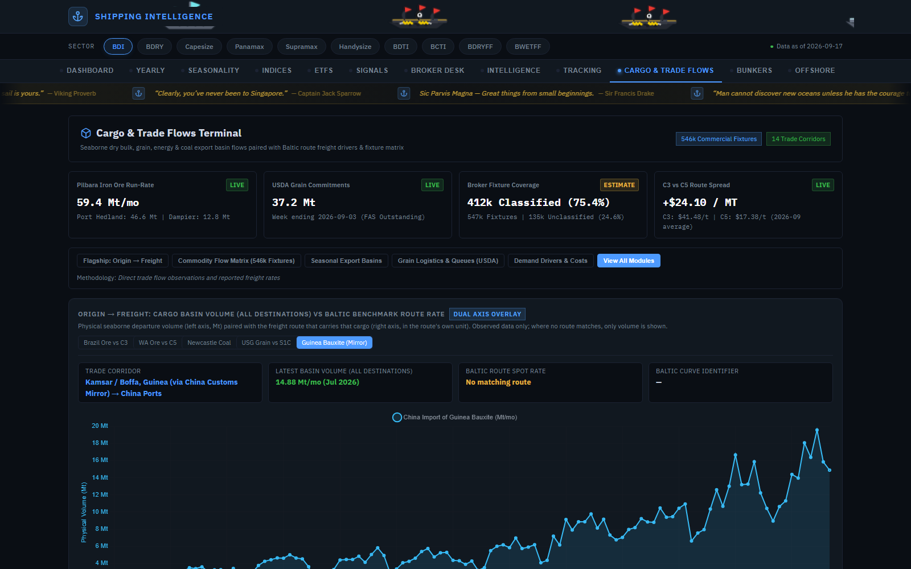
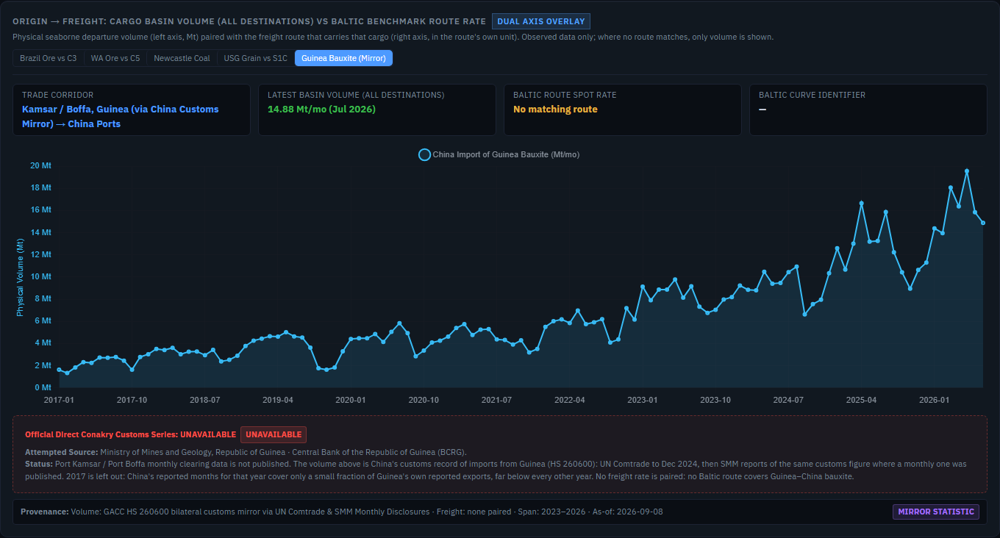
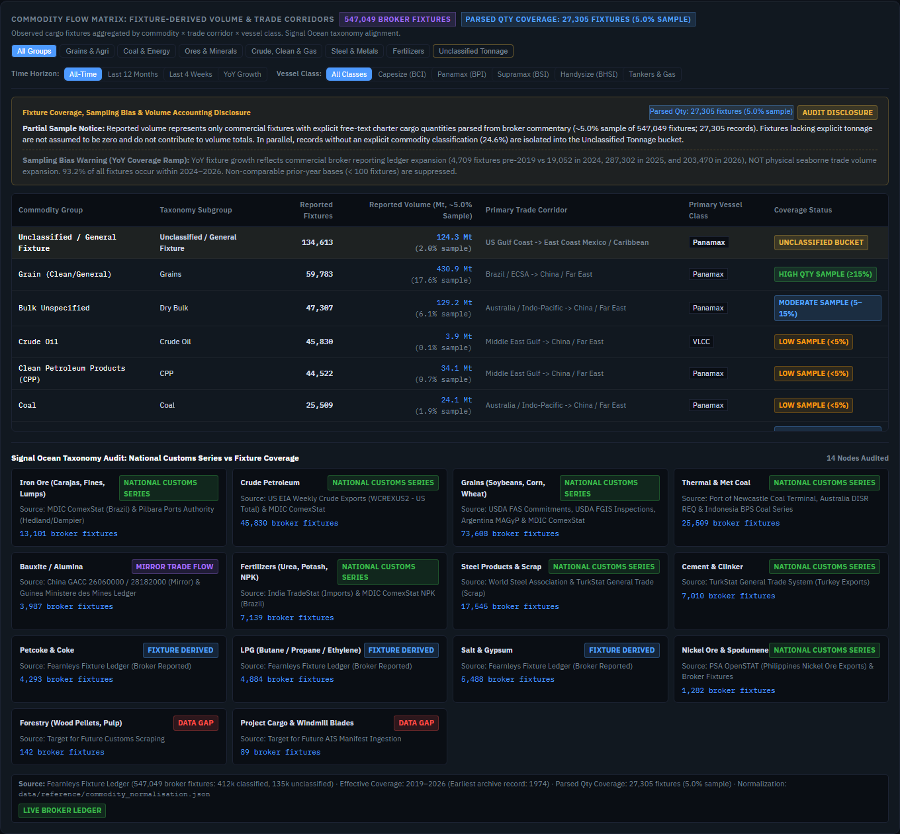
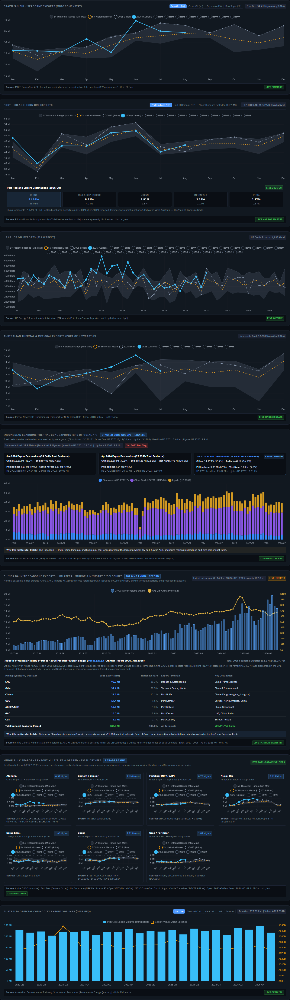
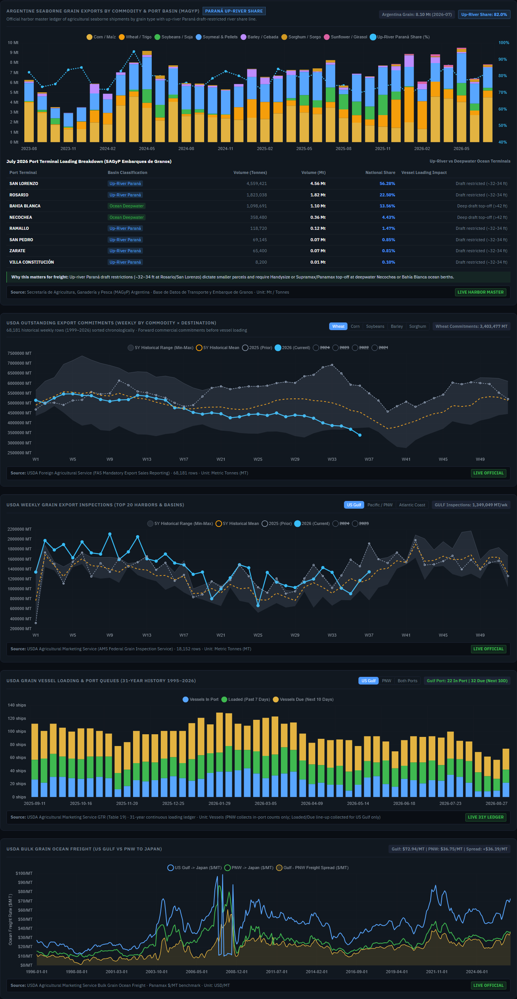

# Cargo & Trade Flows Workstation — Macro Screenshots

This document compiles the 5 authoritative macro workstation screenshots captured from the Cargo & Trade Flows tab (`#tab-cargo`), verifying the complete layout, HUD metrics, flagship route pairings, fixture matrix, seasonal export basins, and grain logistics modules.

---

## 1. Full Cargo & Trade Flows Tab Overview
Complete workstation view showing Hero HUD run-rates (Pilbara 59.4 Mt/mo, USDA commitments 37.2 Mt, 547k Fixtures / 75.4% classified, C3 vs C5 freight spread +$24.10/MT), corridor selectors, and module containers.

* **DOM Anchor**: `#tab-cargo`
* **Resolution**: 1440 × 1080
* **Key Indicators**:
  * Like-for-like Pilbara iron ore: 59.4 Mt/mo (Hedland 46.6 Mt + Dampier 12.8 Mt)
  * Active USDA grain commitments: 37.2 Mt outstanding
  * Broker Fixture Coverage: 412k Classified (75.4%) | 135k Unclassified (24.6%)
  * C3 vs C5 Capesize spread: +$24.10 / MT

---

## 2. Flagship Route: Origin Export Volume & Freight Pairing
Brazil (Tubarão / Ponta da Madeira) → Qingdao C3 Capesize freight route paired with verified MDIC ComexStat monthly seaborne export volumes.

* **DOM Anchor**: `#cargoFlagshipSection`
* **Route**: Route 10001 (Brazil Tubarão → Qingdao, China)
* **Key Indicators**:
  * Clamped Capesize spot rate axis (`min: 0`, eliminating the -$20k/day scale distortion)
  * Dynamic Provenance Footer: MDIC ComexStat primary export data paired with continuous Fearnleys benchmark freight rates
  * Live Paired Data badge: `PAIRED DATA`

---

## 3. Commodity Flow Matrix & Classification Bucket
Broker fixture ledger aggregation across commodity groups, trade corridors, and vessel classes, featuring explicit 5.0% partial sample coverage accounting.

* **DOM Anchor**: `#cargoMatrixSection`
* **Fixture Population**: 547,044 Broker Fixtures (412,433 classified, 134,611 unclassified)
* **Key Indicators**:
  * Parsed Quantity Coverage Badge: `27,305 fixtures (5.0% sample)`
  * Table Header: `Reported Volume (Mt, ~5.0% Sample)`
  * Row-Level Sample Disclosures: E.g., Grain Clean/General 430.9 Mt (17.6% sample), Unclassified 124.3 Mt (2.0% sample)
  * Unclassified Tonnage bucket isolated with explicit `AUDIT DISCLOSURE` card

---

## 4. Seasonal Export Basins & Miner Throughput
Pilbara Ports Authority 24-year historical iron ore throughput, Port of Dampier toggle isolation, and major global iron ore miner guidance.

* **DOM Anchor**: `#cargoBasinsSection`
* **Ports Covered**: Port Hedland (46.6 Mt/mo), Port of Dampier (12.8 Mt/mo)
* **Key Indicators**:
  * Independent Dampier envelope and toggle isolation
  * Retitled Major Global Iron Ore Miners card (incorporating Vale, Rio Tinto, BHP, FMG)
  * Dynamic Port Hedland Destination Header reading `August 2026` / `LIVE AUGUST 2026`
  * 5-year seasonal corridor bands

---

## 5. Grain Logistics & Ocean Freight Queues
Argentine port basin breakdown (Up-River Paraná vs Ocean Deepwater), USDA weekly export sales commitments, Panama Canal wait times, and US Gulf vs PNW ocean freight spreads.

* **DOM Anchor**: `#cargoGrainsSection`
* **Key Indicators**:
  * Dynamic Gulf–PNW freight spread calculation (`gulfToJapan - pnwToJapan`) with active badge (+$28.25/MT) and yellow spread curve
  * USDA FAS export commitments by destination
  * Panama Canal lock transit wait times
  * Landed soybean transport cost competitiveness with USDA ERS lagged publication notices

---

## Appendix: Focused Remediated Defect Card Captures

For comprehensive verification, the 8 dedicated defect card captures are preserved below:

1. **USDA Commitments Barley Empty State**: `./screenshots/card_usda_barley_empty.png`
2. **USDA Commitments Sorghum Empty State**: `./screenshots/card_usda_sorghum_empty.png`
3. **Port of Dampier Toggle**: `./screenshots/card_dampier_toggle.png`
4. **Port Hedland Destination Panel Header**: `./screenshots/card_hedland_destination_header.png`
5. **Major Miners Guidance Chart**: `./screenshots/card_major_miners.png`
6. **Gulf–PNW Ocean Freight Spread**: `./screenshots/card_gulf_pnw_spread.png`
7. **Minor-Bulk Multiples Grid**: `./screenshots/card_minor_bulks.png`
8. **Brazilian Bulk Seaborne Exports**: `./screenshots/card_brazil_seasonal.png`
