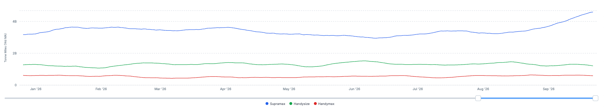
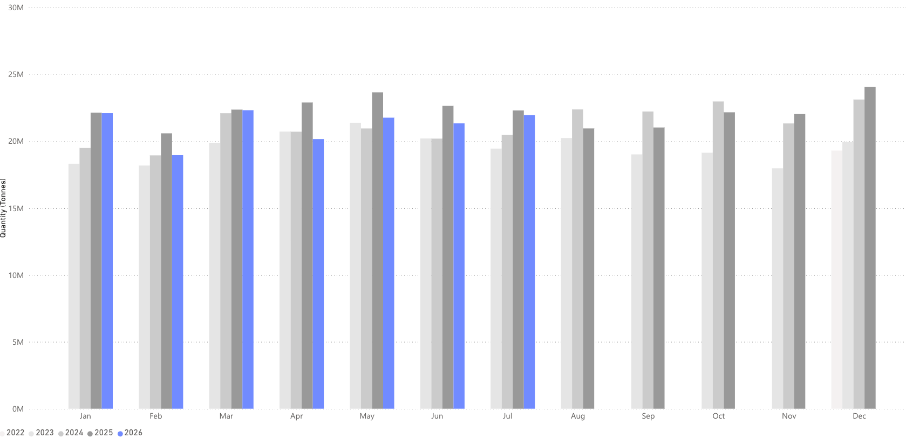
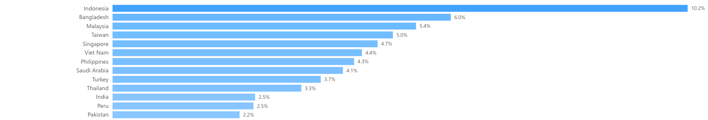

# COMMODITY RADAR | Spotlight: STEEL

**Date**: September 23, 2026 | **Category**: Major Bulk | **Section**: Monitors | **Source**: [https://www.thesignalgroup.com/weekly-market-monitor/steel-flows-face-fresh-challenges-in-the-final-quarter-of-2026](https://www.thesignalgroup.com/weekly-market-monitor/steel-flows-face-fresh-challenges-in-the-final-quarter-of-2026)

---

## Steel flows face fresh challenges in the final quarter of 2026

Steel flows slip into negative growth in July 2026

- Global steel flows fall 1% y/y in July 2026 to reach 22.2 Mt.
- China’s share of global steel flows rises from 41.6% in July 2025 to 45.7% in July 2026, driven by a 9.1% increase in exports.
- Flows from the World Ex. China fell by 7.9%, to 12.0 Mt in July.

*Source:Steel tonne-miles from Signal Ocean https://app.signalocean.com/dry/dynamic/timeseries_dry*

Global steel flows were 22.2 Mt in July 2026, up 1% from the same period a year earlier. Higher flows from China drove much of this growth, while combined flows from elsewhere fell by nearly 8%.

India also saw a remarkable increase in steel exports in July, up 51% from the year before; however, the absolute figure is still far behind China. The exports come despite strong domestic demand for steel; Indian steel mills have been encouraged to place incremental production overseas as lower-cost steel imports to India have squeezed margins.

*Source:Seaborne steel flows  from Signal Ocean https://app.signalocean.com/dry/dynamic/drybulkflows*

Looking ahead into the end of Q3 and into Q4, many of the market dynamics that have affected steel flows are expected to continue. The Arabian Peninsula continues to be widely locked out of the market and has seen its proportion of global steel imports fall from an average of 6.4% between 2022 and 2025 to 4.4% in 2026. This has been most impactful on China who typically sends 10% of its steel exports to the region but has seen this fall to 5.3% in 2026.

China’s steel exports will also face some new challenges going into the final quarter of 2026. The most obvious is the incoming EU crackdown on ‘Melt and Pour.’ From October 1st, the EU is enforcing strict mandates tracking the absolute origin of crude steel; this will cut off the common practice of nations buying lower-cost Chinese steel, rerolling, and selling into the EU as ‘local’ steel.

Turkey is the most likely to see steel imports fall as a result of this, as the country imports around 20% of its steel demand from China. Turkey typically then exports around 28% of its steel exports to either the Central Mediterranean or East Mediterranean.

*Source:Chinese steel exports destination in 2026 from Signal Ocean https://app.signalocean.com/dry/dynamic/drybulkflows*

## Chinese steel exports face new and ongoing challenges in 2026 Q4

Global steel flows nudged higher in July 2026, but the headline figure masks a widening split in the market. China continued to tighten its grip, pushing more volume out even as demand from the rest of the world softened and pulled overall non-China flows down sharply. India emerged as a notable bright spot, with exports surging as domestic mills, squeezed by cheap imports undercutting their margins at home, leaned harder into overseas sales, though it remains a minor player next to China's scale.

Heading into Q4, headwinds are building for Chinese exports. The Arabian Peninsula's share of global steel imports has fallen from 6.4% to 4.4% in 2026, hitting China's regional exports hardest, down to 5.3% of its total from a typical 10%. More significantly, the EU's "Melt and Pour" origin rules take effect October 1st, closing the reroll-and-resell loophole. Turkey, which sources roughly 20% of its steel demand from China and sends about 28% of its exports to the Mediterranean, looks most exposed to the fallout.
