# Weekly Dry Market Monitor: Week 38, 2026

**Date**: September 22, 2026 | **Category**: Dry bulk | **Section**: Monitors | **Source**: [https://www.thesignalgroup.com/weekly-market-monitor/weekly-dry-market-monitor-week-38-2026](https://www.thesignalgroup.com/weekly-market-monitor/weekly-dry-market-monitor-week-38-2026)

---

## SPOTLIGHT OF THE WEEK

## Grain in Focus - US Soybean Sailings to China Recover Through September

US soybean sailings to China recovered in September, following the subdued activity discussed in ourWeek 32 spotlight.At that stage, stronger forward purchases had yet to be matched by a comparable increase in departures. Following the August pause, the seven-day moving average exceeded 41,000 tonnes/day by 10 September and reached around 47,000 tonnes/day at mid-month, before easing to 37,300 tonnes/day on 19 September. September activity is stronger than in the corresponding period of 2025, although the moderation from the mid-month high leaves the continuity of loadings as the next point to watch.

*Figure 1: US soybean departures to China — seven-day moving average, 2026 through 19 September against the same series in 2025 (Source: Signal). The series measures vessel departures from US origins to Chinese destinations, grouped by export date, and is stated in tonnes. It is not segmented by vessel class, so it does not on its own establish demand for any particular size, and the most recent observations may be revised as voyages settle.*

USDA figures put China’s total US soybean commitments for the2026/27 marketing year at 9.858 million tonnes through 10 September, including completed shipments and outstanding sales. The outstanding portion represents cargoes still to be shipped, making their loading schedules relevant to the development of US–China vessel demand over the coming months.Purchases reported on 10 September covered approximately1 million tonnes, with Sinograin booking cargoes fromUS Gulf Coast export terminals to China for December 2026–February 2027 shipment. Earlier buying, reported on 3 August, included at least eight cargoes from US Gulf Coast terminals and six from US Pacific Northwest ports, scheduled for October–November shipment to China. The autumn bookings therefore involve both US export regions, while the later Sinograin purchases extend the US Gulf–China loading programme into winter. These shipment dates fall beyond the September recovery visible in the departure data, placing the associated vessel employment in the fourth quarter and early 2027.

Private Chinese crushers have largely avoided US cargoes because of the additional10% tariffand weak processing margins. Assessments reported in early September indicated that US soybeans for October–January shipment would generate losses even without the additional duty. At those prices, tariff relief alone would offer little incentive for private crushers to book further US shipments, limiting the potential for additional cargo demand beyond the reported state purchases.

## FREIGHT MARKET OVERVIEW | BDI & SEGMENT METRICS

A second week of divergence between the larger and geared sizes.The BDI eased to 3,370 points (+34 daily, −137 WoW), a second consecutive weekly decline, though the composite finished the week on a positive day.Panamaxled the fall, the BPI down 156 points to 2,251 with P5TC at $20,262/day (−$1,400 WoW).Capesizealso eased, the BCI 312 points lower at 5,768 with the C5TC average, on the 180,000 dwt basis, at $48,812/day (−$2,824 WoW); the 182,000 dwt weighted average stood at $52,315/day. Both larger segments nonetheless closed the final session higher, the BCI by 112 points. The geared sizes extended their gains for a second week:Supramaxfirmed (BSI 1,767, +48 WoW) with S11TC at $22,332/day (+$604 WoW) andHandysizerose (BHSI 988, +48 WoW) with HS7TC at $17,776/day (+$851 WoW).

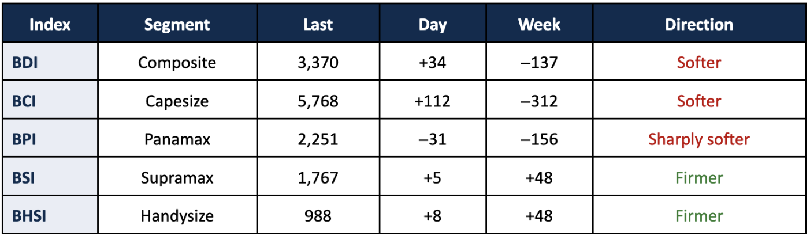
*Signal Figure*

The Atlantic did the work in the small sizes.The single largest route move of the week wasHandysizein theUS Gulf: HS4_38 rose $5,221 to $24,000/day, with HS3_38 (Rio de Janeiro–Recalada) up $945 to $25,167/day, HS2_38 up $536 to $12,700/day, and HS1_38 up $471 to $9,464/day. ThePacific Handysizeroutes were flat to slightly lower over the same days.Supramaxgains were centred on Asia and West Africa, with S8 (South China via Indonesia) up $1,560 to $25,229/day and S3 (North China to West Africa) up $1,109 to $20,892/day, while the twoUS Gulf Supramax routeseased, S1C by $363 and S4A by $337.

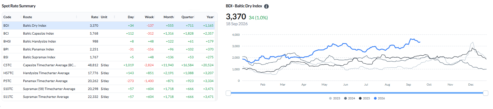
*Figure 2: Baltic Dry Index — spot rate summary across segments and BDI performance as of 18 Sep 2026 (Source: Signal).*

The larger sizes weakened on the Pacific legs.WithinCapesizethe decline was concentrated on the Pacific and backhaul routes, C10_182 (China–Japan transpacific round) down $7,038 to $50,341/day and C16_182 (Far East–Atlantic backhaul) down $1,944 to $21,778/day, while C14_182 rose $606 and the Brazil–China voyage route C3 firmed $0.83 to $42.96/mt.Panamaxfell on every route, with the largest declines on P3A_82 (−$1,763) and P6_82 (−$1,703); thegrain routeseased more modestly, P7 (US Gulf–Qingdao) down $0.34 to $75.95/mt and P8 (Santos–Qingdao) down $0.72 to $56.53/mt.

## Ballasters - by region

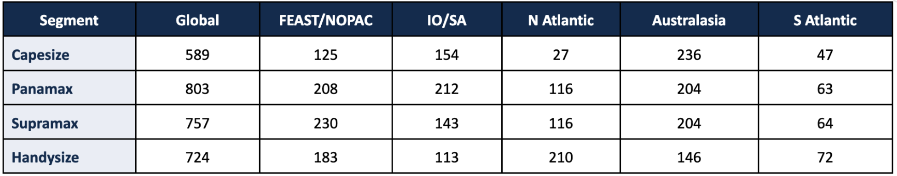
*Signal Figure*

Global ballaster fleet and regional counts as of 18 September 2026 (Source: Signal).

Supramaxcarried the largest open tonnage pool at 757 vessels, with 230 in FEAST/NOPAC and 204 in Australasia.Handysizestood at 724, with the North Atlantic, including Med/Black Sea, its largest single pool at 210 — the region where the week’s strongest route gains were recorded.Panamaxtotalled 803, split evenly between 212 in the Indian Ocean/South Africa, 208 in FEAST/NOPAC and 204 in Australasia.Capesizewas the smallest fleet at 589, of which 236 were positioned in Australasia and only 27 in the North Atlantic.

## CAPESIZE | ANALYSIS

Freight.The BCI eased to 5,768 (+112 day-on-day; −312 week-on-week), with the C5TC average, on the 180,000 dwt basis, at $48,812/day (−$2,824 WoW). The 182,000 dwt weighted average stood at $52,315/day.

ThePacifictimecharter routes led the decline: C10_182 (China–Japan transpacific round) fell $7,038/day WoW to $50,341/day and C16_182 (Far East–Atlantic backhaul) $1,944 to $21,778/day, while C8_182 (Gibraltar/Hamburg transatlantic round) eased $1,563 to $54,750/day and C9_182 $278 to $87,333/day. C14_182 was the exception, rising $606 to $51,379/day. Among thevoyageroutesC3(Tubarao–Qingdao) firmed $0.83 to $42.96/mt andC17(Saldanha Bay–Qingdao) $0.19 to $31.66/mt, whileC5(West Australia–Qingdao) eased $1.27 to $16.58/mt,C7$0.34 to $23.13/mt and C2 $0.11 to $19.59/mt.

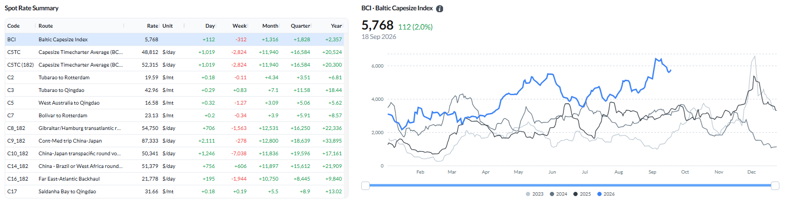
*Signal Figure*

Figure 3: Baltic Capesize Index (BCI) — spot rate summary and BCI performance (Source: Signal).

Ballaster positioning.The global Capesize ballaster count stood at 589 on 18 September, the smallest of the four segments. Australasia held the largest regional pool at 236, ahead of the Indian Ocean/South Africa at 154 and FEAST/NOPAC at 125. The South Atlantic held 47 and the North Atlantic 27.

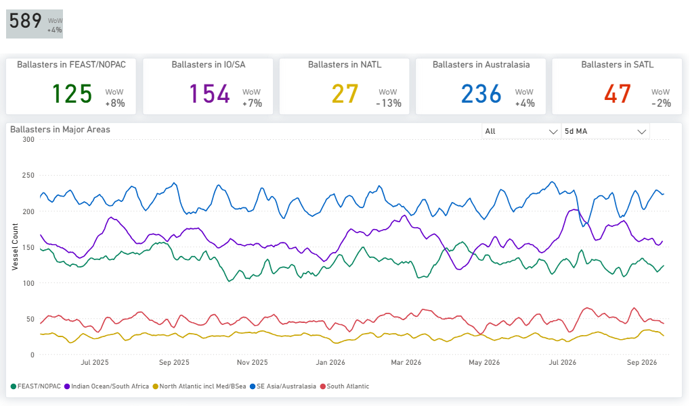
*Signal Figure*

Figure 4: Capesize — Global ballaster fleet and regional positioning (Source: Signal).

Supply/demand by route.On C3 (Tubarao–Qingdao), cumulative supply runs below expected demand across the whole 40-day window, reaching about 302 vessels at day 40 against expected demand near 342, with the two supply measures separating only after about day 30. On C5 (West Australia–Qingdao), total supply is above expected demand from the start of the window and rises to about 215 vessels by day 15 against expected demand near 196, while supply excluding laden tonnage flattens near 162 and falls below expected demand over the closing days.

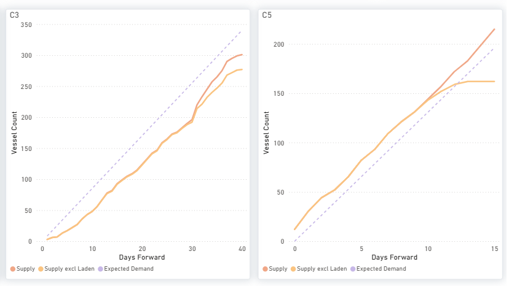
*Signal Figure*

Figure 5: Capesize — C3 & C5 forward balance: cumulative Supply vs Expected Demand over days forward (Source: Signal).

Supply/demand — market-position indicator.The demand-to-supply series compares four-week-average year-on-year growth in tonne-mile demand with growth in available tonnage, so a reading above 1.00 means demand is growing faster than tonnage rather than that cargo physically exceeds ships. For the week ending 17 September, tonne-mile demand is 2.8% above its year-ago level while available tonnage is 0.4% lower, leaving the ratio at1.03. Iron ore fines loadings rose 1.3% over the week, directionally consistent with reports of higher Australian and Brazilian dispatches.

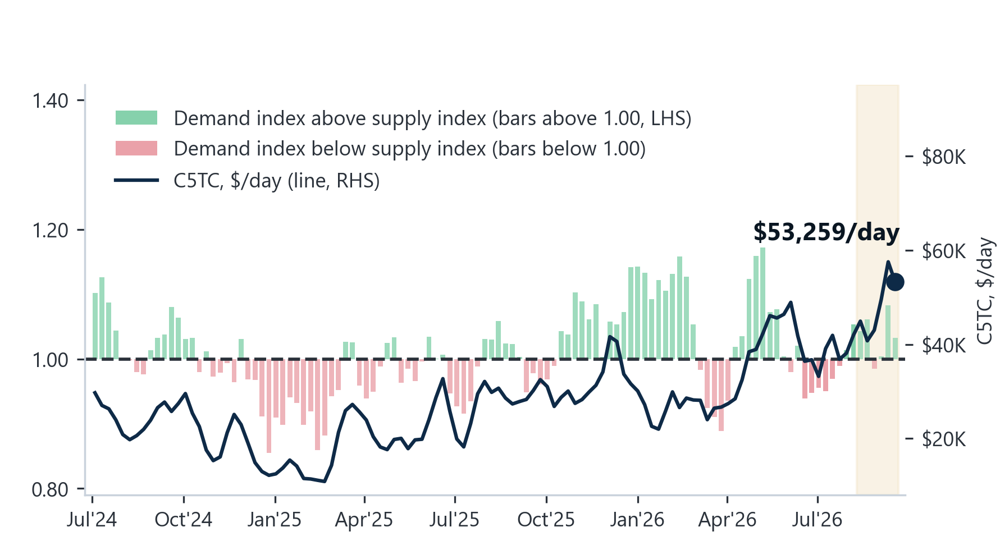
*Signal Figure*

Figure 6: Capesize — demand-to-supply ratio (LHS bars, four-week-average year-on-year growth; above 1.00 = tonne-mile demand growing faster than available tonnage) against the C5TC weekly average (RHS line). Available tonnage excludes VLOC tonnage on long-term contract. Shaded band = latest six provisional weeks. The line and its annotated value are the settled weekly average for the week ending 17 September 2026 and cover a different period from the 18 September closing assessments quoted above (Source: Signal). The reading is provisional, and the side of 1.00 may still shift on revision; the final loading day of the week is incomplete, and the Capesize demand leg carries no settlement nowcast.

## PANAMAX | ANALYSIS

Freight.The BPI fell to 2,251 (−31 day-on-day; −156 week-on-week) and the P5TC average declined $1,400 WoW to $20,262/day, the largest weekly fall of the four segments. Every route in the basket was lower. P3A_82 (Hong Kong–South Korea transpacific) fell $1,763 to $20,400/day, P6_82 (Singapore round via Atlantic) $1,703 to $20,640/day, P1A_82 (Skaw–Gibraltar transatlantic round) $1,218 to $18,859/day and P2A_82 (Skaw–Gibraltar trip to Taiwan–Japan) $1,105 to $29,598/day. P5_82 (South China/Indonesian round) eased $783 to $19,461/day, and P4_82 eased $333 to $12,955/day. The grain routes also softened, with P7 (US Gulf–Qingdao) down $0.34 to $75.95/mt and P8 (Santos–Qingdao) down $0.72 to $56.53/mt.

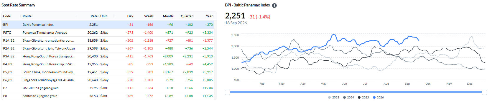
*Signal Figure*

Figure 7: Baltic Panamax Index (BPI) — spot rate summary and BPI performance (Source: Signal).

Ballaster positioning.The global Panamax ballaster count stood at 803 on 18 September. The pool was evenly distributed across the main regions, with 212 in the Indian Ocean/South Africa, 208 in FEAST/NOPAC and 204 in Australasia. The North Atlantic held 116 and the South Atlantic 63.

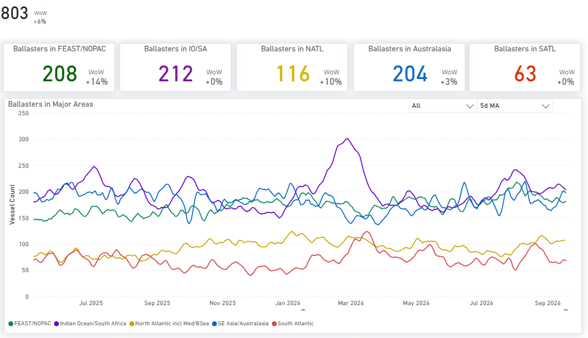
*Signal Figure*

Figure 8: Panamax — Global ballaster fleet and regional positioning (Source: Signal).

‍

Supply/demand by route.On P3, cumulative supply runs below expected demand across the window, reaching about 62 vessels at day 20 against expected demand near 100 — the widest shortfall in the segment. P1/P2/P7 carries a supply surplus from around day 4 through to the end of its window. On P5, the Indonesia round, supply tracks above expected demand through the first seven days before expected demand moves ahead, and supply excluding laden tonnage flattens near 66 vessels against expected demand above 100 at day 10. On P6, the two run close together to about day 10, after which supply sits modestly below expected demand.

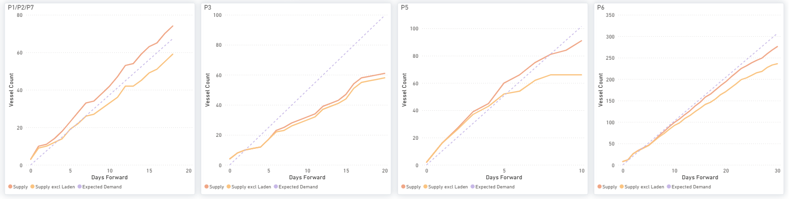
*Signal Figure*

Figure 9: Panamax — P1/P2/P7, P3, P5 & P6: cumulative Supply vs Expected Demand over days forward (Source: Signal).

Supply/demand — market-position indicator.On the demand-to-supply series for the week ending 17 September, tonne-mile demand is 10.7% below a year ago while available tonnage is 0.2% lower, taking the ratio down to0.89from 0.95. The ratio compares year-on-year growth rates and does not measure a physical vessel surplus.

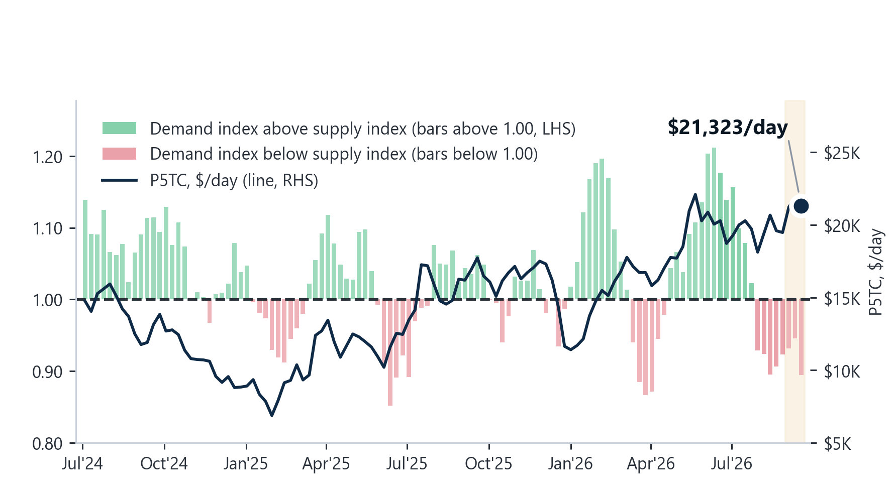
*Signal Figure*

Figure 10: Panamax — demand-to-supply ratio (LHS bars, four-week-average year-on-year growth; above 1.00 = tonne-mile demand growing faster than available tonnage) against the P5TC weekly average (RHS line). Available tonnage excludes VLOC tonnage on long-term contract. Shaded band = latest six provisional weeks. The line and its annotated value are the settled weekly average for the week ending 17 September 2026 and cover a different period from the 18 September closing assessments quoted above (Source: Signal). The reading is provisional, and the tonne-mile leg carries a settlement nowcast for the incomplete final loading day.‍

## SUPRAMAX | ANALYSIS

Freight.The BSI rose to 1,767 (+5 day-on-day; +48 week-on-week), with the S10TC average at $20,298/day and S11TC at $22,332/day, both up $604 WoW. The Asian and West African routes led: S8 (South China via Indonesia) rose $1,560 to $25,229/day, S3 (North China to West Africa) $1,109 to $20,892/day, S1B (Canakkale trip via Mediterranean) $950 to $25,621/day, S3TC_63 $941 to $20,802/day and S2 (North China one Australian round) $931 to $20,919/day. S4B gained $481 to $15,100/day, and S9 gained $369 to $22,838/day. The US Gulf routes were the exception, with S1C easing $363 to $33,331/day and S4A easing $337 to $32,763/day.

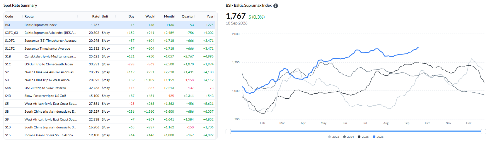
*Signal Figure*

Figure 11: Baltic Supramax Index (BSI) — spot rate summary and BSI performance (Source: Signal).

Ballaster positioning.The global Supramax ballaster count stood at 757 on 18 September, the largest pool of the four segments. FEAST/NOPAC held 230 and Australasia 204, ahead of the Indian Ocean/South Africa at 143 and the North Atlantic at 116. The South Atlantic held 64.

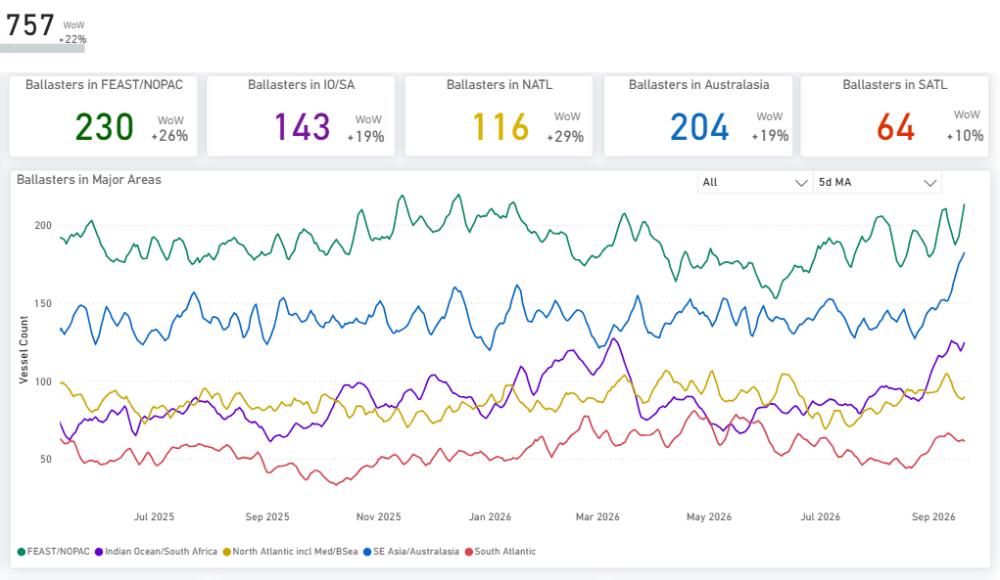
*Signal Figure*

Figure 12: Supramax — Global ballaster fleet and regional positioning (Source: Signal).

Supply/demand by route.S4A/S1C and S4B both carry a clear cumulative supply surplus across the full window, widest on S4B, where supply reaches about 113 vessels at day 20 against expected demand near 64. S8/S10 also runs above expected demand throughout. S5 tracks expected demand closely through the first twelve days before supply moves ahead, reaching about 152 vessels by day 20 against expected demand near 108.

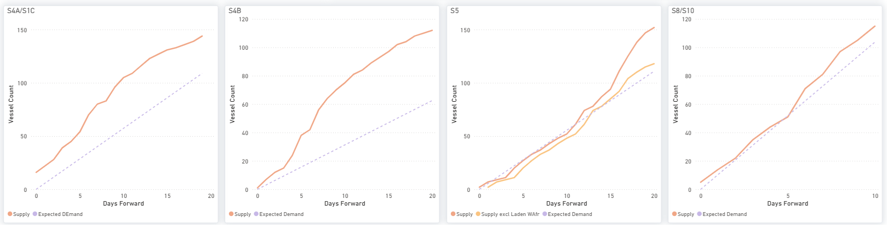
*Signal Figure*

Figure 13: Supramax — S4A/S1C, S4B, S5 & S8/S10: cumulative Supply vs Expected Demand over days forward (Source: Signal).

Supply/demand — market-position indicator.On the demand-to-supply series for the week ending 17 September, tonne-mile demand is 11.6% below a year ago while available tonnage is 6.0% higher, taking the ratio down to0.83from 0.86. Supramax earnings held firmer on a weekly average basis even as the broader Baltic market softened towards the end of the week.

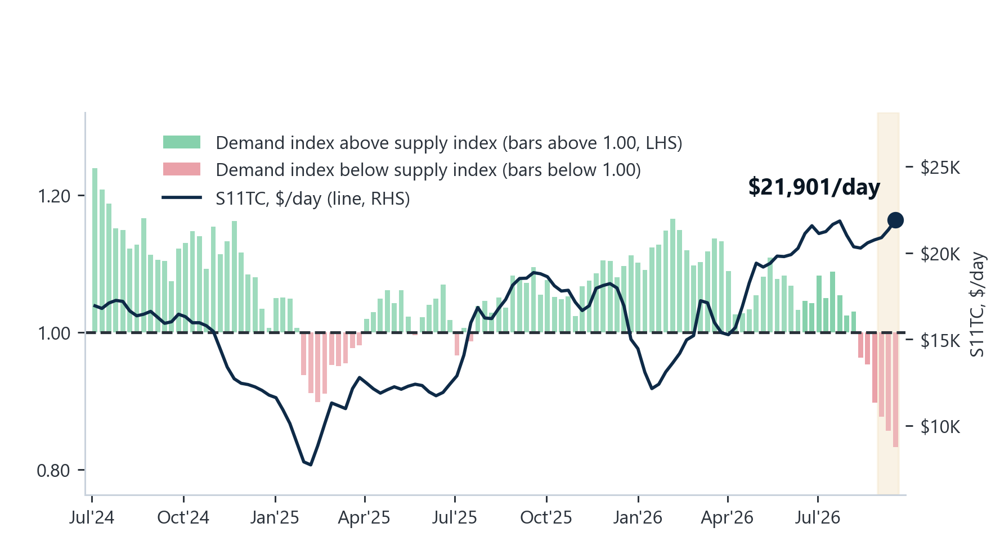
*Signal Figure*

Figure 14: Supramax — demand-to-supply ratio (LHS bars, four-week-average year-on-year growth; above 1.00 = tonne-mile demand growing faster than available tonnage) against the S11TC weekly average (RHS line). Available tonnage excludes VLOC tonnage on long-term contract. Shaded band = latest six provisional weeks. The line and its annotated value are the settled weekly average for the week ending 17 September 2026 and cover a different period from the 18 September closing assessments quoted above (Source: Signal). The reading is provisional, and the tonne-mile leg carries a settlement nowcast for the incomplete final loading day.

## HANDYSIZE | ANALYSIS

Freight.The BHSI rose to 988 (+8 day-on-day; +48 week-on-week), with the HS7TC average up $851 WoW to $17,776/day. The Atlantic again carried the move: HS4_38 (US Gulf) jumped $5,221 to $24,000/day, HS3_38 (Rio de Janeiro–Recalada) rose $945 to $25,167/day, HS2_38 (Skaw-Passero to Boston-Galveston) $536 to $12,700/day and HS1_38 (Skaw-Passero to Rio de Janeiro) $471 to $9,464/day. The Pacific was flat to marginally lower; HS7_38 up $13 to $18,019/day, HS6_38 down $31 to $17,244/day, and HS5_38 down $206 to $18,044/day.

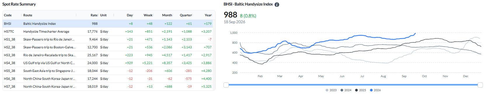
*Signal Figure*

Figure 15: Baltic Handysize Index (BHSI) — spot rate summary and BHSI performance (Source: Signal).

Ballaster positioning.The global Handysize ballaster count stood at 724 on 18 September. The North Atlantic, including Med/Black Sea, held the largest pool at 210, ahead of FEAST/NOPAC at 183 and Australasia at 146. The Indian Ocean/South Africa held 113 and the South Atlantic 72.

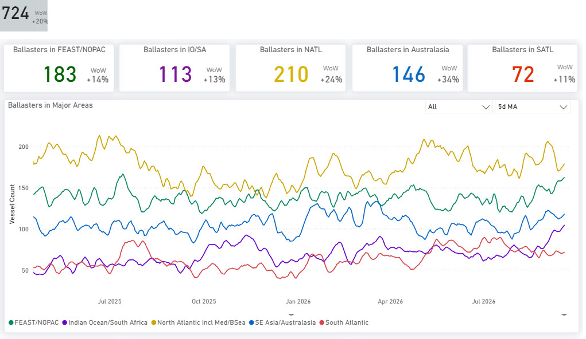
*Signal Figure*

Figure 16: Handysize — Global ballaster fleet and regional positioning (Source: Signal).

‍

Supply/demand by route.HS1/HS2 and HS5 both carry a wide cumulative supply surplus, HS1/HS2 reaching about 175 vessels by day 15 against expected demand near 113, and HS5 about 78 at day 15 against expected demand near 40. HS6 runs modestly above expected demand throughout. On HS7, total supply is below expected demand over roughly the first four days, then moves above it and holds to day 10, while supply excluding laden converges with expected demand at the end of the window.

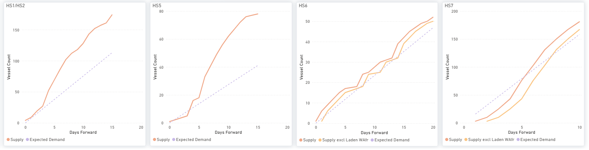
*Signal Figure*

Figure 17: Handysize — HS1/HS2, HS5, HS6 & HS7: cumulative Supply vs Expected Demand over days forward (Source: Signal).

Supply/demand — market-position indicator.On the demand-to-supply series for the week ending 17 September, tonne-mile demand is 17.0% below a year ago while available tonnage is 7.9% lower, leaving the ratio at0.90. Demand remains below available tonnage on this measure, which compares growth rates rather than a physical balance.

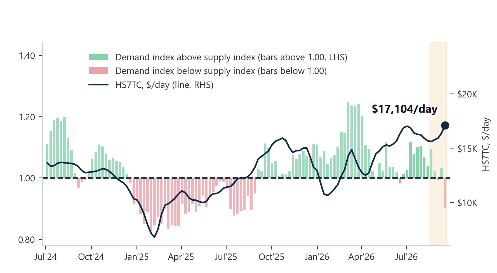
*Signal Figure*

Figure 18: Handysize — demand-to-supply ratio (LHS bars, four-week-average year-on-year growth; above 1.00 = tonne-mile demand growing faster than available tonnage) against the HS7TC weekly average (RHS line). Available tonnage excludes VLOC tonnage on long-term contract. Shaded band = latest six provisional weeks. The line and its annotated value are the settled weekly average for the week ending 17 September 2026 and cover a different period from the 18 September closing assessments quoted above (Source: Signal). Handysize demand is built from Voyage API tonne-mile alone, a different basis from the Panamax and Supramax blended series, so the level should be read within the Handysize series only. The reading is provisional.

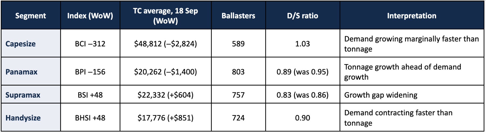
*Signal Figure*

Demand contracting faster than tonnage

Table 1: Index levels, route rates, timecharter averages and ballaster counts are the published assessments of 18 September 2026. Demand-to-supply ratios are the weekly series for the week ending 17 September 2026 and are provisional. The weekly time charter averages underlying that series are not reproduced here, as they cover a different period from the 18 September closing assessments (Source: Signal; Baltic Exchange).

Weekly comparison:The split between the larger and geared sizes widened for a second week. The BPI fell 156 points to 2,251 and the BCI 312 points to 5,768, while the BSI rose 48 points to 1,767 and the BHSI 48 points to 988. The time charter averages moved the same way, P5TC down $1,400 to $20,262/day and C5TC down $2,824 to $48,812/day, against S11TC up $604 to $22,332/day and HS7TC up $851 to $17,776/day. Open tonnage stood at 803 Panamax, 757 Supramax, 724 Handysize, and 589 Capesize vessels. Of the four measured demand-to-supply ratios, only Capesize sits above 1.00; all four are provisional, and small revisions can move them across that line.

‍
