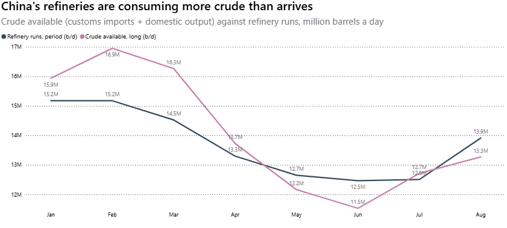
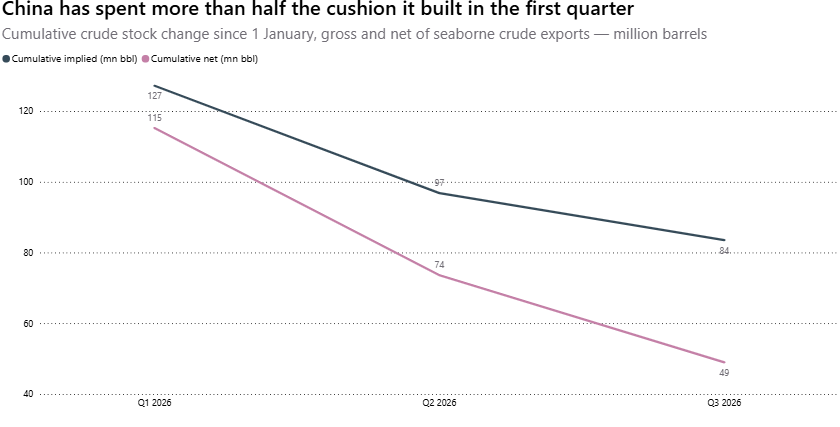
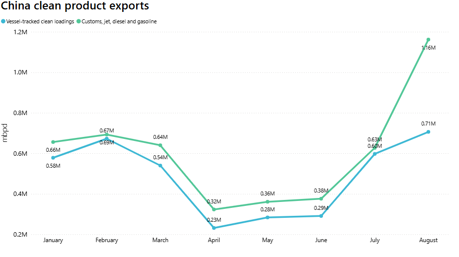
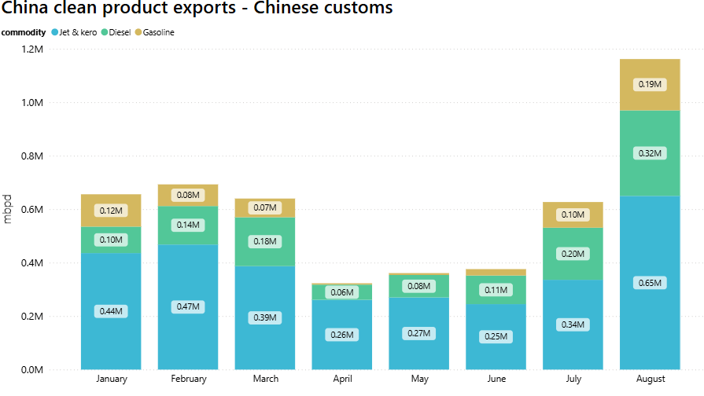

# MARKET INSIGHTS  |  When the Levee Breaks

**Date**: September 24, 2026 | **Category**: Market Insights | **Section**: Newsroom | **Source**: [https://www.thesignalgroup.com/newsroom/when-the-levee-breaks](https://www.thesignalgroup.com/newsroom/when-the-levee-breaks)

---

## SIGNAL OCEAN · MARKET INSIGHTS

## When the Levee Breaks

### Nikolas Zannikos  |  Market Analyst  |  21 September 2026

The weakest June for Chinese crude imports in a decade did not cost a single barrel of throughput. Imports fell 41.3% on the year, runs held above 12.4 mb/d, and product exports went up. The difference came out of the tanks. At the draw rate of the last four months, what is left of this year's build is gone by late November.

Both measures bottomed in June, tracked arrivals at 6.45 mb/d and customs at 7.12. By August imports were back to 8.93 and runs had gone to 13.91, the highest since March.

## The Balance

*Runs and output for January and February come from a single 59-day NBS observation, 895 million barrels of throughput and 261 million of domestic output, so both months carry that one rate of 15.17 and 4.42 mb/d. GACC reported January and February 2025 combined, so no prior-year monthly base exists for either month.*

Two things are moving, and they are not moving for the same reason. Crude available, which is imports plus domestic output, came to 12.16 mb/d in May against runs of 12.65. June was 11.53 against 12.47. August, 13.27 against 13.91. Every one of those gaps came out of a tank.

Imports fell because crude got expensive and Hormuz got difficult. That is a supply-side shock, price and access together. Runs did not lead the recovery, they followed the export programme. So one side of the balance is answering the crude price and the other is answering the product market, with inventory covering the distance. What makes that uncomfortable is where the discretion sits. The export pull is Beijing's to switch off, and it can go a great deal faster than crude purchasing can be rebuilt.

*Figure 1: Crude available, customs imports plus domestic output, against refinery runs, million barrels a day (Source: GACC, NBS).*

## The levee, and how much of it is left

The first quarter added 127 million barrels: +0.76 mb/d over 31 days, +1.78 over 28, +1.74 over 31, or 23.6 plus 49.7 plus 53.9. April through August handed back 44 of that on the headline identity, 66 once crude exports are netted off. So China closes August 84 million barrels up on the year, 49 net. Those are changes. They say China holds 84 million barrels more than it did on 1 January. They do not say 84 million barrels are sitting in its tanks.

Read that as insurance, bought before and through the closure, and 58% of it has been spent in five months. The balance went negative in May. May to August the net draw has run at 0.59 mb/d, which leaves the remaining 49 million barrels covering about 83 days and running out in late November. That is arithmetic at a constant rate, not a forecast: it freezes the May to August draw and assumes nothing at all about September. Use August on its own, 0.89 mb/d, and you are under two months. And at zero the tanks are not empty, they are simply back where they started the year.

*Figure 2: Cumulative crude stock change since 1 January, gross and net of seaborne crude exports, million barrels (Source: GACC).*

## The export pull, and what August actually sold

Runs followed the export programme rather than leading it. Clean product exports, meaning jet, diesel and gasoline, went from 0.36 mb/d in May to 1.16 in August, the high of the year. The August step is the telling one. Throughput rose from 12.51 mb/d in July to 13.91 in August. Clean exports rose from 0.63 to 1.16 over the same two months. That is 38 per cent of the extra throughput coming back out as clean product for export, and the other 62 per cent staying in China. The export programme explains why runs turned.

*Figure 3: China product exports, customs jet, diesel and gasoline against vessel-tracked clean loadings, million barrels a day (Source: GACC, Signal).*

Coverage runs 72 to 97 per cent across those seven months and 87 on the period as a whole, and both series trough in April and turn in July.

The grade mix says where it went. Jet hit a monthly record at 0.65 mb/d, against 0.34 in July and 0.46 a year ago. Diesel went to 0.32 from 0.20, the most since March 2024. Gasoline doubled, 0.10 to 0.19. Jet on its own is 59% of the increase.

*Figure 4: China refined product exports by grade, million barrels a day. The August grade split covers jet, diesel and gasoline; fuel oil and other are reported only as a combined 1.43 Mt remainder (Source: GACC).*

Finally, a view rather than a finding. Three statements out of the US administration in twelve days. On 9 September, that oil prices would not come down until after the midterms. On the 12th, that the war would end soon after them and prices would drop sharply once it did. On the 21st, that he is in deciding mode, probably open to meeting Iran's president at the General Assembly, while keeping military action on the table. Brent fell for a fourth session running that day and still held above $100. The market took the opening and left the threat alone.

Take the sequence at face value and it promises relief after November, not before. Take it as market management and it is a good deal cheaper than a settlement, because a possible war end-date and an open door will hold a forward curve down without anything having to change on the ground.
